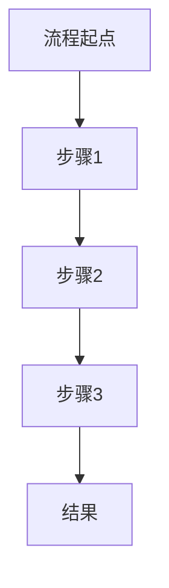
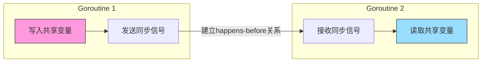

# 编程学习资源库结构标准 v1.2

## 1. 总体组织原则

本仓库是一个编程学习资源库，按照编程语言进行顶层组织，每种语言下按照主题分类整理相关知识点。所有文档采用Markdown格式，保持结构一致性和内容完整性。

## 2. 目录结构规范

```
programming/
├── README.md                    # 项目总体说明
├── {编程语言}/                  # 编程语言目录（如golang, python等）
│   ├── README.md                # 该语言概述及子目录导航
│   ├── 基础知识/                # 语言基础部分
│   │   ├── README.md            # 基础知识概述及文件导航
│   │   └── {具体知识点}.md       # 具体知识点文档
│   ├── 高级特性/                # 语言高级特性
│   ├── 标准库/                  # 标准库使用指南
│   ├── 并发编程/                # 并发相关内容（如适用）
│   ├── 测试与调试/              # 测试与调试相关内容
│   └── 工程实践/                # 实际应用场景与最佳实践
│   └── {特定语言专题}/          # 特定于该语言的专题（如Web开发、数据处理等）
```

## 3. 命名规范

### 3.1 目录命名
- 使用中文全称，清晰表达内容类别
- 目录名应以"/"结尾（在引用时）
- 遵循既定类别命名，新增类别需合理且符合语言特性

### 3.2 文件命名
- 使用中文全称，表达具体知识点
- 统一使用.md扩展名
- 文件名应清晰概括内容，避免过长（一般不超过15个字符）
- 文件名中不使用空格，使用驼峰式命名或短横线连接

### 3.3 README.md文件
- 每个目录必须包含README.md文件
- README.md必须包含目录概述和子文件导航
- 导航部分使用Markdown列表格式，链接到相应的文件

## 4. 内容组织规范

### 4.1 层次结构
- 严格遵循"语言 -> 主题类别 -> 具体知识点"的三级结构组织
- 保持结构统一性，便于导航和索引

### 4.2 标准目录类别及其内容定义

| 目录类别 | 内容定义 | 是否必需 |
|---------|---------|---------|
| 基础知识/ | 语言核心概念与基本语法，初学者必备知识 | 必需 |
| 高级特性/ | 进阶技术与深入原理，高级开发者需要掌握的内容 | 必需 |
| 标准库/ | 语言核心库与常用API的使用指南 | 必需 |
| 并发编程/ | 并发模型与实践（特定语言的并发特性） | 可选 |
| 测试与调试/ | 测试框架、调试技术、性能分析等 | 必需 |
| 工程实践/ | 实际应用场景、项目结构、最佳实践等 | 必需 |
| 其他专题/ | 特定语言的专有主题（如Web开发、数据处理等） | 可选 |

## 5. 文件内容标准

### 5.1 格式要求
- 使用标准Markdown格式
- 代码块必须指定语言类型（如```go, ```python）
- 使用相对路径链接相关文档

### 5.2 内容深度与视觉辅助指南

#### 5.2.1 内容深度差异化
- **基础知识点**：简明扼要，侧重实用性，避免过多理论解释
- **核心/高级知识点**：详尽深入，包含原理解析、底层机制和设计思想
- **标准库/API**：以实用性为主，提供常见用例和最佳实践
- **工程实践**：详细展开，结合真实场景和完整示例

#### 5.2.2 视觉辅助要求
- 对于复杂概念，必须使用图表辅助说明
- 对于流程性内容，应使用流程图展示
- 对于架构设计，使用架构图说明组件关系
- 对于算法，使用图示说明执行过程
- 使用Mermaid或其他Markdown兼容的图表语法

#### 5.2.3 内容结构模板

```markdown
# [知识点名称]

## 概述
[简要介绍该知识点的核心概念和用途，2-3段]

## 基本语法/用法
[简明扼要地说明基本语法或使用方法]

## 核心原理
[若为核心知识点，详细解释底层原理和工作机制]



## 示例代码
```[语言标识]
// 包含必要注释的示例代码
// 确保可运行
```

## 常见问题与解决方案
[列出常见问题及其解决方法]

## 进阶内容（可选）
[更深入的内容或拓展阅读]

## 相关知识点
- [相关知识点链接1](../相对路径/文件名.md)
- [相关知识点链接2](../相对路径/文件名.md)
```

### 5.3 README.md结构模板

```markdown
# [目录名称]

## 概述
[简要介绍该目录包含的内容类别，2-3段]

## 内容列表
- [知识点1](知识点1.md) - 简短描述
- [知识点2](知识点2.md) - 简短描述
- [知识点3](知识点3.md) - 简短描述
```

### 5.4 完整性要求
- README.md中引用的文件必须存在
- 每个具体的.md文件必须在同目录的README.md中被引用
- 引用链接必须是有效的相对路径
- 文件内容必须包含概述和至少一个代码示例
- 相关知识点链接应指向实际存在的文件

## 6. 检验与维护规则

### 6.1 新增内容检查清单
- [ ] 遵循目录结构规范
- [ ] 文件命名符合规范
- [ ] README.md更新并包含新增文件引用
- [ ] 内容结构符合模板要求
- [ ] 相关链接有效且指向正确文件

### 6.2 现有内容更新规则
- 更新内容时保持原有结构
- 添加"最后更新日期"标记在文档底部
- 重大内容变更应在文档开头的概述部分注明

## 7. 实例参考

参考当前仓库中的golang和python目录作为标准实现示例：

```
golang/
├── README.md                    # Golang语言概述
├── 基础知识/
│   ├── README.md                # 基础知识概述
│   ├── 变量和数据类型.md         # 具体知识点
│   ├── 控制结构.md              # 具体知识点
│   └── ...
├── 并发编程/
│   ├── README.md
│   ├── Goroutine基础.md
│   └── ...
```

## 8. 扩展规范

### 8.1 新增语言目录规则
- 在根目录创建新的语言目录
- 完整实现必需的子目录结构
- 创建包含导航的README.md
- 保持与现有语言目录结构一致

### 8.2 新增主题规则
- 根据语言特性可灵活增加主题目录
- 新主题必须在语言目录README.md中添加引用
- 保持命名风格与现有主题一致
- 创建完整的主题README.md

### 8.3 内容关联规则
- 使用相对路径在相关内容之间建立引用链接
- 在每个文档的"相关知识点"部分列出相关链接
- 确保双向链接的一致性（如A链接到B，B也应链接到A）

## 9. AI工具解析指南

### 9.1 结构分析原则
- 识别三级层次结构：编程语言 → 主题类别 → 具体知识点
- 依据上下文自动判断内容所属的知识类别
- 基于既有文件推断相关内容的组织方式

### 9.2 内容生成规则
- 新生成内容必须完全符合5.2节定义的内容结构模板
- 代码示例必须是可执行的、有注释的、符合最佳实践的
- 基础知识内容保持简洁明了，专注于实用性
- 核心概念和原理相关内容必须详细展开，必要时使用图表
- 使用Mermaid语法创建流程图、架构图、状态图等可视化内容
- 使用表格组织复杂概念的对比与分类
- 确保知识点之间的关联通过相对路径链接建立

### 9.3 机器可读标记
- 每个知识点文档顶部可添加YAML格式元数据：
```
---
topic: 变量和数据类型
category: 基础知识
language: golang
difficulty: beginner
prerequisites: [安装与环境配置]
related_topics: [函数基础, 控制结构]
last_updated: 2025-07-28
---
```

### 9.4 自动化检查要点
- 文件结构符合性：确保文件遵循规定的目录结构
- 内容完整性：检查是否包含所有必需的章节（概述、语法、示例等）
- 链接有效性：验证所有相关知识点链接是否有效
- README一致性：确保目录README.md正确引用所有文件
- 命名规范：验证文件和目录名是否符合命名规则

## 10. 实际应用示例

### 10.1 内容深度差异示例

**基础知识示例**（简洁明了）:
```markdown
## 变量声明
在Go语言中，变量声明使用`var`关键字或短变量声明`:=`。

```go
var name string = "Go"  // 显式类型声明
age := 12               // 短变量声明，类型推导
```

常见的基本类型包括：`bool`、`string`、`int`、`float64`等。
```

**核心知识点示例**（详细深入，带图表）:
```markdown
## Go语言内存模型

Go语言的内存模型定义了并发环境下共享变量的行为规范。它规定了在什么条件下，一个goroutine对变量的写入对另一个goroutine的读取可见。

### happens-before关系

Go内存模型基于happens-before原则，它保证了:
1. 在单一goroutine中，语句按程序顺序执行
2. 通过同步原语（如channel、mutex）建立跨goroutine的happens-before关系



### 内存重排与内存屏障
Go编译器和处理器可能会对指令重排序以优化性能。内存屏障操作（如`atomic`包中的操作）可以防止特定类型的重排序...
```

### 10.2 新增知识点示例

当需要为Python添加一个关于"异步IO"的知识点时，步骤如下：

1. 确定知识点所属类别：由于这是Python的高级特性，应放在`python/高级特性/`目录下
2. 创建文件：`python/高级特性/异步IO.md`
3. 更新README：在`python/高级特性/README.md`中添加链接
4. 文件内容按照模板编写：
   
```markdown
# 异步IO

## 概述
异步IO是Python处理并发的一种现代方法，通过async/await语法提供了比传统线程更高效的并发模型。它允许在单线程中管理多个并发任务，无需处理线程安全问题。

Python 3.5引入async/await语法后，异步编程变得更加直观和强大，成为构建高性能IO密集型应用的首选模式。

## 基本语法/用法
```python
import asyncio

async def main():
    print('开始')
    await asyncio.sleep(1)
    print('结束')

asyncio.run(main())
```

## 示例代码
```python
import asyncio
import time

async def fetch_data(name):
    print(f"{name}: 开始获取数据")
    await asyncio.sleep(2)  # 模拟IO操作
    print(f"{name}: 数据获取完成")
    return f"{name}的数据"

async def main():
    start = time.time()
    
    # 并发执行多个异步任务
    results = await asyncio.gather(
        fetch_data("任务1"),
        fetch_data("任务2"),
        fetch_data("任务3")
    )
    
    end = time.time()
    print(f"总共用时: {end - start:.2f}秒")
    print(f"获取的结果: {results}")

if __name__ == "__main__":
    asyncio.run(main())
```

## 常见问题与解决方案
1. **阻塞代码问题**
   - 问题：在异步函数中调用阻塞操作会阻塞整个事件循环
   - 解决：使用`asyncio.to_thread()`或在执行器中运行阻塞代码

2. **嵌套事件循环错误**
   - 问题：在已有事件循环中创建新的事件循环
   - 解决：使用`asyncio.run()`作为程序入口点，不要嵌套调用

## 进阶内容
- 异步上下文管理器
- 异步迭代器和生成器
- 使用asyncio与其他IO库（如aiohttp, asyncpg）集成

## 相关知识点
- [并发编程基础](../并发与异步/README.md)
- [asyncio模块](../并发与异步/asyncio模块.md)
- [协程与生成器](../高级特性/迭代器与生成器高级用法.md)
```

### 10.2 更新README示例

相应的，`python/高级特性/README.md`应进行如下更新：

```markdown
# Python高级特性

## 概述
本目录涵盖Python的高级特性和进阶编程技术，适合已经掌握Python基础知识的开发者学习。这些高级特性能够帮助开发者编写更高效、更简洁、更强大的Python代码。

## 内容列表
- [上下文管理器](上下文管理器.md) - Python的with语句和上下文管理协议
- [描述符协议](描述符协议.md) - 属性访问控制的高级技术
- [元编程技术](元编程技术.md) - 使用元类和装饰器动态修改代码行为
- [异步IO](异步IO.md) - 使用async/await进行高效并发编程
- [迭代器与生成器高级用法](迭代器与生成器高级用法.md) - 深入理解迭代协议
- [魔术方法和运算符重载](魔术方法和运算符重载.md) - 自定义对象行为
```
