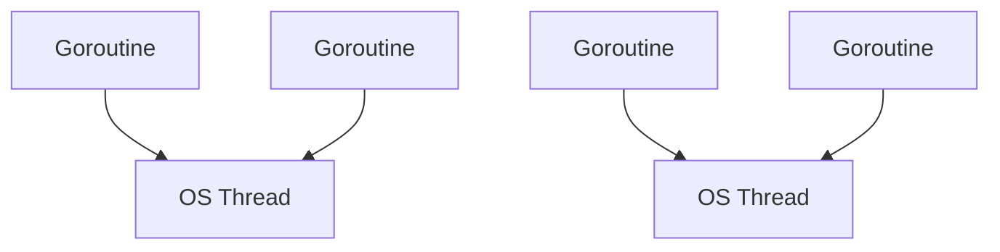
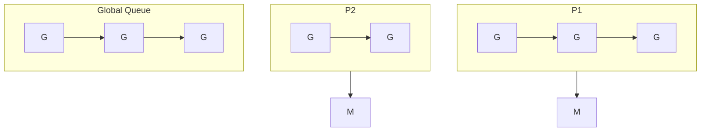
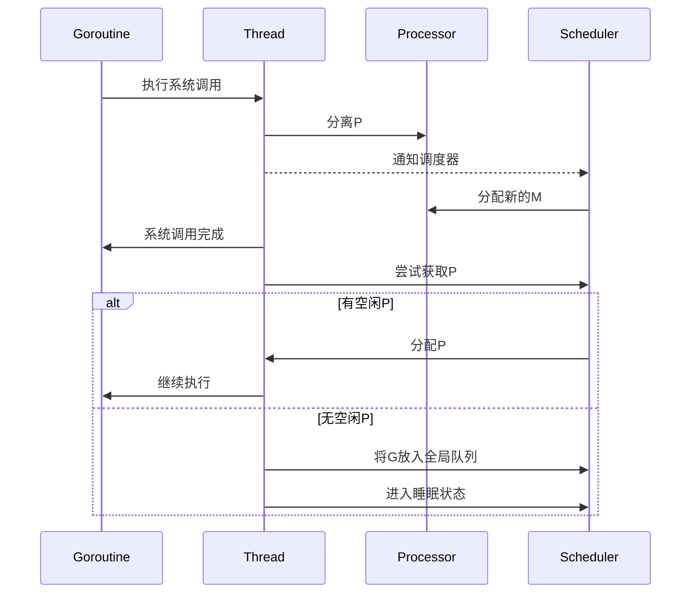

# 调度器原理

## 概述
Go语言的并发模型以轻量级的goroutine为基础，它们由Go运行时的调度器管理，而不是由操作系统直接管理。这种设计使得Go程序可以轻松地运行成千上万的并发任务，同时保持高效的资源利用率。本文深入探讨Go调度器的工作原理、演进历史和内部实现，帮助读者理解Go并发模型的基础架构。

## Go调度器的演进

### 1. G-M模型 (Go 1.0)

Go最初的调度器采用了简单的G-M模型：

- **G (Goroutine)**: 代表一个goroutine，包含栈、指令指针和其他调度相关的信息
- **M (Machine)**: 代表一个操作系统线程，它执行Go代码



这种模型存在一些问题：
- 全局锁导致竞争
- 线程阻塞时，其他goroutine也无法执行
- 缺乏并行性

### 2. G-M-P模型 (Go 1.1+)

为了解决上述问题，Go 1.1引入了G-M-P模型：

- **G (Goroutine)**: 同上，表示一个goroutine
- **M (Machine)**: 同上，表示一个操作系统线程
- **P (Processor)**: 新增的概念，表示一个处理器，它持有一个本地的goroutine队列



G-M-P模型的优势：
- 每个P拥有本地队列，减少了全局竞争
- 当M阻塞时，P可以将其任务交给其他M继续执行
- 可以充分利用多核处理器

### 3. 非均匀内存访问优化 (Go 1.5+)

Go 1.5引入了对NUMA (Non-Uniform Memory Access) 架构的优化，并改进了调度器的工作窃取算法。

### 4. 异步抢占 (Go 1.14+)

Go 1.14引入了异步抢占，解决了长时间运行的goroutine阻塞调度的问题。

## 调度器核心组件

### 1. G (Goroutine)

Goroutine是Go并发模型的基本单位，它是一个轻量级的"用户空间线程"。

```go
type g struct {
    stack       stack   // 栈内存范围 [stack.lo, stack.hi)
    stackguard0 uintptr // 用于栈溢出检查
    stackguard1 uintptr
    
    _panic      *_panic // 内部链表，存储panic信息
    _defer      *_defer // 内部链表，存储defer信息
    
    m           *m      // 当前执行该goroutine的M
    sched       gobuf   // 调度信息，存储goroutine上下文
    
    // 其他字段...
}

type gobuf struct {
    sp   uintptr // 栈指针
    pc   uintptr // 程序计数器
    g    guintptr // goroutine指针
    ctxt unsafe.Pointer // 上下文
    // 其他字段...
}
```

Goroutine的生命周期状态：
- **_Gidle**: 刚刚被分配，还没有初始化
- **_Grunnable**: 等待在运行队列中
- **_Grunning**: 正在执行
- **_Gsyscall**: 正在执行系统调用
- **_Gwaiting**: 阻塞，等待某些条件满足
- **_Gdead**: 未在使用，可能已经退出
- **_Gcopystack**: 正在执行栈复制，栈大小调整
- **_Gscan**: GC正在扫描栈空间
- **_Gscanrunnable**: GC扫描等待运行的goroutine
- **_Gscanwaiting**: GC扫描等待中的goroutine

### 2. M (Machine)

M代表一个操作系统线程，它由调度器负责创建和管理。

```go
type m struct {
    g0        *g        // 用于执行调度指令的特殊goroutine
    curg      *g        // 当前运行的goroutine
    p         puintptr  // 关联的P或nil
    nextp     puintptr  // 下一个要绑定的P
    id        int64
    spinning  bool      // 是否在寻找可运行的goroutine
    blocked   bool      // 是否阻塞在调度器锁上
    // 其他字段...
}
```

M的主要特性：
- M数量受GOMAXPROCS限制，但可能超过该值（如系统调用）
- 每个M有一个特殊的g0，用于执行调度代码
- 当M执行系统调用时，它会脱离P
- 空闲的M会被放入调度器的空闲列表中

### 3. P (Processor)

P是Go调度器的核心，它包含了运行goroutine所需的资源，并维护一个本地的goroutine队列。

```go
type p struct {
    id        int32
    status    uint32    // p状态，如_Pidle, _Prunning
    link      puintptr  // 链接到下一个P
    m         muintptr  // 关联的M或nil
    mcache    *mcache   // 内存分配缓存
    
    runqhead  uint32    // 本地goroutine队列头部位置
    runqtail  uint32    // 本地goroutine队列尾部位置
    runq      [256]guintptr // 本地goroutine队列
    
    runnext   guintptr  // 下一个要执行的goroutine
    
    // 其他字段...
}
```

P的主要状态：
- **_Pidle**: 空闲，没有执行任何goroutine
- **_Prunning**: 正在执行goroutine
- **_Psyscall**: 系统调用中
- **_Pgcstop**: 暂停，等待GC
- **_Pdead**: 未使用

P的数量由GOMAXPROCS决定，默认等于CPU核心数。

## 调度过程

### 1. 创建Goroutine

当我们使用`go`关键字创建一个goroutine时，调度器会：

1. 从P的空闲G池或全局空闲G池获取一个G
2. 初始化G，设置栈和入口函数
3. 将G放入P的本地队列或全局队列

```go
func newproc(siz int32, fn *funcval) {
    // 获取当前g
    gp := getg()
    
    // 获取参数指针
    argp := add(unsafe.Pointer(&fn), sys.PtrSize)
    
    // 获取调用者的PC
    pc := getcallerpc()
    
    // 加锁并创建新的g
    systemstack(func() {
        newg := newproc1(fn, argp, siz, gp, pc)
        
        // 将新g加入运行队列
        runqput(gp.m.p.ptr(), newg, true)
        
        // 如果有空闲的P和M，则尝试唤醒一个工作线程
        if atomic.Load(&sched.npidle) != 0 && atomic.Load(&sched.nmspinning) == 0 {
            wakep()
        }
    })
}
```

### 2. Goroutine调度

Go的调度器采用协作式调度加部分抢占式调度：

- **协作式调度**：goroutine在特定点（如函数调用、channel操作）主动让出CPU
- **抢占式调度**：调度器会在垃圾回收或长时间运行时尝试抢占goroutine

调度时机：
1. `go`语句创建新的goroutine
2. 垃圾回收导致STW（Stop The World）
3. 系统调用阻塞
4. 同步操作阻塞（如mutex、channel）
5. sysmon定期抢占（Go 1.14+）

### 3. 调度循环

调度器的核心是schedule()函数，它在无限循环中执行：

```go
func schedule() {
    // 获取当前g
    gp := getg()
    
    // 必须在系统栈上运行
    if gp.m.locks != 0 {
        throw("schedule: holding locks")
    }
    
    // 调度循环
    for {
        // 尝试从本地队列、全局队列或其他P的队列获取一个goroutine
        gp = findrunnable()
        
        // 执行找到的goroutine
        execute(gp)
    }
}
```

findrunnable() 寻找可运行的goroutine的顺序是：
1. 从当前P的runnext获取
2. 从当前P的本地队列获取
3. 从全局队列获取
4. 从网络轮询器获取
5. 从其他P的队列窃取 (work stealing)

### 4. 工作窃取

为了提高调度效率，Go调度器实现了工作窃取算法：

1. 当P的本地队列为空时，它会从全局队列获取goroutine
2. 如果全局队列也为空，它会随机选择另一个P，并窃取一半的goroutine

```go
// 工作窃取伪代码
func stealWork(p *p) *g {
    // 随机选择一个受害者P
    victim := pickRandomP()
    
    // 尝试从受害者P的队列窃取goroutine
    if victim.runqhead != victim.runqtail {
        // 窃取一半的goroutine
        n := (victim.runqtail - victim.runqhead) / 2
        stolen := make([]*g, n)
        
        // 从受害者P的队列尾部窃取
        for i := 0; i < n; i++ {
            stolen[i] = victim.runq[victim.runqtail-i-1]
        }
        
        // 更新受害者P的队列尾部
        victim.runqtail -= n
        
        // 将窃取的goroutine放入当前P的队列
        for i := 0; i < n; i++ {
            runqput(p, stolen[i], false)
        }
        
        // 返回一个窃取的goroutine
        return stolen[0]
    }
    
    return nil
}
```

### 5. 系统调用处理

当goroutine执行系统调用时：

1. M会将自己与P分离
2. 调度器可能会创建一个新的M来接管该P
3. 系统调用返回后，M会尝试重新获取一个P
4. 如果没有可用的P，M会将goroutine放入全局队列，然后进入睡眠状态



## 调度器性能优化

### 1. 本地队列

每个P维护一个本地goroutine队列，减少了全局锁竞争。本地队列的大小为256，采用环形缓冲区实现。

### 2. 全局队列

当P的本地队列满时，它会将一半的goroutine移到全局队列。全局队列由互斥锁保护，所有P都可以访问。

### 3. 运行队列平衡

调度器通过工作窃取保持P之间的负载平衡，防止某些P过载而其他P空闲。

### 4. 自旋线程

为了减少线程创建和销毁的开销，调度器会保持一定数量的自旋线程（spinning threads），它们在寻找可运行的goroutine。

```go
// 自旋线程算法伪代码
func findRunnable() *g {
    // 标记为自旋状态
    m.spinning = true
    atomic.Add(&sched.nmspinning, 1)
    
    // 寻找工作的逻辑
    for {
        // 尝试从各种队列获取goroutine
        if gp := runqget(p); gp != nil {
            return gp
        }
        if gp := globrunqget(p); gp != nil {
            return gp
        }
        if gp := stealWork(p); gp != nil {
            return gp
        }
        
        // 没找到工作，停止自旋
        m.spinning = false
        atomic.Add(&sched.nmspinning, -1)
        
        // 检查全局队列
        if !runqempty(p) {
            m.spinning = true
            atomic.Add(&sched.nmspinning, 1)
            continue
        }
        
        // 休眠
        stopm()
        break
    }
}
```

### 5. 系统监控线程

Go运行时有一个系统监控线程sysmon，它定期检查：

1. 长时间运行的goroutine，尝试抢占它们
2. 长时间处于系统调用的P，将其与M分离
3. 长时间没有GC的内存，触发GC
4. 调度器的整体状态

```go
func sysmon() {
    // 设置初始扫描周期
    scanperiod := 20 * 1000 * 1000 // 20ms
    
    for {
        // 休眠一段时间
        usleep(scanperiod)
        
        // 动态调整扫描周期
        if idle == 0 {
            scanperiod = 20 * 1000 * 1000 // 20ms
        } else {
            scanperiod = 10 * 1000 * 1000 // 10ms
        }
        
        // 检查长时间运行的goroutine
        if retake(now) != 0 {
            idle = 0
        }
        
        // 检查网络轮询器
        if pollWork() {
            idle = 0
        }
        
        // 检查GC
        if atomic.Load(&forcegc.idle) != 0 {
            lock(&forcegc.lock)
            forcegc.idle = 0
            var list gList
            list.push(forcegc.g)
            injectglist(&list)
            unlock(&forcegc.lock)
        }
        
        // 检查未使用的内存
        if t := (gcTrigger{kind: gcTriggerTime, now: now}); t.test() && atomic.Load(&forcegc.idle) == 0 {
            gcStart(t)
        }
    }
}
```

## 调度器的实际应用

### 1. GOMAXPROCS设置

GOMAXPROCS控制可以同时执行Go代码的操作系统线程数量：

```go
// 设置GOMAXPROCS为CPU核心数
runtime.GOMAXPROCS(runtime.NumCPU())

// 获取当前GOMAXPROCS值
n := runtime.GOMAXPROCS(0)
fmt.Println("Current GOMAXPROCS:", n)
```

GOMAXPROCS设置的考虑因素：
- CPU密集型应用：设置为CPU核心数或略低
- I/O密集型应用：可以设置为CPU核心数的1.5~2倍
- 内存受限环境：可以设置较低值减少内存使用

### 2. Goroutine泄漏检测

Goroutine泄漏是常见的并发问题，可以通过以下方法检测：

```go
// 使用runtime.NumGoroutine()检测
before := runtime.NumGoroutine()
// 执行可能导致goroutine泄漏的操作
after := runtime.NumGoroutine()
fmt.Println("Goroutine增加:", after - before)

// 使用pprof分析goroutine
import _ "net/http/pprof"

func main() {
    go func() {
        http.ListenAndServe("localhost:6060", nil)
    }()
    
    // 应用代码
}

// 然后使用: go tool pprof http://localhost:6060/debug/pprof/goroutine
```

### 3. 调度跟踪

Go提供了调度跟踪工具，帮助分析调度行为：

```go
// 启用跟踪
f, err := os.Create("trace.out")
if err != nil {
    panic(err)
}
defer f.Close()

err = trace.Start(f)
if err != nil {
    panic(err)
}
defer trace.Stop()

// 应用代码

// 使用: go tool trace trace.out
```

### 4. 调度器统计信息

可以通过以下方式查看调度器统计信息：

```go
// 打印调度器统计信息
var stats runtime.MemStats
runtime.ReadMemStats(&stats)
fmt.Printf("Goroutines: %d\n", runtime.NumGoroutine())
fmt.Printf("OS threads: %d\n", pprof.Lookup("threadcreate").Count())
fmt.Printf("GOMAXPROCS: %d\n", runtime.GOMAXPROCS(0))
```

## 调度器优化实践

### 1. 避免阻塞M

系统调用会阻塞M，如果过多的M被阻塞，可能会创建过多的线程：

```go
// 不好的做法：在goroutine中直接进行阻塞IO
func processFiles(files []string) {
    for _, file := range files {
        go func(file string) {
            // 阻塞系统调用
            data, err := ioutil.ReadFile(file)
            // 处理数据...
        }(file)
    }
}

// 更好的做法：使用非阻塞IO或限制并发数
func processFiles(files []string) {
    // 限制并发数
    sem := make(chan struct{}, 10)
    
    for _, file := range files {
        sem <- struct{}{} // 获取令牌
        go func(file string) {
            defer func() { <-sem }() // 释放令牌
            
            // 阻塞系统调用
            data, err := ioutil.ReadFile(file)
            // 处理数据...
        }(file)
    }
}
```

### 2. 负载均衡

确保工作负载均匀分布在所有P上：

```go
// 不好的做法：单一goroutine处理所有任务，其他goroutine等待
func processData(items []Item) {
    results := make(chan Result, len(items))
    
    go func() {
        for _, item := range items {
            // 处理所有项目
            results <- process(item)
        }
    }()
    
    // 收集结果
    for i := 0; i < len(items); i++ {
        <-results
    }
}

// 更好的做法：使用工作池分散负载
func processData(items []Item) {
    numWorkers := runtime.GOMAXPROCS(0)
    results := make(chan Result, len(items))
    itemsChan := make(chan Item, len(items))
    
    // 创建工作池
    for i := 0; i < numWorkers; i++ {
        go func() {
            for item := range itemsChan {
                results <- process(item)
            }
        }()
    }
    
    // 发送任务
    for _, item := range items {
        itemsChan <- item
    }
    close(itemsChan)
    
    // 收集结果
    for i := 0; i < len(items); i++ {
        <-results
    }
}
```

### 3. 避免过多的goroutine

创建过多的goroutine会增加调度开销：

```go
// 不好的做法：为每个任务创建一个goroutine
func processRequests(requests []*Request) {
    for _, req := range requests {
        go processRequest(req) // 可能创建成千上万的goroutine
    }
}

// 更好的做法：使用工作池或批处理
func processRequests(requests []*Request) {
    // 批处理
    const batchSize = 100
    for i := 0; i < len(requests); i += batchSize {
        end := i + batchSize
        if end > len(requests) {
            end = len(requests)
        }
        
        batch := requests[i:end]
        go func(batch []*Request) {
            for _, req := range batch {
                processRequest(req)
            }
        }(batch)
    }
}
```

### 4. 使用协作式抢占

Go 1.14之前，需要确保CPU密集型循环能够被抢占：

```go
// Go 1.14之前，长时间循环可能无法被抢占
func compute() {
    sum := 0
    for i := 0; i < 1e10; i++ {
        sum += i
    }
}

// 添加协作点允许抢占
func compute() {
    sum := 0
    for i := 0; i < 1e10; i++ {
        if i % 1e6 == 0 {
            runtime.Gosched() // 允许其他goroutine运行
        }
        sum += i
    }
}

// Go 1.14+，调度器可以抢占CPU密集型循环
func compute() {
    sum := 0
    for i := 0; i < 1e10; i++ {
        sum += i // 可以被异步抢占
    }
}
```

## 总结

Go语言的调度器是其并发模型的核心，通过G-M-P设计实现了高效的goroutine调度。主要特点包括：

1. **轻量级**：goroutine只需要几KB内存，可以创建数百万个
2. **自动伸缩**：栈大小根据需要自动增长和收缩
3. **协作式与抢占式结合**：既有主动让出CPU的机制，也有强制抢占的能力
4. **工作窃取**：保证负载均衡，提高CPU利用率
5. **多级队列**：本地队列加全局队列，减少锁竞争

理解调度器的工作原理，有助于编写更高效的Go并发程序，避免常见的性能陷阱和并发问题。

## 相关知识点
- [Goroutine基础](./Goroutine基础.md)
- [并发安全和数据竞争](./并发安全和数据竞争.md)
- [高级Goroutine管理](./高级Goroutine管理.md)
- [并发设计模式](./并发设计模式.md)
- [高级特性/内存管理和GC](../高级特性/内存管理和GC.md)
