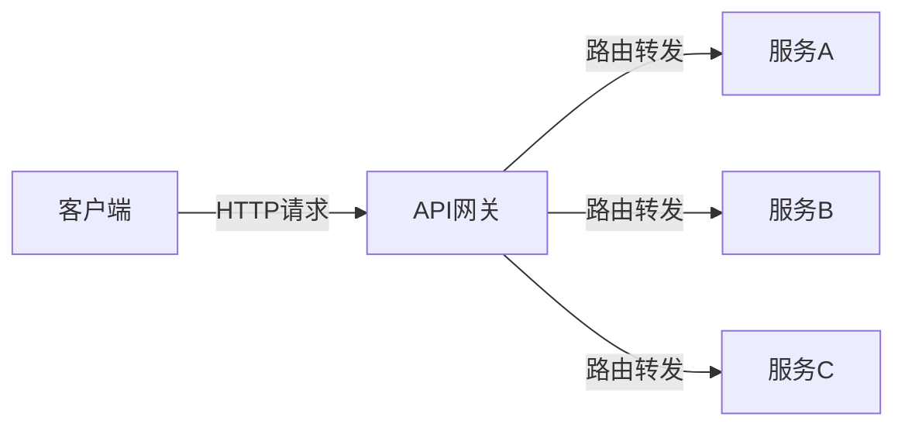
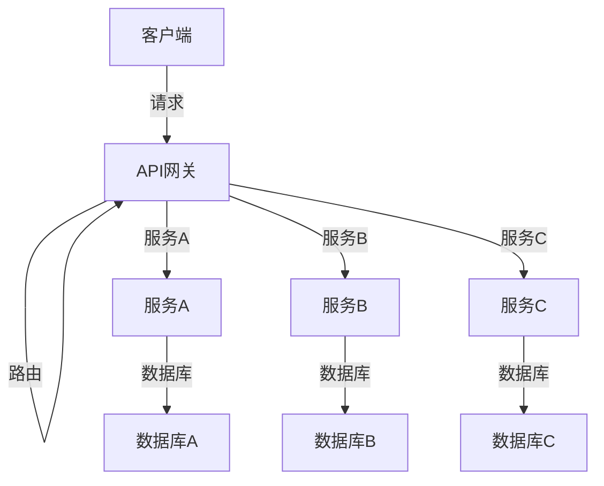

# API网关

## 概述
API网关是微服务架构中的核心组件，作为客户端与微服务系统之间的中间层，它统一管理和路由API请求、处理横切关注点如认证、日志和监控等。在云原生环境中，API网关不仅简化了客户端与服务的交互，还提供了系统弹性和安全性保障。Go语言因其高性能、低资源消耗和强大的并发能力，成为实现API网关的理想选择。

## API网关的核心功能

### 1. 请求路由与转发

API网关最基本的功能是将客户端请求路由到相应的微服务。



#### 基本路由实现

```go
// 基础路由转发
type APIGateway struct {
    routes map[string]string
    client *http.Client
}

func NewAPIGateway() *APIGateway {
    return &APIGateway{
        routes: make(map[string]string),
        client: &http.Client{Timeout: 10 * time.Second},
    }
}

func (g *APIGateway) AddRoute(prefix, target string) {
    g.routes[prefix] = target
}

func (g *APIGateway) ServeHTTP(w http.ResponseWriter, r *http.Request) {
    // 寻找最长匹配的路由前缀
    var targetURL string
    var matchedPrefix string
    
    for prefix, target := range g.routes {
        if strings.HasPrefix(r.URL.Path, prefix) {
            if len(prefix) > len(matchedPrefix) {
                matchedPrefix = prefix
                targetURL = target
            }
        }
    }
    
    if targetURL == "" {
        http.Error(w, "Service not found", http.StatusNotFound)
        return
    }
    
    // 构建目标URL
    targetPath := strings.TrimPrefix(r.URL.Path, matchedPrefix)
    proxyURL := targetURL + targetPath
    if r.URL.RawQuery != "" {
        proxyURL += "?" + r.URL.RawQuery
    }
    
    // 创建代理请求
    proxyReq, err := http.NewRequest(r.Method, proxyURL, r.Body)
    if err != nil {
        http.Error(w, "Error creating proxy request", http.StatusInternalServerError)
        return
    }
    
    // 复制原始请求的头信息
    for key, values := range r.Header {
        for _, value := range values {
            proxyReq.Header.Add(key, value)
        }
    }
    
    // 发送请求
    resp, err := g.client.Do(proxyReq)
    if err != nil {
        http.Error(w, "Error forwarding request", http.StatusInternalServerError)
        return
    }
    defer resp.Body.Close()
    
    // 复制响应头
    for key, values := range resp.Header {
        for _, value := range values {
            w.Header().Add(key, value)
        }
    }
    
    // 设置状态码
    w.WriteHeader(resp.StatusCode)
    
    // 复制响应体
    io.Copy(w, resp.Body)
}
```

### 2. 认证与授权

API网关集中处理认证和授权，简化微服务安全实现。

```go
// JWT认证中间件
type JWTAuthMiddleware struct {
    secretKey []byte
    next      http.Handler
}

func NewJWTAuthMiddleware(secretKey string, next http.Handler) *JWTAuthMiddleware {
    return &JWTAuthMiddleware{
        secretKey: []byte(secretKey),
        next:      next,
    }
}

func (m *JWTAuthMiddleware) ServeHTTP(w http.ResponseWriter, r *http.Request) {
    // 从请求头获取JWT令牌
    authHeader := r.Header.Get("Authorization")
    if authHeader == "" {
        http.Error(w, "Authorization header required", http.StatusUnauthorized)
        return
    }
    
    // 提取令牌
    tokenParts := strings.Split(authHeader, " ")
    if len(tokenParts) != 2 || tokenParts[0] != "Bearer" {
        http.Error(w, "Invalid authorization format", http.StatusUnauthorized)
        return
    }
    tokenString := tokenParts[1]
    
    // 解析JWT令牌
    token, err := jwt.Parse(tokenString, func(token *jwt.Token) (interface{}, error) {
        // 验证签名算法
        if _, ok := token.Method.(*jwt.SigningMethodHMAC); !ok {
            return nil, fmt.Errorf("unexpected signing method: %v", token.Header["alg"])
        }
        return m.secretKey, nil
    })
    
    if err != nil {
        http.Error(w, "Invalid token: "+err.Error(), http.StatusUnauthorized)
        return
    }
    
    // 验证令牌是否有效
    if !token.Valid {
        http.Error(w, "Invalid token", http.StatusUnauthorized)
        return
    }
    
    // 从令牌中提取声明
    claims, ok := token.Claims.(jwt.MapClaims)
    if !ok {
        http.Error(w, "Invalid token claims", http.StatusUnauthorized)
        return
    }
    
    // 检查是否过期
    if exp, ok := claims["exp"].(float64); ok {
        if time.Now().Unix() > int64(exp) {
            http.Error(w, "Token expired", http.StatusUnauthorized)
            return
        }
    }
    
    // 将用户信息添加到请求上下文
    ctx := context.WithValue(r.Context(), "user", claims)
    
    // 调用下一个处理器
    m.next.ServeHTTP(w, r.WithContext(ctx))
}

// 基于角色的授权中间件
type RBACMiddleware struct {
    requiredRole string
    next         http.Handler
}

func NewRBACMiddleware(role string, next http.Handler) *RBACMiddleware {
    return &RBACMiddleware{
        requiredRole: role,
        next:         next,
    }
}

func (m *RBACMiddleware) ServeHTTP(w http.ResponseWriter, r *http.Request) {
    // 从上下文中获取用户信息
    userClaims, ok := r.Context().Value("user").(jwt.MapClaims)
    if !ok {
        http.Error(w, "Unauthorized", http.StatusUnauthorized)
        return
    }
    
    // 检查用户角色
    roles, ok := userClaims["roles"].([]interface{})
    if !ok {
        http.Error(w, "No roles specified", http.StatusForbidden)
        return
    }
    
    // 检查是否有所需角色
    hasRole := false
    for _, role := range roles {
        if roleStr, ok := role.(string); ok && roleStr == m.requiredRole {
            hasRole = true
            break
        }
    }
    
    if !hasRole {
        http.Error(w, "Insufficient permissions", http.StatusForbidden)
        return
    }
    
    // 调用下一个处理器
    m.next.ServeHTTP(w, r)
}
```

### 3. 速率限制

API网关实现速率限制，防止系统过载和滥用。

```go
// 令牌桶速率限制器
type RateLimiter struct {
    tokens     int
    capacity   int
    refillRate int // tokens per second
    lastRefill time.Time
    mutex      sync.Mutex
    clients    map[string]*ClientBucket // IP地址到客户端桶的映射
}

type ClientBucket struct {
    tokens     int
    lastRefill time.Time
}

func NewRateLimiter(capacity, refillRate int) *RateLimiter {
    return &RateLimiter{
        tokens:     capacity,
        capacity:   capacity,
        refillRate: refillRate,
        lastRefill: time.Now(),
        clients:    make(map[string]*ClientBucket),
    }
}

func (rl *RateLimiter) refillTokens() {
    now := time.Now()
    elapsed := now.Sub(rl.lastRefill).Seconds()
    tokensToAdd := int(elapsed * float64(rl.refillRate))
    
    if tokensToAdd > 0 {
        rl.tokens = min(rl.capacity, rl.tokens+tokensToAdd)
        rl.lastRefill = now
    }
}

func (rl *RateLimiter) refillClientTokens(clientIP string) {
    bucket, exists := rl.clients[clientIP]
    if !exists {
        // 新客户端，创建一个满的桶
        rl.clients[clientIP] = &ClientBucket{
            tokens:     rl.capacity,
            lastRefill: time.Now(),
        }
        return
    }
    
    now := time.Now()
    elapsed := now.Sub(bucket.lastRefill).Seconds()
    tokensToAdd := int(elapsed * float64(rl.refillRate))
    
    if tokensToAdd > 0 {
        bucket.tokens = min(rl.capacity, bucket.tokens+tokensToAdd)
        bucket.lastRefill = now
    }
}

func (rl *RateLimiter) Allow(clientIP string) bool {
    rl.mutex.Lock()
    defer rl.mutex.Unlock()
    
    // 全局限制
    rl.refillTokens()
    if rl.tokens <= 0 {
        return false
    }
    
    // 客户端限制
    rl.refillClientTokens(clientIP)
    bucket := rl.clients[clientIP]
    if bucket.tokens <= 0 {
        return false
    }
    
    // 消耗令牌
    rl.tokens--
    bucket.tokens--
    return true
}

func min(a, b int) int {
    if a < b {
        return a
    }
    return b
}

// 速率限制中间件
type RateLimitMiddleware struct {
    limiter *RateLimiter
    next    http.Handler
}

func NewRateLimitMiddleware(limiter *RateLimiter, next http.Handler) *RateLimitMiddleware {
    return &RateLimitMiddleware{
        limiter: limiter,
        next:    next,
    }
}

func (m *RateLimitMiddleware) ServeHTTP(w http.ResponseWriter, r *http.Request) {
    // 获取客户端IP
    clientIP := r.RemoteAddr
    if forwardedFor := r.Header.Get("X-Forwarded-For"); forwardedFor != "" {
        clientIP = strings.Split(forwardedFor, ",")[0]
    }
    
    // 检查速率限制
    if !m.limiter.Allow(clientIP) {
        w.Header().Set("Retry-After", "1") // 建议1秒后重试
        http.Error(w, "Rate limit exceeded", http.StatusTooManyRequests)
        return
    }
    
    // 调用下一个处理器
    m.next.ServeHTTP(w, r)
}
```

### 4. 请求聚合

API网关可以聚合多个微服务的响应，减少客户端请求次数。

```go
// 请求聚合处理器
type AggregationHandler struct {
    services map[string]string // 服务名到URL的映射
    client   *http.Client
}

func NewAggregationHandler() *AggregationHandler {
    return &AggregationHandler{
        services: make(map[string]string),
        client:   &http.Client{Timeout: 5 * time.Second},
    }
}

func (h *AggregationHandler) AddService(name, url string) {
    h.services[name] = url
}

func (h *AggregationHandler) ServeHTTP(w http.ResponseWriter, r *http.Request) {
    // 解析聚合请求
    var requestBody struct {
        Requests map[string]struct {
            Path   string            `json:"path"`
            Method string            `json:"method"`
            Body   interface{}       `json:"body,omitempty"`
            Headers map[string]string `json:"headers,omitempty"`
        } `json:"requests"`
    }
    
    if err := json.NewDecoder(r.Body).Decode(&requestBody); err != nil {
        http.Error(w, "Invalid request: "+err.Error(), http.StatusBadRequest)
        return
    }
    
    // 执行并发请求
    var wg sync.WaitGroup
    resultsMutex := sync.Mutex{}
    results := make(map[string]interface{})
    errors := make(map[string]string)
    
    for serviceName, request := range requestBody.Requests {
        wg.Add(1)
        go func(name string, req struct {
            Path   string
            Method string
            Body   interface{}
            Headers map[string]string
        }) {
            defer wg.Done()
            
            serviceURL, ok := h.services[name]
            if !ok {
                resultsMutex.Lock()
                errors[name] = "Service not found"
                resultsMutex.Unlock()
                return
            }
            
            // 创建请求
            var reqBody io.Reader
            if req.Body != nil {
                jsonBody, err := json.Marshal(req.Body)
                if err != nil {
                    resultsMutex.Lock()
                    errors[name] = "Invalid request body: " + err.Error()
                    resultsMutex.Unlock()
                    return
                }
                reqBody = bytes.NewBuffer(jsonBody)
            }
            
            // 构建URL
            url := serviceURL + req.Path
            
            // 创建HTTP请求
            httpReq, err := http.NewRequest(req.Method, url, reqBody)
            if err != nil {
                resultsMutex.Lock()
                errors[name] = "Error creating request: " + err.Error()
                resultsMutex.Unlock()
                return
            }
            
            // 设置头信息
            for key, value := range req.Headers {
                httpReq.Header.Set(key, value)
            }
            
            // 默认设置为JSON
            if httpReq.Header.Get("Content-Type") == "" {
                httpReq.Header.Set("Content-Type", "application/json")
            }
            
            // 发送请求
            resp, err := h.client.Do(httpReq)
            if err != nil {
                resultsMutex.Lock()
                errors[name] = "Error sending request: " + err.Error()
                resultsMutex.Unlock()
                return
            }
            defer resp.Body.Close()
            
            // 读取响应
            respBody, err := ioutil.ReadAll(resp.Body)
            if err != nil {
                resultsMutex.Lock()
                errors[name] = "Error reading response: " + err.Error()
                resultsMutex.Unlock()
                return
            }
            
            // 解析JSON响应
            var respData interface{}
            if err := json.Unmarshal(respBody, &respData); err != nil {
                // 如果不是JSON，则返回字符串
                resultsMutex.Lock()
                results[name] = string(respBody)
                resultsMutex.Unlock()
                return
            }
            
            // 保存结果
            resultsMutex.Lock()
            results[name] = respData
            resultsMutex.Unlock()
        }(serviceName, request)
    }
    
    // 等待所有请求完成
    wg.Wait()
    
    // 构建聚合响应
    response := map[string]interface{}{
        "results": results,
    }
    
    if len(errors) > 0 {
        response["errors"] = errors
    }
    
    // 返回结果
    w.Header().Set("Content-Type", "application/json")
    if err := json.NewEncoder(w).Encode(response); err != nil {
        http.Error(w, "Error encoding response", http.StatusInternalServerError)
        return
    }
}
```

### 5. 熔断器模式

API网关实现熔断器模式，防止级联故障。

```go
// 熔断器状态
type CircuitState int

const (
    StateClosed CircuitState = iota // 闭合状态：请求正常通过
    StateOpen                       // 开路状态：请求被拒绝
    StateHalfOpen                   // 半开状态：允许有限请求通过以测试系统恢复
)

// 熔断器
type CircuitBreaker struct {
    state          CircuitState
    failureThreshold int
    successThreshold int
    timeout        time.Duration
    failures       int
    successes      int
    lastStateChange time.Time
    mutex          sync.Mutex
}

func NewCircuitBreaker(failureThreshold, successThreshold int, timeout time.Duration) *CircuitBreaker {
    return &CircuitBreaker{
        state:            StateClosed,
        failureThreshold: failureThreshold,
        successThreshold: successThreshold,
        timeout:          timeout,
        failures:         0,
        successes:        0,
        lastStateChange:  time.Now(),
    }
}

func (cb *CircuitBreaker) Execute(req *http.Request, client *http.Client) (*http.Response, error) {
    cb.mutex.Lock()
    
    // 检查状态
    switch cb.state {
    case StateOpen:
        // 检查是否过了超时时间
        if time.Since(cb.lastStateChange) > cb.timeout {
            cb.state = StateHalfOpen
            cb.lastStateChange = time.Now()
            cb.successes = 0
        } else {
            cb.mutex.Unlock()
            return nil, fmt.Errorf("circuit breaker is open")
        }
    case StateHalfOpen:
        // 半开状态仅允许有限数量的请求通过
        if cb.successes >= cb.successThreshold {
            cb.state = StateClosed
            cb.failures = 0
            cb.lastStateChange = time.Now()
        }
    case StateClosed:
        // 闭合状态正常处理
    }
    
    cb.mutex.Unlock()
    
    // 执行请求
    resp, err := client.Do(req)
    
    cb.mutex.Lock()
    defer cb.mutex.Unlock()
    
    // 更新熔断器状态
    if err != nil || (resp != nil && resp.StatusCode >= 500) {
        // 请求失败
        cb.failures++
        if cb.state == StateClosed && cb.failures >= cb.failureThreshold {
            cb.state = StateOpen
            cb.lastStateChange = time.Now()
        } else if cb.state == StateHalfOpen {
            cb.state = StateOpen
            cb.lastStateChange = time.Now()
        }
        return resp, err
    } else {
        // 请求成功
        if cb.state == StateHalfOpen {
            cb.successes++
            if cb.successes >= cb.successThreshold {
                cb.state = StateClosed
                cb.failures = 0
                cb.lastStateChange = time.Now()
            }
        } else if cb.state == StateClosed {
            cb.failures = 0
        }
        return resp, nil
    }
}

// 熔断器中间件
type CircuitBreakerMiddleware struct {
    breakers map[string]*CircuitBreaker // 服务名到熔断器的映射
    next     http.Handler
    client   *http.Client
}

func NewCircuitBreakerMiddleware(next http.Handler) *CircuitBreakerMiddleware {
    return &CircuitBreakerMiddleware{
        breakers: make(map[string]*CircuitBreaker),
        next:     next,
        client:   &http.Client{Timeout: 10 * time.Second},
    }
}

func (m *CircuitBreakerMiddleware) AddBreaker(service string, failureThreshold, successThreshold int, timeout time.Duration) {
    m.breakers[service] = NewCircuitBreaker(failureThreshold, successThreshold, timeout)
}

func (m *CircuitBreakerMiddleware) ServeHTTP(w http.ResponseWriter, r *http.Request) {
    // 提取目标服务 (这里假设通过路径的第一部分确定服务)
    parts := strings.Split(strings.Trim(r.URL.Path, "/"), "/")
    if len(parts) == 0 {
        http.Error(w, "Invalid path", http.StatusBadRequest)
        return
    }
    
    service := parts[0]
    breaker, exists := m.breakers[service]
    
    // 如果服务没有熔断器配置，直接转发
    if !exists {
        m.next.ServeHTTP(w, r)
        return
    }
    
    // 创建一个自定义的ResponseWriter来捕获状态码
    rw := &responseWriter{
        ResponseWriter: w,
        statusCode:     http.StatusOK,
    }
    
    // 使用熔断器执行请求
    err := m.executeWithBreaker(breaker, rw, r)
    if err != nil {
        http.Error(w, "Service unavailable", http.StatusServiceUnavailable)
        return
    }
}

// 自定义ResponseWriter以捕获状态码
type responseWriter struct {
    http.ResponseWriter
    statusCode int
}

func (rw *responseWriter) WriteHeader(code int) {
    rw.statusCode = code
    rw.ResponseWriter.WriteHeader(code)
}

func (m *CircuitBreakerMiddleware) executeWithBreaker(breaker *CircuitBreaker, w http.ResponseWriter, r *http.Request) error {
    // 创建一个新的请求用于熔断器执行
    proxyReq, err := http.NewRequest(r.Method, r.URL.String(), r.Body)
    if err != nil {
        return err
    }
    
    // 复制原始请求的头信息
    for key, values := range r.Header {
        for _, value := range values {
            proxyReq.Header.Add(key, value)
        }
    }
    
    // 使用熔断器执行请求
    resp, err := breaker.Execute(proxyReq, m.client)
    if err != nil {
        return err
    }
    defer resp.Body.Close()
    
    // 复制响应头
    for key, values := range resp.Header {
        for _, value := range values {
            w.Header().Add(key, value)
        }
    }
    
    // 设置状态码
    w.WriteHeader(resp.StatusCode)
    
    // 复制响应体
    _, err = io.Copy(w, resp.Body)
    return err
}
```

## 使用Go构建API网关

### 1. 使用标准库构建简单网关

```go
// 简单API网关实现
package main

import (
    "log"
    "net/http"
    "time"
)

func main() {
    // 创建API网关
    gateway := NewAPIGateway()
    
    // 添加路由
    gateway.AddRoute("/users", "http://user-service:8080")
    gateway.AddRoute("/products", "http://product-service:8080")
    gateway.AddRoute("/orders", "http://order-service:8080")
    
    // 创建速率限制器
    rateLimiter := NewRateLimiter(100, 10) // 容量100，每秒补充10个令牌
    
    // 创建认证中间件
    authMiddleware := NewJWTAuthMiddleware("your-secret-key", nil)
    
    // 创建速率限制中间件
    rateLimitMiddleware := NewRateLimitMiddleware(rateLimiter, gateway)
    
    // 组合中间件
    handler := authMiddleware
    authMiddleware.next = rateLimitMiddleware
    
    // 启动服务器
    server := &http.Server{
        Addr:         ":8000",
        Handler:      handler,
        ReadTimeout:  5 * time.Second,
        WriteTimeout: 10 * time.Second,
        IdleTimeout:  120 * time.Second,
    }
    
    log.Println("API Gateway starting on :8000")
    log.Fatal(server.ListenAndServe())
}
```

### 2. 使用开源框架

#### 使用Chi框架

```go
// 使用Chi框架的API网关
package main

import (
    "log"
    "net/http"
    "time"
    
    "github.com/go-chi/chi/v5"
    "github.com/go-chi/chi/v5/middleware"
)

func main() {
    r := chi.NewRouter()
    
    // 中间件
    r.Use(middleware.RequestID)
    r.Use(middleware.RealIP)
    r.Use(middleware.Logger)
    r.Use(middleware.Recoverer)
    r.Use(middleware.Timeout(30 * time.Second))
    
    // 自定义中间件
    r.Use(func(next http.Handler) http.Handler {
        return NewJWTAuthMiddleware("your-secret-key", next)
    })
    
    // 速率限制中间件
    rateLimiter := NewRateLimiter(100, 10)
    r.Use(func(next http.Handler) http.Handler {
        return NewRateLimitMiddleware(rateLimiter, next)
    })
    
    // 服务路由
    r.Route("/users", func(r chi.Router) {
        r.Use(func(next http.Handler) http.Handler {
            return http.HandlerFunc(func(w http.ResponseWriter, r *http.Request) {
                // 转发到用户服务
                forwardRequest("http://user-service:8080", w, r)
            })
        })
        r.Get("/", func(w http.ResponseWriter, r *http.Request) {})
        r.Post("/", func(w http.ResponseWriter, r *http.Request) {})
        r.Get("/{id}", func(w http.ResponseWriter, r *http.Request) {})
    })
    
    r.Route("/products", func(r chi.Router) {
        r.Use(func(next http.Handler) http.Handler {
            return http.HandlerFunc(func(w http.ResponseWriter, r *http.Request) {
                // 转发到产品服务
                forwardRequest("http://product-service:8080", w, r)
            })
        })
        r.Get("/", func(w http.ResponseWriter, r *http.Request) {})
        r.Get("/{id}", func(w http.ResponseWriter, r *http.Request) {})
    })
    
    // 聚合端点
    r.Post("/aggregate", NewAggregationHandler().ServeHTTP)
    
    // 启动服务器
    server := &http.Server{
        Addr:         ":8000",
        Handler:      r,
        ReadTimeout:  5 * time.Second,
        WriteTimeout: 10 * time.Second,
        IdleTimeout:  120 * time.Second,
    }
    
    log.Println("API Gateway starting on :8000")
    log.Fatal(server.ListenAndServe())
}

func forwardRequest(targetBase string, w http.ResponseWriter, r *http.Request) {
    // 构建目标URL
    targetURL := targetBase + r.URL.Path
    if r.URL.RawQuery != "" {
        targetURL += "?" + r.URL.RawQuery
    }
    
    // 创建代理请求
    proxyReq, err := http.NewRequest(r.Method, targetURL, r.Body)
    if err != nil {
        http.Error(w, "Error creating proxy request", http.StatusInternalServerError)
        return
    }
    
    // 复制原始请求的头信息
    for key, values := range r.Header {
        for _, value := range values {
            proxyReq.Header.Add(key, value)
        }
    }
    
    // 发送请求
    client := &http.Client{Timeout: 10 * time.Second}
    resp, err := client.Do(proxyReq)
    if err != nil {
        http.Error(w, "Error forwarding request", http.StatusInternalServerError)
        return
    }
    defer resp.Body.Close()
    
    // 复制响应头
    for key, values := range resp.Header {
        for _, value := range values {
            w.Header().Add(key, value)
        }
    }
    
    // 设置状态码
    w.WriteHeader(resp.StatusCode)
    
    // 复制响应体
    io.Copy(w, resp.Body)
}
```

### 3. 使用Traefik

Traefik是一个开源的边缘路由器，可以作为API网关使用，特别适合Kubernetes环境。

```yaml
# docker-compose.yml
version: '3'

services:
  traefik:
    image: traefik:v2.5
    command:
      - "--api.insecure=true"
      - "--providers.docker=true"
      - "--providers.docker.exposedbydefault=false"
      - "--entrypoints.web.address=:80"
    ports:
      - "80:80"
      - "8080:8080"
    volumes:
      - /var/run/docker.sock:/var/run/docker.sock

  user-service:
    image: user-service:latest
    labels:
      - "traefik.enable=true"
      - "traefik.http.routers.user.rule=PathPrefix(`/users`)"
      - "traefik.http.services.user.loadbalancer.server.port=8080"

  product-service:
    image: product-service:latest
    labels:
      - "traefik.enable=true"
      - "traefik.http.routers.product.rule=PathPrefix(`/products`)"
      - "traefik.http.services.product.loadbalancer.server.port=8080"

  order-service:
    image: order-service:latest
    labels:
      - "traefik.enable=true"
      - "traefik.http.routers.order.rule=PathPrefix(`/orders`)"
      - "traefik.http.services.order.loadbalancer.server.port=8080"
```

## API网关的最佳实践

### 1. 性能优化

```go
// 使用连接池优化HTTP客户端
func createOptimizedClient() *http.Client {
    transport := &http.Transport{
        Proxy: http.ProxyFromEnvironment,
        DialContext: (&net.Dialer{
            Timeout:   30 * time.Second,
            KeepAlive: 30 * time.Second,
            DualStack: true,
        }).DialContext,
        MaxIdleConns:          100,
        IdleConnTimeout:       90 * time.Second,
        TLSHandshakeTimeout:   10 * time.Second,
        ExpectContinueTimeout: 1 * time.Second,
        MaxIdleConnsPerHost:   10,
        MaxConnsPerHost:       20,
    }
    
    return &http.Client{
        Transport: transport,
        Timeout:   10 * time.Second,
    }
}

// 使用压缩中间件
func CompressionMiddleware(next http.Handler) http.Handler {
    return http.HandlerFunc(func(w http.ResponseWriter, r *http.Request) {
        // 检查客户端是否支持压缩
        if !strings.Contains(r.Header.Get("Accept-Encoding"), "gzip") {
            next.ServeHTTP(w, r)
            return
        }
        
        // 创建gzip writer
        gz := gzip.NewWriter(w)
        defer gz.Close()
        
        // 创建包装的ResponseWriter
        gzw := &gzipResponseWriter{
            ResponseWriter: w,
            Writer:         gz,
        }
        
        // 设置Content-Encoding头
        w.Header().Set("Content-Encoding", "gzip")
        
        // 调用下一个处理器
        next.ServeHTTP(gzw, r)
    })
}

type gzipResponseWriter struct {
    http.ResponseWriter
    Writer *gzip.Writer
}

func (gzw *gzipResponseWriter) Write(data []byte) (int, error) {
    return gzw.Writer.Write(data)
}
```

### 2. 监控与指标收集

```go
// Prometheus指标中间件
func PrometheusMiddleware(next http.Handler) http.Handler {
    // 创建指标
    requestCounter := prometheus.NewCounterVec(
        prometheus.CounterOpts{
            Name: "http_requests_total",
            Help: "Total number of HTTP requests",
        },
        []string{"method", "endpoint", "status"},
    )
    
    requestDuration := prometheus.NewHistogramVec(
        prometheus.HistogramOpts{
            Name:    "http_request_duration_seconds",
            Help:    "HTTP request duration in seconds",
            Buckets: prometheus.DefBuckets,
        },
        []string{"method", "endpoint"},
    )
    
    // 注册指标
    prometheus.MustRegister(requestCounter, requestDuration)
    
    return http.HandlerFunc(func(w http.ResponseWriter, r *http.Request) {
        start := time.Now()
        
        // 创建状态捕获响应写入器
        rw := &statusCapturingResponseWriter{
            ResponseWriter: w,
            status:         http.StatusOK,
        }
        
        // 调用下一个处理器
        next.ServeHTTP(rw, r)
        
        // 记录指标
        duration := time.Since(start).Seconds()
        endpoint := r.URL.Path
        method := r.Method
        status := strconv.Itoa(rw.status)
        
        requestCounter.WithLabelValues(method, endpoint, status).Inc()
        requestDuration.WithLabelValues(method, endpoint).Observe(duration)
    })
}

// 自定义响应写入器，用于捕获状态码
type statusCapturingResponseWriter struct {
    http.ResponseWriter
    status int
}

func (scw *statusCapturingResponseWriter) WriteHeader(code int) {
    scw.status = code
    scw.ResponseWriter.WriteHeader(code)
}
```

### 3. 日志与追踪

```go
// 请求ID中间件
func RequestIDMiddleware(next http.Handler) http.Handler {
    return http.HandlerFunc(func(w http.ResponseWriter, r *http.Request) {
        requestID := r.Header.Get("X-Request-ID")
        if requestID == "" {
            requestID = uuid.New().String()
        }
        
        // 将请求ID添加到响应头
        w.Header().Set("X-Request-ID", requestID)
        
        // 将请求ID添加到上下文
        ctx := context.WithValue(r.Context(), "requestID", requestID)
        
        // 调用下一个处理器
        next.ServeHTTP(w, r.WithContext(ctx))
    })
}

// 结构化日志中间件
func LoggingMiddleware(next http.Handler) http.Handler {
    return http.HandlerFunc(func(w http.ResponseWriter, r *http.Request) {
        start := time.Now()
        
        // 创建状态捕获响应写入器
        rw := &statusCapturingResponseWriter{
            ResponseWriter: w,
            status:         http.StatusOK,
        }
        
        // 从上下文获取请求ID
        requestID, _ := r.Context().Value("requestID").(string)
        
        // 记录请求日志
        log.Printf(
            "request: method=%s path=%s remote_addr=%s request_id=%s",
            r.Method, r.URL.Path, r.RemoteAddr, requestID,
        )
        
        // 调用下一个处理器
        next.ServeHTTP(rw, r)
        
        // 记录响应日志
        duration := time.Since(start).Milliseconds()
        log.Printf(
            "response: method=%s path=%s status=%d duration=%dms request_id=%s",
            r.Method, r.URL.Path, rw.status, duration, requestID,
        )
    })
}
```

### 4. 安全最佳实践

```go
// CORS中间件
func CORSMiddleware(next http.Handler) http.Handler {
    return http.HandlerFunc(func(w http.ResponseWriter, r *http.Request) {
        // 设置CORS头
        w.Header().Set("Access-Control-Allow-Origin", "https://example.com")
        w.Header().Set("Access-Control-Allow-Methods", "GET, POST, PUT, DELETE, OPTIONS")
        w.Header().Set("Access-Control-Allow-Headers", "Content-Type, Authorization")
        w.Header().Set("Access-Control-Max-Age", "86400")
        
        // 处理预检请求
        if r.Method == "OPTIONS" {
            w.WriteHeader(http.StatusOK)
            return
        }
        
        // 调用下一个处理器
        next.ServeHTTP(w, r)
    })
}

// 安全头中间件
func SecurityHeadersMiddleware(next http.Handler) http.Handler {
    return http.HandlerFunc(func(w http.ResponseWriter, r *http.Request) {
        // 设置安全头
        w.Header().Set("X-XSS-Protection", "1; mode=block")
        w.Header().Set("X-Content-Type-Options", "nosniff")
        w.Header().Set("X-Frame-Options", "DENY")
        w.Header().Set("Content-Security-Policy", "default-src 'self'")
        w.Header().Set("Referrer-Policy", "strict-origin-when-cross-origin")
        
        // 调用下一个处理器
        next.ServeHTTP(w, r)
    })
}

// CSRF保护中间件
func CSRFMiddleware(next http.Handler) http.Handler {
    return http.HandlerFunc(func(w http.ResponseWriter, r *http.Request) {
        // 只检查非GET/HEAD/OPTIONS请求
        if r.Method != "GET" && r.Method != "HEAD" && r.Method != "OPTIONS" {
            // 获取CSRF令牌
            csrfToken := r.Header.Get("X-CSRF-Token")
            if csrfToken == "" {
                http.Error(w, "CSRF token required", http.StatusForbidden)
                return
            }
            
            // 验证CSRF令牌
            if !validateCSRFToken(r, csrfToken) {
                http.Error(w, "Invalid CSRF token", http.StatusForbidden)
                return
            }
        }
        
        // 调用下一个处理器
        next.ServeHTTP(w, r)
    })
}

func validateCSRFToken(r *http.Request, token string) bool {
    // 实际实现应该验证令牌是否有效
    // 这里只是一个示例
    expectedToken := getExpectedCSRFToken(r)
    return token == expectedToken
}

func getExpectedCSRFToken(r *http.Request) string {
    // 实际实现应该生成或检索预期的令牌
    // 这里只是一个示例
    return "expected-csrf-token"
}
```

## API网关与微服务架构

### 1. API网关在微服务中的角色



### 2. 与服务发现集成

```go
// 与服务发现集成的API网关
type DiscoveryAwareGateway struct {
    discoveryClient ServiceDiscoveryClient
    loadBalancer    LoadBalancer
    client          *http.Client
}

func NewDiscoveryAwareGateway(discoveryClient ServiceDiscoveryClient, loadBalancer LoadBalancer) *DiscoveryAwareGateway {
    return &DiscoveryAwareGateway{
        discoveryClient: discoveryClient,
        loadBalancer:    loadBalancer,
        client:          createOptimizedClient(),
    }
}

func (g *DiscoveryAwareGateway) ServeHTTP(w http.ResponseWriter, r *http.Request) {
    // 解析路径获取服务名
    parts := strings.Split(strings.Trim(r.URL.Path, "/"), "/")
    if len(parts) == 0 {
        http.Error(w, "Invalid path", http.StatusBadRequest)
        return
    }
    
    serviceName := parts[0]
    
    // 获取服务实例
    instances, err := g.discoveryClient.GetServiceInstances(serviceName)
    if err != nil {
        http.Error(w, "Error finding service: "+err.Error(), http.StatusInternalServerError)
        return
    }
    
    if len(instances) == 0 {
        http.Error(w, "No instances available for service: "+serviceName, http.StatusServiceUnavailable)
        return
    }
    
    // 使用负载均衡器选择实例
    instance, err := g.loadBalancer.Select(instances)
    if err != nil {
        http.Error(w, "Error selecting service instance: "+err.Error(), http.StatusInternalServerError)
        return
    }
    
    // 构建目标URL
    targetPath := "/" + strings.Join(parts[1:], "/")
    targetURL := fmt.Sprintf("http://%s:%d%s", instance.Host, instance.Port, targetPath)
    if r.URL.RawQuery != "" {
        targetURL += "?" + r.URL.RawQuery
    }
    
    // 转发请求
    g.forwardRequest(targetURL, w, r)
}

func (g *DiscoveryAwareGateway) forwardRequest(targetURL string, w http.ResponseWriter, r *http.Request) {
    // 创建代理请求
    proxyReq, err := http.NewRequest(r.Method, targetURL, r.Body)
    if err != nil {
        http.Error(w, "Error creating proxy request", http.StatusInternalServerError)
        return
    }
    
    // 复制原始请求的头信息
    for key, values := range r.Header {
        for _, value := range values {
            proxyReq.Header.Add(key, value)
        }
    }
    
    // 添加请求ID
    requestID := r.Context().Value("requestID")
    if requestID != nil {
        proxyReq.Header.Set("X-Request-ID", requestID.(string))
    }
    
    // 发送请求
    resp, err := g.client.Do(proxyReq)
    if err != nil {
        http.Error(w, "Error forwarding request: "+err.Error(), http.StatusInternalServerError)
        return
    }
    defer resp.Body.Close()
    
    // 复制响应头
    for key, values := range resp.Header {
        for _, value := range values {
            w.Header().Add(key, value)
        }
    }
    
    // 设置状态码
    w.WriteHeader(resp.StatusCode)
    
    // 复制响应体
    io.Copy(w, resp.Body)
}
```

### 3. 部署策略

```yaml
# Kubernetes部署示例
apiVersion: apps/v1
kind: Deployment
metadata:
  name: api-gateway
  labels:
    app: api-gateway
spec:
  replicas: 3
  selector:
    matchLabels:
      app: api-gateway
  template:
    metadata:
      labels:
        app: api-gateway
    spec:
      containers:
      - name: api-gateway
        image: api-gateway:latest
        ports:
        - containerPort: 8000
        resources:
          limits:
            cpu: "1"
            memory: "512Mi"
          requests:
            cpu: "0.5"
            memory: "256Mi"
        livenessProbe:
          httpGet:
            path: /health
            port: 8000
          initialDelaySeconds: 30
          periodSeconds: 10
        readinessProbe:
          httpGet:
            path: /health
            port: 8000
          initialDelaySeconds: 5
          periodSeconds: 5
        env:
        - name: SERVICE_DISCOVERY_URL
          value: "http://consul:8500"
        - name: JWT_SECRET
          valueFrom:
            secretKeyRef:
              name: api-gateway-secrets
              key: jwt-secret
---
apiVersion: v1
kind: Service
metadata:
  name: api-gateway
spec:
  selector:
    app: api-gateway
  ports:
  - port: 80
    targetPort: 8000
  type: LoadBalancer
```

## 相关知识点
- [微服务架构概述](微服务架构概述.md)
- [服务发现](服务发现.md)
- [配置中心](配置中心.md)
- [微服务监控](微服务监控.md)
- [标准库/http网络编程](../标准库/http网络编程.md)
