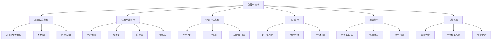

# 微服务监控

## 概述
微服务监控是云原生架构中的关键环节，它允许开发和运维团队深入了解分布式系统的健康状态、性能特征和潜在问题。随着系统规模的扩大和服务数量的增加，有效的监控变得至关重要，它不仅能帮助快速定位故障，还能提供数据支持业务决策和系统优化。Go语言因其低资源消耗和高并发特性，成为实现监控系统和集成监控功能的理想选择。

## 微服务监控的核心概念

### 1. 监控维度

微服务监控通常涵盖以下维度：



### 2. 监控黄金指标

业界公认的监控"黄金指标"（Four Golden Signals）：

1. **延迟（Latency）**：服务响应请求所需的时间
2. **流量（Traffic）**：系统处理的请求量
3. **错误（Errors）**：失败请求的比率
4. **饱和度（Saturation）**：系统资源的使用程度

## Go语言实现监控

### 1. 基于Prometheus的指标收集

```go
// 基于Prometheus的指标收集
package main

import (
    "log"
    "net/http"
    "time"
    
    "github.com/prometheus/client_golang/prometheus"
    "github.com/prometheus/client_golang/prometheus/promauto"
    "github.com/prometheus/client_golang/prometheus/promhttp"
)

var (
    // 请求计数器
    requestsTotal = promauto.NewCounterVec(
        prometheus.CounterOpts{
            Name: "http_requests_total",
            Help: "Total number of HTTP requests",
        },
        []string{"method", "endpoint", "status"},
    )
    
    // 请求延迟直方图
    requestDuration = promauto.NewHistogramVec(
        prometheus.HistogramOpts{
            Name:    "http_request_duration_seconds",
            Help:    "HTTP request duration in seconds",
            Buckets: prometheus.DefBuckets,
        },
        []string{"method", "endpoint"},
    )
    
    // 当前处理中的请求数
    requestsInProgress = promauto.NewGaugeVec(
        prometheus.GaugeOpts{
            Name: "http_requests_in_progress",
            Help: "Number of HTTP requests currently in progress",
        },
        []string{"method", "endpoint"},
    )
    
    // 系统饱和度指标（例如，连接池使用率）
    connectionPoolUsage = promauto.NewGauge(
        prometheus.GaugeOpts{
            Name: "connection_pool_usage",
            Help: "Connection pool usage (0-1)",
        },
    )
)

// 创建一个中间件来收集HTTP指标
func metricsMiddleware(next http.Handler) http.Handler {
    return http.HandlerFunc(func(w http.ResponseWriter, r *http.Request) {
        // 捕获请求开始时间
        start := time.Now()
        
        // 跟踪进行中的请求
        requestsInProgress.WithLabelValues(r.Method, r.URL.Path).Inc()
        defer requestsInProgress.WithLabelValues(r.Method, r.URL.Path).Dec()
        
        // 创建响应记录器以捕获状态码
        recorder := &responseRecorder{
            ResponseWriter: w,
            statusCode:     http.StatusOK, // 默认值
        }
        
        // 调用下一个处理器
        next.ServeHTTP(recorder, r)
        
        // 计算请求持续时间
        duration := time.Since(start).Seconds()
        
        // 记录请求计数和持续时间
        status := http.StatusText(recorder.statusCode)
        requestsTotal.WithLabelValues(r.Method, r.URL.Path, status).Inc()
        requestDuration.WithLabelValues(r.Method, r.URL.Path).Observe(duration)
    })
}

// 响应记录器，用于捕获状态码
type responseRecorder struct {
    http.ResponseWriter
    statusCode int
}

func (r *responseRecorder) WriteHeader(statusCode int) {
    r.statusCode = statusCode
    r.ResponseWriter.WriteHeader(statusCode)
}

func main() {
    // 模拟连接池使用率更新
    go func() {
        for {
            // 在实际应用中，这会是真实的连接池使用率
            connectionPoolUsage.Set(0.7)
            time.Sleep(5 * time.Second)
        }
    }()
    
    // 注册Prometheus处理器
    http.Handle("/metrics", promhttp.Handler())
    
    // 注册应用处理器
    http.Handle("/", metricsMiddleware(http.HandlerFunc(func(w http.ResponseWriter, r *http.Request) {
        // 模拟随机延迟
        time.Sleep(time.Duration(100+time.Now().UnixNano()%400) * time.Millisecond)
        
        // 随机返回错误
        if time.Now().UnixNano()%10 == 0 {
            w.WriteHeader(http.StatusInternalServerError)
            w.Write([]byte("Internal Server Error"))
            return
        }
        
        w.Write([]byte("Hello, World!"))
    })))
    
    // 启动HTTP服务器
    log.Println("Starting server on :8080")
    log.Fatal(http.ListenAndServe(":8080", nil))
}
```

### 2. 健康检查实现

```go
// 健康检查实现
package main

import (
    "encoding/json"
    "log"
    "net/http"
    "sync"
    "time"
)

// 服务健康状态
type HealthStatus struct {
    Status      string            `json:"status"`      // "UP", "DOWN", "DEGRADED"
    Version     string            `json:"version"`     // 服务版本
    Description string            `json:"description"` // 服务描述
    Checks      []ComponentHealth `json:"checks"`      // 各组件健康状态
}

// 组件健康状态
type ComponentHealth struct {
    Component   string            `json:"component"`   // 组件名称
    Status      string            `json:"status"`      // "UP", "DOWN"
    Details     map[string]string `json:"details"`     // 详细信息
    LastChecked time.Time         `json:"lastChecked"` // 上次检查时间
}

// 健康检查器
type HealthChecker struct {
    mutex       sync.RWMutex
    status      HealthStatus
    checkers    []func() ComponentHealth
    lastUpdated time.Time
}

func NewHealthChecker(serviceName, version string) *HealthChecker {
    return &HealthChecker{
        status: HealthStatus{
            Status:      "UP",
            Version:     version,
            Description: serviceName,
            Checks:      []ComponentHealth{},
        },
        checkers:    []func() ComponentHealth{},
        lastUpdated: time.Now(),
    }
}

// 添加组件健康检查
func (h *HealthChecker) AddCheck(checker func() ComponentHealth) {
    h.mutex.Lock()
    defer h.mutex.Unlock()
    
    h.checkers = append(h.checkers, checker)
}

// 运行所有健康检查
func (h *HealthChecker) RunChecks() {
    h.mutex.Lock()
    defer h.mutex.Unlock()
    
    h.lastUpdated = time.Now()
    h.status.Checks = make([]ComponentHealth, 0, len(h.checkers))
    
    allUp := true
    for _, checker := range h.checkers {
        check := checker()
        h.status.Checks = append(h.status.Checks, check)
        
        if check.Status != "UP" {
            allUp = false
        }
    }
    
    if allUp {
        h.status.Status = "UP"
    } else {
        // 检查是否有关键组件故障
        criticalFailure := false
        for _, check := range h.status.Checks {
            if isCriticalComponent(check.Component) && check.Status != "UP" {
                criticalFailure = true
                break
            }
        }
        
        if criticalFailure {
            h.status.Status = "DOWN"
        } else {
            h.status.Status = "DEGRADED"
        }
    }
}

// 判断是否为关键组件
func isCriticalComponent(component string) bool {
    criticalComponents := map[string]bool{
        "database": true,
        "cache":    false,
        "auth":     true,
    }
    
    return criticalComponents[component]
}

// 获取健康状态
func (h *HealthChecker) GetStatus() HealthStatus {
    h.mutex.RLock()
    defer h.mutex.RUnlock()
    
    // 如果上次更新时间超过30秒，运行新的检查
    if time.Since(h.lastUpdated) > 30*time.Second {
        h.mutex.RUnlock()
        h.RunChecks()
        h.mutex.RLock()
    }
    
    return h.status
}

// HTTP处理器
func (h *HealthChecker) ServeHTTP(w http.ResponseWriter, r *http.Request) {
    status := h.GetStatus()
    
    w.Header().Set("Content-Type", "application/json")
    
    // 设置适当的状态码
    if status.Status == "UP" {
        w.WriteHeader(http.StatusOK)
    } else if status.Status == "DEGRADED" {
        w.WriteHeader(http.StatusOK) // 有些系统使用 200 + 状态字段
    } else {
        w.WriteHeader(http.StatusServiceUnavailable)
    }
    
    // 返回JSON响应
    json.NewEncoder(w).Encode(status)
}

// 启动定期健康检查
func (h *HealthChecker) StartPeriodicChecks(interval time.Duration) {
    ticker := time.NewTicker(interval)
    go func() {
        for range ticker.C {
            h.RunChecks()
        }
    }()
}

// 示例检查函数：数据库健康检查
func databaseHealthCheck() ComponentHealth {
    // 在实际应用中，这里会尝试连接数据库并执行简单查询
    start := time.Now()
    isHealthy := true // 模拟数据库检查结果
    duration := time.Since(start)
    
    details := map[string]string{
        "responseTime": duration.String(),
        "connections":  "10/50",
    }
    
    status := "UP"
    if !isHealthy {
        status = "DOWN"
        details["error"] = "Connection refused"
    }
    
    return ComponentHealth{
        Component:   "database",
        Status:      status,
        Details:     details,
        LastChecked: time.Now(),
    }
}

// 示例检查函数：Redis缓存健康检查
func redisHealthCheck() ComponentHealth {
    // 在实际应用中，这里会尝试连接Redis并执行PING命令
    isHealthy := true // 模拟Redis检查结果
    
    details := map[string]string{
        "version": "6.0.9",
        "mode":    "standalone",
    }
    
    status := "UP"
    if !isHealthy {
        status = "DOWN"
        details["error"] = "Connection timeout"
    }
    
    return ComponentHealth{
        Component:   "cache",
        Status:      status,
        Details:     details,
        LastChecked: time.Now(),
    }
}

// 示例检查函数：认证服务健康检查
func authServiceHealthCheck() ComponentHealth {
    // 在实际应用中，这里会调用认证服务的健康检查端点
    isHealthy := true // 模拟认证服务检查结果
    
    details := map[string]string{
        "provider": "oauth2",
    }
    
    status := "UP"
    if !isHealthy {
        status = "DOWN"
        details["error"] = "Service unavailable"
    }
    
    return ComponentHealth{
        Component:   "auth",
        Status:      status,
        Details:     details,
        LastChecked: time.Now(),
    }
}

func main() {
    // 创建健康检查器
    checker := NewHealthChecker("user-service", "1.0.0")
    
    // 添加各组件的健康检查
    checker.AddCheck(databaseHealthCheck)
    checker.AddCheck(redisHealthCheck)
    checker.AddCheck(authServiceHealthCheck)
    
    // 启动定期健康检查
    checker.StartPeriodicChecks(1 * time.Minute)
    
    // 注册HTTP处理器
    http.Handle("/health", checker)
    http.Handle("/health/live", http.HandlerFunc(func(w http.ResponseWriter, r *http.Request) {
        // 存活检查 - 简单地返回200表示服务正在运行
        w.WriteHeader(http.StatusOK)
    }))
    http.Handle("/health/ready", http.HandlerFunc(func(w http.ResponseWriter, r *http.Request) {
        // 就绪检查 - 检查服务是否可以处理请求
        status := checker.GetStatus()
        if status.Status == "UP" || status.Status == "DEGRADED" {
            w.WriteHeader(http.StatusOK)
        } else {
            w.WriteHeader(http.StatusServiceUnavailable)
        }
    }))
    
    // 启动HTTP服务器
    log.Println("Starting health check server on :8080")
    log.Fatal(http.ListenAndServe(":8080", nil))
}
```

### 3. 分布式追踪集成

```go
// 分布式追踪集成（基于OpenTelemetry）
package main

import (
    "context"
    "log"
    "net/http"
    
    "go.opentelemetry.io/otel"
    "go.opentelemetry.io/otel/attribute"
    "go.opentelemetry.io/otel/exporters/jaeger"
    "go.opentelemetry.io/otel/sdk/resource"
    tracesdk "go.opentelemetry.io/otel/sdk/trace"
    semconv "go.opentelemetry.io/otel/semconv/v1.4.0"
    "go.opentelemetry.io/otel/trace"
    "go.opentelemetry.io/contrib/instrumentation/net/http/otelhttp"
)

// 初始化Jaeger追踪
func initTracer() (*tracesdk.TracerProvider, error) {
    // 创建Jaeger导出器
    exporter, err := jaeger.New(jaeger.WithCollectorEndpoint(jaeger.WithEndpoint("http://localhost:14268/api/traces")))
    if err != nil {
        return nil, err
    }
    
    // 创建资源
    res, err := resource.New(context.Background(),
        resource.WithAttributes(
            semconv.ServiceNameKey.String("user-service"),
            attribute.String("environment", "production"),
            attribute.String("version", "1.0.0"),
        ),
    )
    if err != nil {
        return nil, err
    }
    
    // 创建追踪提供者
    tp := tracesdk.NewTracerProvider(
        tracesdk.WithSampler(tracesdk.AlwaysSample()),
        tracesdk.WithBatcher(exporter),
        tracesdk.WithResource(res),
    )
    
    // 设置全局追踪提供者
    otel.SetTracerProvider(tp)
    
    return tp, nil
}

// 处理HTTP请求的函数
func handleRequest(w http.ResponseWriter, r *http.Request) {
    // 获取当前请求的上下文和跨度
    ctx := r.Context()
    span := trace.SpanFromContext(ctx)
    defer span.End()
    
    // 添加属性到跨度
    span.SetAttributes(attribute.String("handler", "handleRequest"))
    
    // 创建子跨度进行数据库操作
    dbCtx, dbSpan := otel.Tracer("user-service").Start(ctx, "database-query")
    defer dbSpan.End()
    
    // 模拟数据库查询
    _ = queryDatabase(dbCtx, "SELECT * FROM users")
    
    // 响应请求
    w.Write([]byte("Hello, traced world!"))
}

// 模拟数据库查询
func queryDatabase(ctx context.Context, query string) []map[string]interface{} {
    // 获取当前跨度
    span := trace.SpanFromContext(ctx)
    
    // 添加查询信息到跨度
    span.SetAttributes(
        attribute.String("db.system", "postgresql"),
        attribute.String("db.statement", query),
    )
    
    // 模拟查询延迟
    time.Sleep(100 * time.Millisecond)
    
    // 模拟结果
    return []map[string]interface{}{
        {"id": 1, "name": "User 1"},
        {"id": 2, "name": "User 2"},
    }
}

// 调用外部服务
func callExternalService(ctx context.Context, url string) ([]byte, error) {
    client := http.Client{
        Transport: otelhttp.NewTransport(http.DefaultTransport),
    }
    
    req, err := http.NewRequestWithContext(ctx, "GET", url, nil)
    if err != nil {
        return nil, err
    }
    
    resp, err := client.Do(req)
    if err != nil {
        return nil, err
    }
    defer resp.Body.Close()
    
    return ioutil.ReadAll(resp.Body)
}

func main() {
    // 初始化追踪
    tp, err := initTracer()
    if err != nil {
        log.Fatalf("Failed to initialize tracer: %v", err)
    }
    defer func() {
        if err := tp.Shutdown(context.Background()); err != nil {
            log.Printf("Error shutting down tracer provider: %v", err)
        }
    }()
    
    // 创建一个带有追踪的HTTP处理器
    handler := otelhttp.NewHandler(http.HandlerFunc(handleRequest), "http-handler")
    
    // 注册处理器
    http.Handle("/", handler)
    
    // 启动HTTP服务器
    log.Println("Starting server on :8080")
    log.Fatal(http.ListenAndServe(":8080", nil))
}
```

### 4. 日志集成

```go
// 结构化日志集成（基于zap）
package main

import (
    "context"
    "net/http"
    "time"
    
    "go.uber.org/zap"
    "go.uber.org/zap/zapcore"
    "go.opentelemetry.io/otel/trace"
)

// 创建带有追踪上下文的日志记录器
func newLogger() (*zap.Logger, error) {
    config := zap.NewProductionConfig()
    config.EncoderConfig.TimeKey = "timestamp"
    config.EncoderConfig.EncodeTime = zapcore.ISO8601TimeEncoder
    
    return config.Build()
}

// 从上下文中提取追踪信息并添加到日志中
func loggerWithTraceContext(ctx context.Context, logger *zap.Logger) *zap.Logger {
    span := trace.SpanFromContext(ctx)
    if span.SpanContext().IsValid() {
        traceID := span.SpanContext().TraceID().String()
        spanID := span.SpanContext().SpanID().String()
        
        return logger.With(
            zap.String("trace_id", traceID),
            zap.String("span_id", spanID),
        )
    }
    return logger
}

// 日志中间件
func loggingMiddleware(logger *zap.Logger, next http.Handler) http.Handler {
    return http.HandlerFunc(func(w http.ResponseWriter, r *http.Request) {
        start := time.Now()
        
        // 创建响应记录器
        rec := &responseRecorder{
            ResponseWriter: w,
            statusCode:     http.StatusOK,
        }
        
        // 从请求上下文获取追踪信息
        ctxLogger := loggerWithTraceContext(r.Context(), logger)
        
        // 记录请求开始
        ctxLogger.Info("Request started",
            zap.String("method", r.Method),
            zap.String("path", r.URL.Path),
            zap.String("remote_addr", r.RemoteAddr),
            zap.String("user_agent", r.UserAgent()),
        )
        
        // 调用下一个处理器
        next.ServeHTTP(rec, r)
        
        // 计算请求持续时间
        duration := time.Since(start)
        
        // 记录请求完成
        ctxLogger.Info("Request completed",
            zap.String("method", r.Method),
            zap.String("path", r.URL.Path),
            zap.Int("status", rec.statusCode),
            zap.Duration("duration", duration),
        )
    })
}

// 响应记录器
type responseRecorder struct {
    http.ResponseWriter
    statusCode int
}

func (r *responseRecorder) WriteHeader(statusCode int) {
    r.statusCode = statusCode
    r.ResponseWriter.WriteHeader(statusCode)
}

func main() {
    // 创建日志记录器
    logger, err := newLogger()
    if err != nil {
        panic("Failed to initialize logger: " + err.Error())
    }
    defer logger.Sync()
    
    // 设置全局默认日志记录器
    zap.ReplaceGlobals(logger)
    
    // 创建处理器
    handler := http.HandlerFunc(func(w http.ResponseWriter, r *http.Request) {
        // 获取请求特定的日志记录器
        ctxLogger := loggerWithTraceContext(r.Context(), logger)
        
        // 记录一些业务日志
        ctxLogger.Info("Processing request",
            zap.String("user_id", r.URL.Query().Get("user_id")),
            zap.String("action", "get_user_details"),
        )
        
        // 模拟处理
        time.Sleep(100 * time.Millisecond)
        
        // 记录处理结果
        ctxLogger.Info("Request processed successfully",
            zap.Int("items_returned", 10),
        )
        
        w.Write([]byte("Hello, logged world!"))
    })
    
    // 应用日志中间件
    loggedHandler := loggingMiddleware(logger, handler)
    
    // 注册处理器
    http.Handle("/", loggedHandler)
    
    // 启动HTTP服务器
    logger.Info("Starting server on :8080")
    if err := http.ListenAndServe(":8080", nil); err != nil {
        logger.Fatal("Server failed", zap.Error(err))
    }
}
```

## 监控工具与集成

### 1. Prometheus + Grafana

Prometheus是一个开源的监控系统，而Grafana则是一个可视化工具，两者结合可以提供强大的监控和可视化功能。

```yaml
# docker-compose.yml
version: '3'

services:
  app:
    image: your-go-app:latest
    ports:
      - "8080:8080"
    # 其他配置...

  prometheus:
    image: prom/prometheus:latest
    ports:
      - "9090:9090"
    volumes:
      - ./prometheus.yml:/etc/prometheus/prometheus.yml
    command:
      - '--config.file=/etc/prometheus/prometheus.yml'
      - '--storage.tsdb.path=/prometheus'
      - '--web.console.libraries=/usr/share/prometheus/console_libraries'
      - '--web.console.templates=/usr/share/prometheus/consoles'

  grafana:
    image: grafana/grafana:latest
    ports:
      - "3000:3000"
    volumes:
      - ./grafana/provisioning:/etc/grafana/provisioning
    environment:
      - GF_SECURITY_ADMIN_PASSWORD=admin
    depends_on:
      - prometheus
```

Prometheus配置文件：

```yaml
# prometheus.yml
global:
  scrape_interval: 15s
  evaluation_interval: 15s

scrape_configs:
  - job_name: 'go-app'
    scrape_interval: 5s
    static_configs:
      - targets: ['app:8080']
```

### 2. ELK Stack集成

ELK Stack（Elasticsearch, Logstash, Kibana）是一个流行的日志收集、处理和可视化的解决方案。

```go
// logstash日志输出
package main

import (
    "net"
    "time"
    
    "go.uber.org/zap"
    "go.uber.org/zap/zapcore"
)

// 创建Logstash日志记录器
func newLogstashLogger(logstashAddr string) (*zap.Logger, error) {
    // 创建Logstash连接
    conn, err := net.Dial("tcp", logstashAddr)
    if err != nil {
        return nil, err
    }
    
    // 创建JSON编码器
    encoderConfig := zap.NewProductionEncoderConfig()
    encoderConfig.TimeKey = "timestamp"
    encoderConfig.EncodeTime = zapcore.ISO8601TimeEncoder
    
    encoder := zapcore.NewJSONEncoder(encoderConfig)
    
    // 创建写入器
    writer := zapcore.AddSync(conn)
    
    // 创建核心
    core := zapcore.NewCore(encoder, writer, zap.InfoLevel)
    
    // 添加基本字段
    logger := zap.New(core).With(
        zap.String("service", "user-service"),
        zap.String("environment", "production"),
        zap.String("version", "1.0.0"),
    )
    
    return logger, nil
}

// 使用示例
func main() {
    // 创建Logstash日志记录器
    logger, err := newLogstashLogger("logstash:5000")
    if err != nil {
        panic("Failed to connect to Logstash: " + err.Error())
    }
    defer logger.Sync()
    
    // 记录日志
    logger.Info("Application started",
        zap.Int("pid", os.Getpid()),
        zap.String("host", os.Hostname()),
    )
    
    // 模拟应用运行
    for i := 0; i < 10; i++ {
        logger.Info("Processing item",
            zap.Int("item_id", i),
            zap.String("status", "success"),
            zap.Int("duration_ms", rand.Intn(100)),
        )
        time.Sleep(1 * time.Second)
    }
    
    logger.Info("Application stopped")
}
```

### 3. Jaeger分布式追踪

Jaeger是一个分布式追踪系统，用于监控和排查微服务架构中的问题。

```yaml
# docker-compose.yml (追加)
services:
  # ... 其他服务
  
  jaeger:
    image: jaegertracing/all-in-one:latest
    ports:
      - "16686:16686"  # UI
      - "14268:14268"  # Collector HTTP
      - "6831:6831/udp"  # Agent UDP
    environment:
      - COLLECTOR_ZIPKIN_HTTP_PORT=9411
```

### 4. Kubernetes集成

在Kubernetes环境中，可以使用以下清单文件来部署带有监控的应用：

```yaml
# deployment.yaml
apiVersion: apps/v1
kind: Deployment
metadata:
  name: user-service
  labels:
    app: user-service
spec:
  replicas: 3
  selector:
    matchLabels:
      app: user-service
  template:
    metadata:
      labels:
        app: user-service
      annotations:
        prometheus.io/scrape: "true"
        prometheus.io/path: "/metrics"
        prometheus.io/port: "8080"
    spec:
      containers:
      - name: user-service
        image: your-go-app:latest
        ports:
        - containerPort: 8080
        livenessProbe:
          httpGet:
            path: /health/live
            port: 8080
          initialDelaySeconds: 30
          periodSeconds: 10
        readinessProbe:
          httpGet:
            path: /health/ready
            port: 8080
          initialDelaySeconds: 5
          periodSeconds: 5
        resources:
          limits:
            cpu: "500m"
            memory: "512Mi"
          requests:
            cpu: "100m"
            memory: "128Mi"
        env:
        - name: JAEGER_ENDPOINT
          value: "http://jaeger-collector:14268/api/traces"
        - name: LOG_LEVEL
          value: "info"
```

## 监控最佳实践

### 1. 指标收集原则

为应用程序定义合适的指标是一门艺术，需要遵循一些原则：

```go
// 指标命名和标签
const (
    // 前缀_子系统_单位_后缀
    metricHTTPRequestsTotal      = "http_requests_total"       // 计数器
    metricHTTPRequestDurationSec = "http_request_duration_seconds" // 直方图
    metricDBConnectionsOpen      = "db_connections_open"       // 仪表盘
    metricQueueSize              = "queue_size"                // 仪表盘
)

// 标签（维度）应该有有限的基数
// 好的标签例子
var goodLabels = []string{
    "method",    // HTTP方法，基数很小(GET, POST, etc.)
    "status",    // HTTP状态，基数有限(200, 404, 500, etc.)
    "endpoint",  // API端点，基数可控
    "service",   // 服务名称，基数固定
}

// 不好的标签例子（可能导致基数爆炸）
var badLabels = []string{
    "user_id",      // 用户ID，基数无限
    "request_id",   // 请求ID，基数无限
    "timestamp",    // 时间戳，基数无限
    "client_ip",    // 客户端IP，基数很大
}
```

### 2. 日志级别与格式

合理使用日志级别，确保收集有价值的信息而不会淹没重要信息：

```go
// 日志级别使用示例
func loggingExample() {
    logger, _ := zap.NewProduction()
    defer logger.Sync()
    
    // DEBUG: 详细的开发信息，用于问题诊断
    logger.Debug("Connected to database",
        zap.String("user", "app_user"),
        zap.String("database", "users_db"),
        zap.Int("pool_size", 10),
    )
    
    // INFO: 普通操作信息，表明程序按预期运行
    logger.Info("User registered",
        zap.String("user_id", "123"),
        zap.String("email", "user@example.com"),
    )
    
    // WARN: 潜在问题，但不影响正常操作
    logger.Warn("High database latency detected",
        zap.Int("query_time_ms", 500),
        zap.String("query", "SELECT * FROM users"),
    )
    
    // ERROR: 错误事件，可能影响部分功能
    logger.Error("Failed to process payment",
        zap.String("user_id", "123"),
        zap.String("payment_id", "pay_123"),
        zap.Error(errors.New("gateway timeout")),
    )
    
    // FATAL: 严重错误，导致程序终止
    // logger.Fatal("Database connection lost",
    //     zap.String("database", "users_db"),
    //     zap.Error(errors.New("connection refused")),
    // )
}
```

### 3. 告警策略

有效的告警策略应该关注真正需要人工干预的问题：

```go
// Prometheus告警规则示例
/*
groups:
- name: example
  rules:
  # 高错误率告警
  - alert: HighErrorRate
    expr: sum(rate(http_requests_total{status=~"5.."}[5m])) / sum(rate(http_requests_total[5m])) > 0.05
    for: 5m
    labels:
      severity: critical
    annotations:
      summary: "High HTTP error rate"
      description: "Error rate is {{ $value | humanizePercentage }} for the past 5 minutes"

  # 服务可用性告警
  - alert: ServiceDown
    expr: up{job="go-app"} == 0
    for: 1m
    labels:
      severity: critical
    annotations:
      summary: "Service is down"
      description: "{{ $labels.instance }} of job {{ $labels.job }} has been down for more than 1 minute."

  # 高延迟告警
  - alert: HighLatency
    expr: histogram_quantile(0.95, sum(rate(http_request_duration_seconds_bucket[5m])) by (le)) > 0.5
    for: 5m
    labels:
      severity: warning
    annotations:
      summary: "High latency"
      description: "95th percentile latency is {{ $value }} seconds for the past 5 minutes"

  # 资源饱和告警
  - alert: HighCPUUsage
    expr: sum(rate(process_cpu_seconds_total{job="go-app"}[1m])) / count(process_cpu_seconds_total{job="go-app"}) > 0.8
    for: 5m
    labels:
      severity: warning
    annotations:
      summary: "High CPU usage"
      description: "CPU usage is {{ $value | humanizePercentage }} for the past 5 minutes"
*/
```

### 4. 可观测性设计

在设计应用时，应该考虑可观测性需求：

```go
// 可观测性设计模式 - 装饰器示例
type Service interface {
    DoSomething(ctx context.Context, param string) (string, error)
}

// 基础服务实现
type BaseService struct {
    // ... 配置、依赖等
}

func (s *BaseService) DoSomething(ctx context.Context, param string) (string, error) {
    // 实际业务逻辑
    return "result for " + param, nil
}

// 带有监控的服务装饰器
type InstrumentedService struct {
    next   Service
    tracer trace.Tracer
    logger *zap.Logger
    meter  metric.Meter
}

func NewInstrumentedService(next Service, tracer trace.Tracer, logger *zap.Logger, meter metric.Meter) *InstrumentedService {
    return &InstrumentedService{
        next:   next,
        tracer: tracer,
        logger: logger,
        meter:  meter,
    }
}

func (s *InstrumentedService) DoSomething(ctx context.Context, param string) (string, error) {
    // 1. 创建跨度
    ctx, span := s.tracer.Start(ctx, "DoSomething")
    defer span.End()
    
    // 2. 添加属性
    span.SetAttributes(attribute.String("param", param))
    
    // 3. 记录日志
    logger := s.logger.With(
        zap.String("trace_id", span.SpanContext().TraceID().String()),
        zap.String("method", "DoSomething"),
        zap.String("param", param),
    )
    logger.Info("Starting operation")
    
    // 4. 增加计数器
    counter, _ := s.meter.SyncInt64().Counter("operation_count")
    counter.Add(ctx, 1, attribute.String("operation", "DoSomething"))
    
    // 5. 记录操作开始时间
    startTime := time.Now()
    
    // 6. 调用下一个服务
    result, err := s.next.DoSomething(ctx, param)
    
    // 7. 记录操作持续时间
    duration := time.Since(startTime)
    histogram, _ := s.meter.SyncFloat64().Histogram("operation_duration")
    histogram.Record(ctx, duration.Seconds(), attribute.String("operation", "DoSomething"))
    
    // 8. 记录结果
    if err != nil {
        // 8.1 记录错误
        span.RecordError(err)
        span.SetStatus(codes.Error, err.Error())
        logger.Error("Operation failed", zap.Error(err), zap.Duration("duration", duration))
        
        // 8.2 增加错误计数
        errorCounter, _ := s.meter.SyncInt64().Counter("operation_errors")
        errorCounter.Add(ctx, 1, attribute.String("operation", "DoSomething"))
    } else {
        // 8.3 记录成功
        logger.Info("Operation completed", 
            zap.Duration("duration", duration),
            zap.Int("result_length", len(result)),
        )
    }
    
    return result, err
}
```

## 微服务监控的挑战与解决方案

### 1. 高基数问题

监控系统中的高基数问题指的是某些标签（如用户ID、IP地址等）具有大量不同的值，可能导致性能问题。

解决方案：

```go
// 通过分组减少基数
func reduceCardinality() {
    // 不好的方式：记录每个用户ID
    badCounter.Inc(prometheus.Labels{
        "user_id": "12345", // 基数无限
    })
    
    // 好的方式：按用户类型分组
    goodCounter.Inc(prometheus.Labels{
        "user_type": getUserType("12345"), // 基数有限
    })
    
    // 不好的方式：精确的延迟时间
    badHistogram.Observe(243.532, prometheus.Labels{
        "endpoint": "/api/users/12345", // 高基数
    })
    
    // 好的方式：标准化路径
    goodHistogram.Observe(243.532, prometheus.Labels{
        "endpoint": "/api/users/:id", // 低基数
    })
}

// 标准化HTTP路径
func normalizeHTTPPath(path string) string {
    // 使用正则表达式将ID替换为占位符
    idPattern := regexp.MustCompile(`/\d+`)
    uuidPattern := regexp.MustCompile(`/[0-9a-f]{8}-[0-9a-f]{4}-[0-9a-f]{4}-[0-9a-f]{4}-[0-9a-f]{12}`)
    
    path = idPattern.ReplaceAllString(path, "/:id")
    path = uuidPattern.ReplaceAllString(path, "/:uuid")
    
    return path
}
```

### 2. 分布式追踪的采样策略

在大规模系统中，记录所有请求的追踪数据是不现实的，因此需要采样策略：

```go
// 配置OpenTelemetry采样器
func configureSampler() *tracesdk.TracerProvider {
    // 概率采样器：采样10%的请求
    probabilitySampler := tracesdk.ProbabilitySampler(0.1)
    
    // 组合采样器
    compositeSampler := &CompositeSampler{
        // 始终采样错误请求
        ErrorSampler: &ErrorSampler{},
        // 对其他请求使用概率采样
        DefaultSampler: probabilitySampler,
    }
    
    return tracesdk.NewTracerProvider(
        tracesdk.WithSampler(compositeSampler),
        // 其他配置...
    )
}

// 组合采样器
type CompositeSampler struct {
    ErrorSampler    tracesdk.Sampler
    DefaultSampler  tracesdk.Sampler
}

func (s *CompositeSampler) ShouldSample(params tracesdk.SamplingParameters) tracesdk.SamplingResult {
    // 检查是否有错误标记
    for _, attr := range params.Attributes {
        if attr.Key == "error" && attr.Value.AsBool() {
            // 是错误请求，使用错误采样器
            return s.ErrorSampler.ShouldSample(params)
        }
    }
    
    // 不是错误请求，使用默认采样器
    return s.DefaultSampler.ShouldSample(params)
}

// 错误采样器：始终采样错误
type ErrorSampler struct{}

func (s *ErrorSampler) ShouldSample(params tracesdk.SamplingParameters) tracesdk.SamplingResult {
    return tracesdk.SamplingResult{
        Decision:   tracesdk.RecordAndSample,
        Attributes: []attribute.KeyValue{
            attribute.String("sampler.type", "error"),
        },
    }
}
```

### 3. 日志聚合与分析

处理大量微服务产生的日志需要有效的聚合和分析策略：

```go
// 结构化日志格式
type LogEntry struct {
    Timestamp   time.Time              `json:"timestamp"`
    Level       string                 `json:"level"`
    Message     string                 `json:"message"`
    ServiceName string                 `json:"service_name"`
    TraceID     string                 `json:"trace_id,omitempty"`
    SpanID      string                 `json:"span_id,omitempty"`
    Caller      string                 `json:"caller,omitempty"`
    Fields      map[string]interface{} `json:"fields,omitempty"`
}

// 日志过滤和采样
func configureLogging() *zap.Logger {
    // 创建采样配置
    samplerConfig := zap.SamplerConfig{
        Initial:    100, // 保留前100条日志
        Thereafter: 100, // 之后每100条保留1条
    }
    
    // 创建日志配置
    config := zap.Config{
        Level:       zap.NewAtomicLevelAt(zap.InfoLevel),
        Development: false,
        Sampling:    &samplerConfig, // 启用采样
        Encoding:    "json",
        EncoderConfig: zapcore.EncoderConfig{
            TimeKey:        "timestamp",
            LevelKey:       "level",
            NameKey:        "logger",
            CallerKey:      "caller",
            MessageKey:     "message",
            StacktraceKey:  "stacktrace",
            LineEnding:     zapcore.DefaultLineEnding,
            EncodeLevel:    zapcore.LowercaseLevelEncoder,
            EncodeTime:     zapcore.ISO8601TimeEncoder,
            EncodeDuration: zapcore.SecondsDurationEncoder,
            EncodeCaller:   zapcore.ShortCallerEncoder,
        },
        OutputPaths:      []string{"stdout"},
        ErrorOutputPaths: []string{"stderr"},
    }
    
    return zap.Must(config.Build())
}
```

## 相关知识点
- [微服务架构概述](微服务架构概述.md)
- [API网关](API网关.md)
- [服务发现](服务发现.md)
- [配置中心](配置中心.md)
- [标准库/http网络编程](../标准库/http网络编程.md)
- [高级特性/性能分析和调优](../高级特性/性能分析和调优.md)
