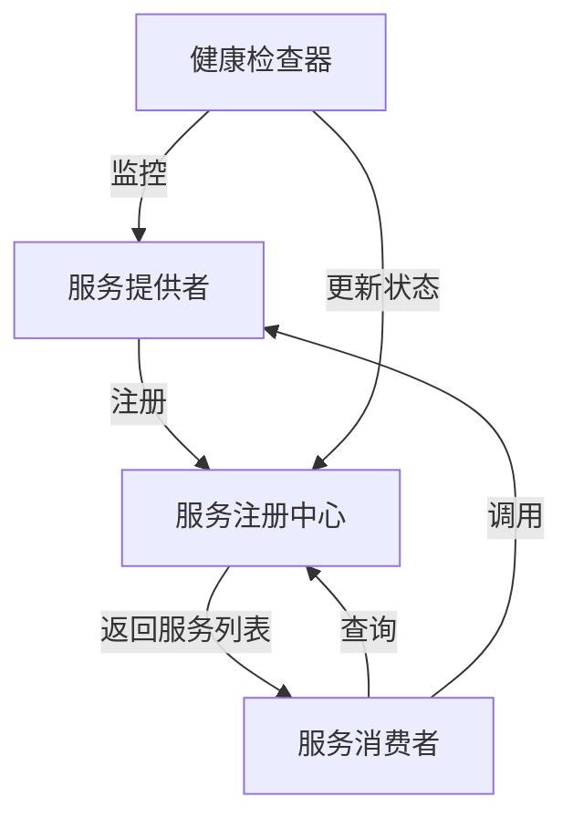

# 服务发现

## 概述
服务发现是微服务架构中的核心组件，它允许服务动态定位和访问其他服务，而无需硬编码服务地址。在云原生环境中，服务实例可能会动态扩缩容、迁移或重启，服务发现机制使得服务之间可以在这种动态环境中可靠地通信。Go语言凭借其高效的并发模型和简洁的语法，成为实现服务发现系统的理想选择。

## 服务发现的基本原理

### 1. 服务发现的核心组件



### 2. 服务发现的两种模式

#### 客户端发现模式
服务消费者直接查询服务注册中心，获取可用的服务实例，并使用负载均衡算法选择一个实例进行调用。

```go
// 客户端发现模式示例
type ServiceDiscovery struct {
    registryAddress string
    client          *http.Client
}

func NewServiceDiscovery(registryAddress string) *ServiceDiscovery {
    return &ServiceDiscovery{
        registryAddress: registryAddress,
        client:          &http.Client{Timeout: 10 * time.Second},
    }
}

func (sd *ServiceDiscovery) GetServiceInstances(serviceName string) ([]ServiceInstance, error) {
    resp, err := sd.client.Get(fmt.Sprintf("%s/services/%s", sd.registryAddress, serviceName))
    if err != nil {
        return nil, err
    }
    defer resp.Body.Close()
    
    var instances []ServiceInstance
    if err := json.NewDecoder(resp.Body).Decode(&instances); err != nil {
        return nil, err
    }
    
    return instances, nil
}

func (sd *ServiceDiscovery) CallService(serviceName, endpoint string) ([]byte, error) {
    instances, err := sd.GetServiceInstances(serviceName)
    if err != nil {
        return nil, err
    }
    
    if len(instances) == 0 {
        return nil, fmt.Errorf("no instances available for service: %s", serviceName)
    }
    
    // 简单的负载均衡：随机选择一个实例
    instance := instances[rand.Intn(len(instances))]
    
    // 调用服务
    serviceURL := fmt.Sprintf("http://%s:%d%s", instance.Host, instance.Port, endpoint)
    resp, err := sd.client.Get(serviceURL)
    if err != nil {
        return nil, err
    }
    defer resp.Body.Close()
    
    return ioutil.ReadAll(resp.Body)
}
```

#### 服务端发现模式
服务消费者通过一个中间组件（如API网关或负载均衡器）发出请求，该组件查询服务注册中心并将请求路由到可用的服务实例。

```go
// 服务端发现模式 - API网关示例
type APIGateway struct {
    registry        *ServiceRegistry
    healthChecker   *HealthChecker
    server          *http.Server
}

func NewAPIGateway(addr string, registry *ServiceRegistry) *APIGateway {
    gateway := &APIGateway{
        registry: registry,
        healthChecker: NewHealthChecker(registry),
    }
    
    mux := http.NewServeMux()
    mux.HandleFunc("/", gateway.handleRequest)
    
    gateway.server = &http.Server{
        Addr:    addr,
        Handler: mux,
    }
    
    return gateway
}

func (g *APIGateway) Start() error {
    // 启动健康检查
    go g.healthChecker.Start()
    
    // 启动API网关
    return g.server.ListenAndServe()
}

func (g *APIGateway) handleRequest(w http.ResponseWriter, r *http.Request) {
    // 解析请求路径以确定目标服务和端点
    parts := strings.SplitN(r.URL.Path[1:], "/", 2)
    if len(parts) < 2 {
        http.Error(w, "Invalid path", http.StatusBadRequest)
        return
    }
    
    serviceName := parts[0]
    endpoint := "/" + parts[1]
    
    // 从注册中心获取服务实例
    instances, err := g.registry.GetServiceInstances(serviceName)
    if err != nil {
        http.Error(w, err.Error(), http.StatusInternalServerError)
        return
    }
    
    if len(instances) == 0 {
        http.Error(w, "Service not available", http.StatusServiceUnavailable)
        return
    }
    
    // 负载均衡：选择一个实例
    instance := instances[rand.Intn(len(instances))]
    
    // 构造目标URL
    targetURL := fmt.Sprintf("http://%s:%d%s", instance.Host, instance.Port, endpoint)
    
    // 创建代理请求
    proxyReq, err := http.NewRequest(r.Method, targetURL, r.Body)
    if err != nil {
        http.Error(w, err.Error(), http.StatusInternalServerError)
        return
    }
    
    // 复制原始请求的头信息
    for key, values := range r.Header {
        for _, value := range values {
            proxyReq.Header.Add(key, value)
        }
    }
    
    // 发送代理请求
    client := &http.Client{}
    resp, err := client.Do(proxyReq)
    if err != nil {
        http.Error(w, err.Error(), http.StatusInternalServerError)
        return
    }
    defer resp.Body.Close()
    
    // 复制响应头
    for key, values := range resp.Header {
        for _, value := range values {
            w.Header().Add(key, value)
        }
    }
    
    // 设置状态码
    w.WriteHeader(resp.StatusCode)
    
    // 复制响应体
    io.Copy(w, resp.Body)
}
```

## 常用服务发现工具

### 1. Consul

Consul是一个流行的服务发现和配置工具，提供了服务发现、健康检查、KV存储等功能。

```go
// Consul服务注册示例
package main

import (
    "fmt"
    "log"
    "net/http"
    "os"
    "os/signal"
    "syscall"
    
    consulapi "github.com/hashicorp/consul/api"
)

func main() {
    // 创建Consul客户端
    config := consulapi.DefaultConfig()
    config.Address = "localhost:8500"
    client, err := consulapi.NewClient(config)
    if err != nil {
        log.Fatalf("Error creating Consul client: %s", err)
    }
    
    // 服务信息
    serviceName := "user-service"
    serviceID := "user-service-1"
    servicePort := 8080
    
    // 注册服务
    registration := &consulapi.AgentServiceRegistration{
        ID:      serviceID,
        Name:    serviceName,
        Port:    servicePort,
        Address: "localhost",
        Check: &consulapi.AgentServiceCheck{
            HTTP:     fmt.Sprintf("http://localhost:%d/health", servicePort),
            Interval: "10s",
            Timeout:  "2s",
        },
    }
    
    if err := client.Agent().ServiceRegister(registration); err != nil {
        log.Fatalf("Error registering service: %s", err)
    }
    
    // 启动HTTP服务器
    http.HandleFunc("/health", func(w http.ResponseWriter, r *http.Request) {
        w.WriteHeader(http.StatusOK)
        w.Write([]byte("OK"))
    })
    
    http.HandleFunc("/", func(w http.ResponseWriter, r *http.Request) {
        w.Write([]byte("User Service is running!"))
    })
    
    go func() {
        log.Printf("Starting HTTP server on port %d", servicePort)
        if err := http.ListenAndServe(fmt.Sprintf(":%d", servicePort), nil); err != nil {
            log.Fatalf("Error starting HTTP server: %s", err)
        }
    }()
    
    // 捕获退出信号
    quit := make(chan os.Signal, 1)
    signal.Notify(quit, syscall.SIGINT, syscall.SIGTERM)
    <-quit
    
    // 注销服务
    log.Println("Deregistering service...")
    if err := client.Agent().ServiceDeregister(serviceID); err != nil {
        log.Fatalf("Error deregistering service: %s", err)
    }
    
    log.Println("Service deregistered. Exiting...")
}
```

### 2. etcd

etcd是一个分布式键值存储系统，常用于服务发现和配置管理。

```go
// etcd服务发现示例
package main

import (
    "context"
    "fmt"
    "log"
    "net/http"
    "os"
    "os/signal"
    "syscall"
    "time"
    
    clientv3 "go.etcd.io/etcd/client/v3"
)

func main() {
    // 创建etcd客户端
    client, err := clientv3.New(clientv3.Config{
        Endpoints:   []string{"localhost:2379"},
        DialTimeout: 5 * time.Second,
    })
    if err != nil {
        log.Fatalf("Error creating etcd client: %s", err)
    }
    defer client.Close()
    
    // 服务信息
    serviceName := "user-service"
    serviceID := "user-service-1"
    serviceAddr := "localhost:8080"
    
    // 租约TTL为30秒
    resp, err := client.Grant(context.Background(), 30)
    if err != nil {
        log.Fatalf("Error creating lease: %s", err)
    }
    leaseID := resp.ID
    
    // 注册服务
    key := fmt.Sprintf("/services/%s/%s", serviceName, serviceID)
    _, err = client.Put(context.Background(), key, serviceAddr, clientv3.WithLease(leaseID))
    if err != nil {
        log.Fatalf("Error registering service: %s", err)
    }
    
    // 自动续约
    keepAliveCh, err := client.KeepAlive(context.Background(), leaseID)
    if err != nil {
        log.Fatalf("Error setting up lease keep-alive: %s", err)
    }
    
    // 处理续约响应
    go func() {
        for {
            _, ok := <-keepAliveCh
            if !ok {
                log.Println("Keep alive channel closed")
                return
            }
        }
    }()
    
    // 启动HTTP服务器
    http.HandleFunc("/", func(w http.ResponseWriter, r *http.Request) {
        w.Write([]byte("User Service is running!"))
    })
    
    go func() {
        log.Println("Starting HTTP server on :8080")
        if err := http.ListenAndServe(":8080", nil); err != nil {
            log.Fatalf("Error starting HTTP server: %s", err)
        }
    }()
    
    // 捕获退出信号
    quit := make(chan os.Signal, 1)
    signal.Notify(quit, syscall.SIGINT, syscall.SIGTERM)
    <-quit
    
    // 注销服务
    log.Println("Deregistering service...")
    _, err = client.Delete(context.Background(), key)
    if err != nil {
        log.Fatalf("Error deregistering service: %s", err)
    }
    
    log.Println("Service deregistered. Exiting...")
}
```

### 3. Kubernetes Service Discovery

Kubernetes提供了内置的服务发现机制，通过DNS和环境变量使服务能够相互发现。

```go
// Kubernetes服务发现示例
package main

import (
    "fmt"
    "log"
    "net/http"
    "os"
)

func main() {
    // 在Kubernetes中，可以通过服务名直接访问其他服务
    // 例如，如果有一个名为"user-service"的服务，可以通过以下方式访问：
    // http://user-service.default.svc.cluster.local
    
    // 从环境变量获取其他服务的地址（Kubernetes会自动注入）
    // 例如，对于名为PAYMENT_SERVICE的服务，Kubernetes会注入如下环境变量：
    // PAYMENT_SERVICE_SERVICE_HOST=10.0.0.11
    // PAYMENT_SERVICE_SERVICE_PORT=8080
    
    paymentServiceHost := os.Getenv("PAYMENT_SERVICE_SERVICE_HOST")
    paymentServicePort := os.Getenv("PAYMENT_SERVICE_SERVICE_PORT")
    
    if paymentServiceHost != "" && paymentServicePort != "" {
        paymentServiceURL := fmt.Sprintf("http://%s:%s", paymentServiceHost, paymentServicePort)
        log.Printf("Payment service URL: %s", paymentServiceURL)
    }
    
    // 也可以直接使用服务名
    paymentServiceURL := "http://payment-service:8080"
    log.Printf("Payment service URL (using service name): %s", paymentServiceURL)
    
    // 启动HTTP服务器
    http.HandleFunc("/", func(w http.ResponseWriter, r *http.Request) {
        w.Write([]byte("User Service is running in Kubernetes!"))
    })
    
    log.Println("Starting HTTP server on :8080")
    if err := http.ListenAndServe(":8080", nil); err != nil {
        log.Fatalf("Error starting HTTP server: %s", err)
    }
}
```

## 服务发现的最佳实践

### 1. 健康检查

定期检查服务健康状态，及时发现和处理故障服务。

```go
// 健康检查实现
type HealthChecker struct {
    registry *ServiceRegistry
    interval time.Duration
    client   *http.Client
}

func NewHealthChecker(registry *ServiceRegistry) *HealthChecker {
    return &HealthChecker{
        registry: registry,
        interval: 10 * time.Second,
        client:   &http.Client{Timeout: 2 * time.Second},
    }
}

func (hc *HealthChecker) Start() {
    ticker := time.NewTicker(hc.interval)
    defer ticker.Stop()
    
    for {
        <-ticker.C
        hc.checkAllServices()
    }
}

func (hc *HealthChecker) checkAllServices() {
    services := hc.registry.GetAllServices()
    
    for _, service := range services {
        for _, instance := range service.Instances {
            go hc.checkInstance(service.Name, instance)
        }
    }
}

func (hc *HealthChecker) checkInstance(serviceName string, instance ServiceInstance) {
    healthURL := fmt.Sprintf("http://%s:%d/health", instance.Host, instance.Port)
    
    resp, err := hc.client.Get(healthURL)
    if err != nil || resp.StatusCode != http.StatusOK {
        // 标记为不健康
        hc.registry.UpdateInstanceStatus(serviceName, instance.ID, false)
        log.Printf("Instance %s of service %s is unhealthy", instance.ID, serviceName)
        return
    }
    
    // 标记为健康
    hc.registry.UpdateInstanceStatus(serviceName, instance.ID, true)
}
```

### 2. 服务注册与注销

确保服务启动时正确注册，终止时及时注销。

```go
// 服务生命周期管理
func registerService(client *consulapi.Client, serviceInfo ServiceInfo) error {
    registration := &consulapi.AgentServiceRegistration{
        ID:      serviceInfo.ID,
        Name:    serviceInfo.Name,
        Port:    serviceInfo.Port,
        Address: serviceInfo.Address,
        Check: &consulapi.AgentServiceCheck{
            HTTP:     fmt.Sprintf("http://%s:%d/health", serviceInfo.Address, serviceInfo.Port),
            Interval: "10s",
            Timeout:  "2s",
        },
    }
    
    return client.Agent().ServiceRegister(registration)
}

func deregisterService(client *consulapi.Client, serviceID string) error {
    return client.Agent().ServiceDeregister(serviceID)
}

func setupGracefulShutdown(client *consulapi.Client, serviceID string) {
    quit := make(chan os.Signal, 1)
    signal.Notify(quit, syscall.SIGINT, syscall.SIGTERM)
    
    <-quit
    log.Println("Shutting down...")
    
    // 注销服务
    if err := deregisterService(client, serviceID); err != nil {
        log.Printf("Error deregistering service: %s", err)
    }
    
    // 给一些时间让注销操作传播
    time.Sleep(2 * time.Second)
    log.Println("Service deregistered. Exiting...")
}
```

### 3. 缓存与容错

在客户端实现缓存和容错机制，提高系统的可靠性。

```go
// 带缓存和容错的服务发现客户端
type ServiceDiscoveryClient struct {
    registry      ServiceRegistry
    cache         map[string][]ServiceInstance
    cacheMutex    sync.RWMutex
    cacheTTL      time.Duration
    cacheUpdatedAt map[string]time.Time
}

func NewServiceDiscoveryClient(registry ServiceRegistry) *ServiceDiscoveryClient {
    client := &ServiceDiscoveryClient{
        registry:       registry,
        cache:          make(map[string][]ServiceInstance),
        cacheTTL:       time.Minute,
        cacheUpdatedAt: make(map[string]time.Time),
    }
    
    // 启动缓存刷新
    go client.refreshCache()
    
    return client
}

func (c *ServiceDiscoveryClient) GetServiceInstances(serviceName string) ([]ServiceInstance, error) {
    // 先尝试从缓存获取
    c.cacheMutex.RLock()
    cachedInstances, exists := c.cache[serviceName]
    lastUpdated, _ := c.cacheUpdatedAt[serviceName]
    c.cacheMutex.RUnlock()
    
    // 如果缓存有效，直接返回
    if exists && time.Since(lastUpdated) < c.cacheTTL {
        return cachedInstances, nil
    }
    
    // 从注册中心获取
    instances, err := c.registry.GetServiceInstances(serviceName)
    if err != nil {
        // 如果获取失败但有缓存，返回缓存数据（即使已过期）
        if exists {
            log.Printf("Error fetching service instances, using cached data: %s", err)
            return cachedInstances, nil
        }
        return nil, err
    }
    
    // 更新缓存
    c.cacheMutex.Lock()
    c.cache[serviceName] = instances
    c.cacheUpdatedAt[serviceName] = time.Now()
    c.cacheMutex.Unlock()
    
    return instances, nil
}

func (c *ServiceDiscoveryClient) refreshCache() {
    ticker := time.NewTicker(c.cacheTTL / 2)
    defer ticker.Stop()
    
    for {
        <-ticker.C
        
        // 获取所有服务名
        c.cacheMutex.RLock()
        services := make([]string, 0, len(c.cache))
        for service := range c.cache {
            services = append(services, service)
        }
        c.cacheMutex.RUnlock()
        
        // 刷新每个服务的缓存
        for _, service := range services {
            instances, err := c.registry.GetServiceInstances(service)
            if err != nil {
                log.Printf("Error refreshing cache for service %s: %s", service, err)
                continue
            }
            
            c.cacheMutex.Lock()
            c.cache[service] = instances
            c.cacheUpdatedAt[service] = time.Now()
            c.cacheMutex.Unlock()
        }
    }
}
```

### 4. 负载均衡

实现不同的负载均衡策略，合理分配请求。

```go
// 负载均衡器接口
type LoadBalancer interface {
    Select(instances []ServiceInstance) (ServiceInstance, error)
}

// 随机负载均衡
type RandomLoadBalancer struct{}

func (lb *RandomLoadBalancer) Select(instances []ServiceInstance) (ServiceInstance, error) {
    if len(instances) == 0 {
        return ServiceInstance{}, fmt.Errorf("no instances available")
    }
    return instances[rand.Intn(len(instances))], nil
}

// 轮询负载均衡
type RoundRobinLoadBalancer struct {
    counter map[string]int
    mutex   sync.Mutex
}

func NewRoundRobinLoadBalancer() *RoundRobinLoadBalancer {
    return &RoundRobinLoadBalancer{
        counter: make(map[string]int),
    }
}

func (lb *RoundRobinLoadBalancer) Select(instances []ServiceInstance) (ServiceInstance, error) {
    if len(instances) == 0 {
        return ServiceInstance{}, fmt.Errorf("no instances available")
    }
    
    // 为了简化，使用服务名作为计数器的键
    lb.mutex.Lock()
    defer lb.mutex.Unlock()
    
    // 假设所有实例属于同一服务
    serviceName := instances[0].ServiceName
    count := lb.counter[serviceName]
    
    // 选择实例
    instance := instances[count%len(instances)]
    
    // 更新计数器
    lb.counter[serviceName] = (count + 1) % len(instances)
    
    return instance, nil
}

// 加权负载均衡
type WeightedLoadBalancer struct{}

func (lb *WeightedLoadBalancer) Select(instances []ServiceInstance) (ServiceInstance, error) {
    if len(instances) == 0 {
        return ServiceInstance{}, fmt.Errorf("no instances available")
    }
    
    // 计算总权重
    totalWeight := 0
    for _, instance := range instances {
        totalWeight += instance.Weight
    }
    
    // 如果所有实例权重为0，则使用随机选择
    if totalWeight == 0 {
        return instances[rand.Intn(len(instances))], nil
    }
    
    // 选择随机值
    randomWeight := rand.Intn(totalWeight) + 1
    
    // 根据权重选择实例
    currentWeight := 0
    for _, instance := range instances {
        currentWeight += instance.Weight
        if randomWeight <= currentWeight {
            return instance, nil
        }
    }
    
    // 不应该到达这里，但为了安全返回最后一个实例
    return instances[len(instances)-1], nil
}
```

## 服务发现在微服务架构中的应用

### 1. 与API网关集成

```go
// API网关与服务发现集成
type ApiGateway struct {
    discoveryClient *ServiceDiscoveryClient
    loadBalancer    LoadBalancer
    routes          map[string]string // 路径前缀到服务名的映射
}

func NewApiGateway(discoveryClient *ServiceDiscoveryClient, loadBalancer LoadBalancer) *ApiGateway {
    return &ApiGateway{
        discoveryClient: discoveryClient,
        loadBalancer:    loadBalancer,
        routes:          make(map[string]string),
    }
}

func (g *ApiGateway) AddRoute(pathPrefix, serviceName string) {
    g.routes[pathPrefix] = serviceName
}

func (g *ApiGateway) ServeHTTP(w http.ResponseWriter, r *http.Request) {
    // 查找匹配的路由
    var targetService string
    var longestMatch string
    
    for prefix, service := range g.routes {
        if strings.HasPrefix(r.URL.Path, prefix) {
            if len(prefix) > len(longestMatch) {
                longestMatch = prefix
                targetService = service
            }
        }
    }
    
    if targetService == "" {
        http.Error(w, "Service not found", http.StatusNotFound)
        return
    }
    
    // 获取服务实例
    instances, err := g.discoveryClient.GetServiceInstances(targetService)
    if err != nil {
        http.Error(w, "Error finding service instances", http.StatusInternalServerError)
        return
    }
    
    if len(instances) == 0 {
        http.Error(w, "No instances available for service", http.StatusServiceUnavailable)
        return
    }
    
    // 使用负载均衡器选择实例
    instance, err := g.loadBalancer.Select(instances)
    if err != nil {
        http.Error(w, "Error selecting service instance", http.StatusInternalServerError)
        return
    }
    
    // 构建目标URL
    targetPath := strings.TrimPrefix(r.URL.Path, longestMatch)
    targetURL := fmt.Sprintf("http://%s:%d%s", instance.Host, instance.Port, targetPath)
    if r.URL.RawQuery != "" {
        targetURL += "?" + r.URL.RawQuery
    }
    
    // 创建代理请求
    proxyReq, err := http.NewRequest(r.Method, targetURL, r.Body)
    if err != nil {
        http.Error(w, "Error creating proxy request", http.StatusInternalServerError)
        return
    }
    
    // 复制原始请求的头信息
    for key, values := range r.Header {
        for _, value := range values {
            proxyReq.Header.Add(key, value)
        }
    }
    
    // 添加追踪头信息
    proxyReq.Header.Add("X-Forwarded-For", r.RemoteAddr)
    proxyReq.Header.Add("X-Gateway-Service", "api-gateway")
    
    // 发送代理请求
    client := &http.Client{Timeout: 10 * time.Second}
    resp, err := client.Do(proxyReq)
    if err != nil {
        http.Error(w, "Error forwarding request", http.StatusInternalServerError)
        return
    }
    defer resp.Body.Close()
    
    // 复制响应头
    for key, values := range resp.Header {
        for _, value := range values {
            w.Header().Add(key, value)
        }
    }
    
    // 设置状态码
    w.WriteHeader(resp.StatusCode)
    
    // 复制响应体
    io.Copy(w, resp.Body)
}
```

### 2. 微服务之间的通信

```go
// 微服务客户端
type ServiceClient struct {
    discoveryClient *ServiceDiscoveryClient
    loadBalancer    LoadBalancer
    serviceName     string
    httpClient      *http.Client
}

func NewServiceClient(discoveryClient *ServiceDiscoveryClient, loadBalancer LoadBalancer, serviceName string) *ServiceClient {
    return &ServiceClient{
        discoveryClient: discoveryClient,
        loadBalancer:    loadBalancer,
        serviceName:     serviceName,
        httpClient:      &http.Client{Timeout: 5 * time.Second},
    }
}

func (c *ServiceClient) Call(method, endpoint string, body io.Reader) (*http.Response, error) {
    // 获取服务实例
    instances, err := c.discoveryClient.GetServiceInstances(c.serviceName)
    if err != nil {
        return nil, fmt.Errorf("error getting service instances: %w", err)
    }
    
    if len(instances) == 0 {
        return nil, fmt.Errorf("no instances available for service %s", c.serviceName)
    }
    
    // 使用负载均衡器选择实例
    instance, err := c.loadBalancer.Select(instances)
    if err != nil {
        return nil, fmt.Errorf("error selecting service instance: %w", err)
    }
    
    // 构建目标URL
    targetURL := fmt.Sprintf("http://%s:%d%s", instance.Host, instance.Port, endpoint)
    
    // 创建请求
    req, err := http.NewRequest(method, targetURL, body)
    if err != nil {
        return nil, fmt.Errorf("error creating request: %w", err)
    }
    
    // 设置通用头
    req.Header.Set("Content-Type", "application/json")
    req.Header.Set("Accept", "application/json")
    
    // 发送请求
    return c.httpClient.Do(req)
}

// 使用示例
func ExampleServiceClientUsage() {
    // 创建服务发现客户端
    discoveryClient := NewServiceDiscoveryClient(consulRegistry)
    
    // 创建负载均衡器
    loadBalancer := NewRoundRobinLoadBalancer()
    
    // 创建服务客户端
    userServiceClient := NewServiceClient(discoveryClient, loadBalancer, "user-service")
    
    // 调用服务
    userData := map[string]interface{}{
        "id": 123,
    }
    jsonData, _ := json.Marshal(userData)
    
    resp, err := userServiceClient.Call("POST", "/api/users", bytes.NewBuffer(jsonData))
    if err != nil {
        log.Printf("Error calling user service: %s", err)
        return
    }
    defer resp.Body.Close()
    
    // 处理响应
    if resp.StatusCode != http.StatusOK {
        log.Printf("Service returned non-OK status: %d", resp.StatusCode)
        return
    }
    
    var result map[string]interface{}
    if err := json.NewDecoder(resp.Body).Decode(&result); err != nil {
        log.Printf("Error decoding response: %s", err)
        return
    }
    
    log.Printf("Service response: %v", result)
}
```

## 相关知识点
- [微服务架构概述](微服务架构概述.md)
- [API网关](API网关.md)
- [配置中心](配置中心.md)
- [微服务监控](微服务监控.md)
- [标准库/http网络编程](../标准库/http网络编程.md)
