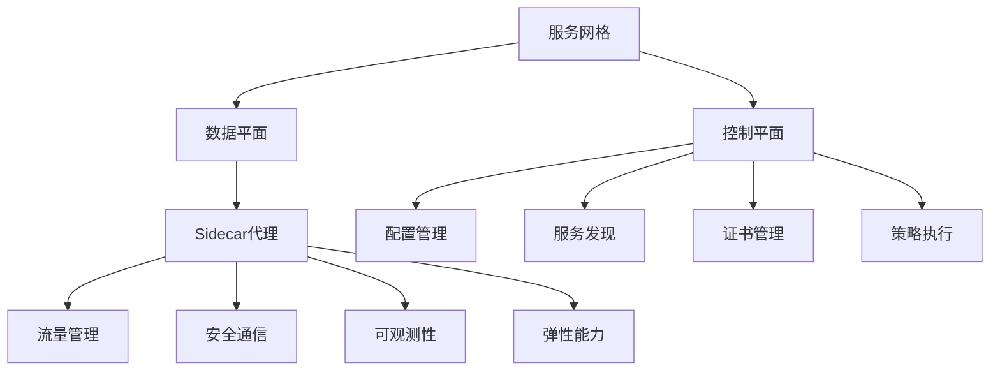

# 服务网格

## 概述
服务网格（Service Mesh）是一个专门处理服务间通信的基础设施层，它负责在现代云原生应用的复杂服务拓扑中可靠地传递请求。服务网格通常以轻量级网络代理的形式实现，这些代理与应用程序代码部署在一起，但对应用程序透明。Go语言因其高效的并发模型和低资源占用特性，成为实现服务网格代理的理想选择，许多主流服务网格解决方案如Istio的数据平面Envoy虽然使用C++实现，但控制平面组件大量采用Go语言开发。

## 服务网格的核心概念

### 1. 基本架构

服务网格通常由两个主要部分组成：数据平面和控制平面。



### 2. 核心功能

服务网格提供的主要功能包括：

1. **流量管理**：负载均衡、流量路由、流量分割、请求重试等
2. **安全通信**：服务间TLS加密、身份验证、授权
3. **可观测性**：请求指标、分布式追踪、访问日志
4. **弹性能力**：超时控制、熔断、故障注入、流量镜像

## Go语言实现服务网格

### 1. 实现简单的Sidecar代理

```go
// 简单的Sidecar代理实现
package main

import (
    "crypto/tls"
    "io"
    "log"
    "net/http"
    "net/http/httputil"
    "net/url"
    "os"
    "strings"
    "time"
    
    "github.com/prometheus/client_golang/prometheus"
    "github.com/prometheus/client_golang/prometheus/promauto"
    "github.com/prometheus/client_golang/prometheus/promhttp"
)

var (
    // 请求计数器
    requestsTotal = promauto.NewCounterVec(
        prometheus.CounterOpts{
            Name: "proxy_requests_total",
            Help: "Total number of requests processed by the proxy",
        },
        []string{"service", "method", "status"},
    )
    
    // 请求延迟直方图
    requestDuration = promauto.NewHistogramVec(
        prometheus.HistogramOpts{
            Name:    "proxy_request_duration_seconds",
            Help:    "Proxy request duration in seconds",
            Buckets: prometheus.DefBuckets,
        },
        []string{"service", "method"},
    )
    
    // 活跃连接数
    activeConnections = promauto.NewGaugeVec(
        prometheus.GaugeOpts{
            Name: "proxy_active_connections",
            Help: "Number of active connections",
        },
        []string{"service"},
    )
)

// 服务定义
type Service struct {
    Name      string
    TargetURL *url.URL
    Circuit   *CircuitBreaker
}

// 熔断器
type CircuitBreaker struct {
    failures          int
    failureThreshold  int
    resetTimeout      time.Duration
    lastFailure       time.Time
    state             string // "closed", "open", "half-open"
    successThreshold  int
    successes         int
    mutex             sync.Mutex
}

func NewCircuitBreaker(failureThreshold, successThreshold int, resetTimeout time.Duration) *CircuitBreaker {
    return &CircuitBreaker{
        failureThreshold: failureThreshold,
        successThreshold: successThreshold,
        resetTimeout:     resetTimeout,
        state:            "closed",
    }
}

func (cb *CircuitBreaker) AllowRequest() bool {
    cb.mutex.Lock()
    defer cb.mutex.Unlock()
    
    if cb.state == "closed" {
        return true
    }
    
    if cb.state == "open" {
        // 检查是否超过重置超时
        if time.Since(cb.lastFailure) > cb.resetTimeout {
            cb.state = "half-open"
            return true
        }
        return false
    }
    
    // 半开状态允许有限请求通过
    return true
}

func (cb *CircuitBreaker) RecordSuccess() {
    cb.mutex.Lock()
    defer cb.mutex.Unlock()
    
    if cb.state == "half-open" {
        cb.successes++
        if cb.successes >= cb.successThreshold {
            cb.state = "closed"
            cb.failures = 0
            cb.successes = 0
        }
    }
}

func (cb *CircuitBreaker) RecordFailure() {
    cb.mutex.Lock()
    defer cb.mutex.Unlock()
    
    cb.failures++
    cb.lastFailure = time.Now()
    
    if cb.state == "closed" && cb.failures >= cb.failureThreshold {
        cb.state = "open"
    } else if cb.state == "half-open" {
        cb.state = "open"
    }
}

func (cb *CircuitBreaker) GetState() string {
    cb.mutex.Lock()
    defer cb.mutex.Unlock()
    return cb.state
}

// 重试策略
type RetryPolicy struct {
    MaxRetries int
    BackoffMin time.Duration
    BackoffMax time.Duration
}

// Sidecar代理
type SidecarProxy struct {
    services    map[string]*Service
    retryPolicy RetryPolicy
}

func NewSidecarProxy(retryPolicy RetryPolicy) *SidecarProxy {
    return &SidecarProxy{
        services:    make(map[string]*Service),
        retryPolicy: retryPolicy,
    }
}

func (p *SidecarProxy) AddService(name string, targetURL string) error {
    parsedURL, err := url.Parse(targetURL)
    if err != nil {
        return err
    }
    
    p.services[name] = &Service{
        Name:      name,
        TargetURL: parsedURL,
        Circuit:   NewCircuitBreaker(5, 3, 10*time.Second),
    }
    
    return nil
}

func (p *SidecarProxy) ServeHTTP(w http.ResponseWriter, r *http.Request) {
    // 从路径中提取服务名
    pathParts := strings.SplitN(strings.TrimPrefix(r.URL.Path, "/"), "/", 2)
    if len(pathParts) < 1 {
        http.Error(w, "Invalid path", http.StatusBadRequest)
        return
    }
    
    serviceName := pathParts[0]
    service, exists := p.services[serviceName]
    if !exists {
        http.Error(w, "Service not found", http.StatusNotFound)
        return
    }
    
    // 检查熔断器状态
    if !service.Circuit.AllowRequest() {
        http.Error(w, "Service unavailable", http.StatusServiceUnavailable)
        requestsTotal.WithLabelValues(serviceName, r.Method, "503").Inc()
        return
    }
    
    // 重建请求路径
    path := "/"
    if len(pathParts) > 1 {
        path += pathParts[1]
    }
    
    // 创建反向代理
    proxy := httputil.NewSingleHostReverseProxy(service.TargetURL)
    originalDirector := proxy.Director
    proxy.Director = func(req *http.Request) {
        originalDirector(req)
        req.URL.Path = path
    }
    
    // 捕获响应
    proxy.ModifyResponse = func(resp *http.Response) error {
        if resp.StatusCode >= 500 {
            service.Circuit.RecordFailure()
        } else {
            service.Circuit.RecordSuccess()
        }
        return nil
    }
    
    // 错误处理
    proxy.ErrorHandler = func(w http.ResponseWriter, r *http.Request, err error) {
        log.Printf("Proxy error: %v", err)
        service.Circuit.RecordFailure()
        http.Error(w, "Service error", http.StatusBadGateway)
        requestsTotal.WithLabelValues(serviceName, r.Method, "502").Inc()
    }
    
    // 记录请求开始时间
    start := time.Now()
    
    // 增加活跃连接数
    activeConnections.WithLabelValues(serviceName).Inc()
    defer activeConnections.WithLabelValues(serviceName).Dec()
    
    // 执行请求
    recorder := &responseRecorder{
        ResponseWriter: w,
        statusCode:     http.StatusOK,
    }
    
    // 实现带重试的请求
    retries := 0
    var lastError error
    
    for retries <= p.retryPolicy.MaxRetries {
        if retries > 0 {
            // 指数退避
            backoff := p.retryPolicy.BackoffMin * time.Duration(1<<uint(retries-1))
            if backoff > p.retryPolicy.BackoffMax {
                backoff = p.retryPolicy.BackoffMax
            }
            time.Sleep(backoff)
            log.Printf("Retrying request to %s (attempt %d)", serviceName, retries)
        }
        
        // 执行请求
        proxy.ServeHTTP(recorder, r)
        
        // 检查是否需要重试
        if recorder.statusCode < 500 {
            break
        }
        
        retries++
    }
    
    // 记录指标
    duration := time.Since(start).Seconds()
    requestDuration.WithLabelValues(serviceName, r.Method).Observe(duration)
    requestsTotal.WithLabelValues(
        serviceName,
        r.Method,
        http.StatusText(recorder.statusCode),
    ).Inc()
    
    log.Printf(
        "Request: method=%s path=%s service=%s status=%d duration=%.3fs retries=%d circuit=%s",
        r.Method, r.URL.Path, serviceName, recorder.statusCode, duration, retries,
        service.Circuit.GetState(),
    )
}

// 响应记录器
type responseRecorder struct {
    http.ResponseWriter
    statusCode int
}

func (r *responseRecorder) WriteHeader(statusCode int) {
    r.statusCode = statusCode
    r.ResponseWriter.WriteHeader(statusCode)
}

func main() {
    // 创建代理
    proxy := NewSidecarProxy(RetryPolicy{
        MaxRetries: 3,
        BackoffMin: 100 * time.Millisecond,
        BackoffMax: 1 * time.Second,
    })
    
    // 添加服务
    if err := proxy.AddService("users", "http://users-service:8080"); err != nil {
        log.Fatalf("Failed to add service: %v", err)
    }
    if err := proxy.AddService("products", "http://products-service:8080"); err != nil {
        log.Fatalf("Failed to add service: %v", err)
    }
    if err := proxy.AddService("orders", "http://orders-service:8080"); err != nil {
        log.Fatalf("Failed to add service: %v", err)
    }
    
    // 注册指标端点
    http.Handle("/metrics", promhttp.Handler())
    
    // 注册代理处理器
    http.Handle("/", proxy)
    
    // 启动HTTP服务器
    log.Println("Starting sidecar proxy on :9090")
    log.Fatal(http.ListenAndServe(":9090", nil))
}
```

### 2. 服务网格控制平面

控制平面负责管理和配置数据平面（Sidecar代理）：

```go
// 简化的控制平面实现
package main

import (
    "encoding/json"
    "log"
    "net/http"
    "sync"
    "time"
)

// 路由规则
type RouteRule struct {
    Path        string   `json:"path"`
    Method      string   `json:"method,omitempty"`
    Destination string   `json:"destination"`
    Weight      int      `json:"weight,omitempty"`
    Headers     []string `json:"headers,omitempty"`
    Retries     int      `json:"retries,omitempty"`
    Timeout     string   `json:"timeout,omitempty"`
}

// 服务配置
type ServiceConfig struct {
    Name         string      `json:"name"`
    Endpoints    []string    `json:"endpoints"`
    Routes       []RouteRule `json:"routes"`
    CircuitBreaker struct {
        FailureThreshold int    `json:"failureThreshold"`
        SuccessThreshold int    `json:"successThreshold"`
        ResetTimeout     string `json:"resetTimeout"`
    } `json:"circuitBreaker"`
    Retry struct {
        MaxRetries int    `json:"maxRetries"`
        BackoffMin string `json:"backoffMin"`
        BackoffMax string `json:"backoffMax"`
    } `json:"retry"`
}

// 控制平面
type ControlPlane struct {
    services map[string]ServiceConfig
    mutex    sync.RWMutex
}

func NewControlPlane() *ControlPlane {
    return &ControlPlane{
        services: make(map[string]ServiceConfig),
    }
}

func (cp *ControlPlane) AddService(config ServiceConfig) {
    cp.mutex.Lock()
    defer cp.mutex.Unlock()
    
    cp.services[config.Name] = config
    log.Printf("Service added: %s", config.Name)
}

func (cp *ControlPlane) GetService(name string) (ServiceConfig, bool) {
    cp.mutex.RLock()
    defer cp.mutex.RUnlock()
    
    config, exists := cp.services[name]
    return config, exists
}

func (cp *ControlPlane) GetAllServices() []ServiceConfig {
    cp.mutex.RLock()
    defer cp.mutex.RUnlock()
    
    services := make([]ServiceConfig, 0, len(cp.services))
    for _, config := range cp.services {
        services = append(services, config)
    }
    
    return services
}

func (cp *ControlPlane) HandleGetService(w http.ResponseWriter, r *http.Request) {
    name := r.URL.Path[len("/services/"):]
    if name == "" {
        // 返回所有服务
        services := cp.GetAllServices()
        w.Header().Set("Content-Type", "application/json")
        json.NewEncoder(w).Encode(services)
        return
    }
    
    // 返回特定服务
    service, exists := cp.GetService(name)
    if !exists {
        http.Error(w, "Service not found", http.StatusNotFound)
        return
    }
    
    w.Header().Set("Content-Type", "application/json")
    json.NewEncoder(w).Encode(service)
}

func (cp *ControlPlane) HandleAddService(w http.ResponseWriter, r *http.Request) {
    var config ServiceConfig
    if err := json.NewDecoder(r.Body).Decode(&config); err != nil {
        http.Error(w, "Invalid request body", http.StatusBadRequest)
        return
    }
    
    if config.Name == "" {
        http.Error(w, "Service name is required", http.StatusBadRequest)
        return
    }
    
    cp.AddService(config)
    w.WriteHeader(http.StatusCreated)
}

func main() {
    cp := NewControlPlane()
    
    // 添加示例服务
    cp.AddService(ServiceConfig{
        Name:      "users",
        Endpoints: []string{"http://users-service:8080"},
        Routes: []RouteRule{
            {
                Path:        "/api/users",
                Destination: "users",
                Method:      "GET",
            },
            {
                Path:        "/api/users/:id",
                Destination: "users",
                Method:      "GET",
            },
        },
        CircuitBreaker: struct {
            FailureThreshold int    `json:"failureThreshold"`
            SuccessThreshold int    `json:"successThreshold"`
            ResetTimeout     string `json:"resetTimeout"`
        }{
            FailureThreshold: 5,
            SuccessThreshold: 3,
            ResetTimeout:     "10s",
        },
        Retry: struct {
            MaxRetries int    `json:"maxRetries"`
            BackoffMin string `json:"backoffMin"`
            BackoffMax string `json:"backoffMax"`
        }{
            MaxRetries: 3,
            BackoffMin: "100ms",
            BackoffMax: "1s",
        },
    })
    
    // 注册HTTP处理器
    http.HandleFunc("/services/", cp.HandleGetService)
    http.HandleFunc("/services", cp.HandleAddService)
    
    // 启动HTTP服务器
    log.Println("Starting control plane on :8080")
    log.Fatal(http.ListenAndServe(":8080", nil))
}
```

## 主流服务网格解决方案

### 1. Istio

Istio是最流行的服务网格解决方案之一，它使用Envoy作为数据平面代理，而控制平面则是由Go语言开发的组件构成。

```yaml
# Istio示例：将流量分割到不同版本的服务
apiVersion: networking.istio.io/v1alpha3
kind: VirtualService
metadata:
  name: reviews
spec:
  hosts:
    - reviews
  http:
  - route:
    - destination:
        host: reviews
        subset: v1
      weight: 75
    - destination:
        host: reviews
        subset: v2
      weight: 25
---
apiVersion: networking.istio.io/v1alpha3
kind: DestinationRule
metadata:
  name: reviews
spec:
  host: reviews
  subsets:
  - name: v1
    labels:
      version: v1
  - name: v2
    labels:
      version: v2
```

### 2. Linkerd

Linkerd是一个轻量级服务网格，专注于简单性和易用性，它完全用Go和Rust编写。

```yaml
# Linkerd示例：添加服务到网格
apiVersion: apps/v1
kind: Deployment
metadata:
  name: podinfo
  namespace: test
  labels:
    app: podinfo
  annotations:
    linkerd.io/inject: enabled
spec:
  replicas: 1
  selector:
    matchLabels:
      app: podinfo
  template:
    metadata:
      labels:
        app: podinfo
    spec:
      containers:
      - name: podinfo
        image: stefanprodan/podinfo:latest
        ports:
        - containerPort: 9898
          name: http
```

### 3. Consul Connect

Consul Connect是HashiCorp Consul的服务网格功能，也是用Go语言开发的。

```hcl
# Consul服务定义示例
service {
  name = "web"
  port = 8080
  
  connect {
    sidecar_service {
      proxy {
        upstreams = [
          {
            destination_name = "api"
            local_bind_port = 9090
          }
        ]
      }
    }
  }
}
```

## 服务网格实现的关键技术

### 1. 流量拦截

在Kubernetes环境中，服务网格通常使用iptables规则来拦截进出Pod的流量：

```go
// 简化的流量拦截模拟
func setupIPTables() error {
    // 在实际场景中，这些操作通常由initContainer完成
    
    // 创建ISTIO_REDIRECT链
    cmd := exec.Command("iptables", "-t", "nat", "-N", "ISTIO_REDIRECT")
    if err := cmd.Run(); err != nil {
        return err
    }
    
    // 将所有入站流量重定向到Sidecar代理
    cmd = exec.Command(
        "iptables", "-t", "nat", "-A", "ISTIO_REDIRECT",
        "-p", "tcp", "-j", "REDIRECT", "--to-port", "15001",
    )
    if err := cmd.Run(); err != nil {
        return err
    }
    
    // 将所有出站流量重定向到Sidecar代理
    cmd = exec.Command(
        "iptables", "-t", "nat", "-A", "OUTPUT",
        "-p", "tcp", "-j", "ISTIO_REDIRECT",
    )
    if err := cmd.Run(); err != nil {
        return err
    }
    
    return nil
}
```

### 2. TLS证书管理

服务网格通常使用mTLS（双向TLS）来保护服务间通信：

```go
// 简化的TLS证书管理
type CertificateManager struct {
    caCert     *x509.Certificate
    caKey      *rsa.PrivateKey
    certTTL    time.Duration
    issuedCerts map[string]*tls.Certificate
    mutex      sync.RWMutex
}

func NewCertificateManager(caCertPEM, caKeyPEM []byte, certTTL time.Duration) (*CertificateManager, error) {
    // 解析CA证书
    block, _ := pem.Decode(caCertPEM)
    if block == nil {
        return nil, fmt.Errorf("failed to parse CA certificate PEM")
    }
    
    caCert, err := x509.ParseCertificate(block.Bytes)
    if err != nil {
        return nil, fmt.Errorf("failed to parse CA certificate: %v", err)
    }
    
    // 解析CA私钥
    block, _ = pem.Decode(caKeyPEM)
    if block == nil {
        return nil, fmt.Errorf("failed to parse CA key PEM")
    }
    
    caKey, err := x509.ParsePKCS1PrivateKey(block.Bytes)
    if err != nil {
        return nil, fmt.Errorf("failed to parse CA key: %v", err)
    }
    
    return &CertificateManager{
        caCert:     caCert,
        caKey:      caKey,
        certTTL:    certTTL,
        issuedCerts: make(map[string]*tls.Certificate),
    }, nil
}

func (cm *CertificateManager) GetCertificate(serviceName string) (*tls.Certificate, error) {
    cm.mutex.RLock()
    cert, exists := cm.issuedCerts[serviceName]
    cm.mutex.RUnlock()
    
    if exists {
        // 检查证书是否即将过期
        leaf, err := x509.ParseCertificate(cert.Certificate[0])
        if err != nil {
            return nil, err
        }
        
        // 如果证书有效期超过一半，返回现有证书
        if time.Now().Before(leaf.NotBefore.Add(leaf.NotAfter.Sub(leaf.NotBefore) / 2)) {
            return cert, nil
        }
    }
    
    // 生成新证书
    return cm.generateCertificate(serviceName)
}

func (cm *CertificateManager) generateCertificate(serviceName string) (*tls.Certificate, error) {
    // 生成私钥
    privateKey, err := rsa.GenerateKey(rand.Reader, 2048)
    if err != nil {
        return nil, fmt.Errorf("failed to generate private key: %v", err)
    }
    
    // 创建证书模板
    now := time.Now()
    template := x509.Certificate{
        SerialNumber: big.NewInt(now.Unix()),
        Subject: pkix.Name{
            CommonName:   serviceName,
            Organization: []string{"Service Mesh"},
        },
        NotBefore:             now,
        NotAfter:              now.Add(cm.certTTL),
        KeyUsage:              x509.KeyUsageDigitalSignature | x509.KeyUsageKeyEncipherment,
        ExtKeyUsage:           []x509.ExtKeyUsage{x509.ExtKeyUsageServerAuth, x509.ExtKeyUsageClientAuth},
        BasicConstraintsValid: true,
        DNSNames:              []string{serviceName},
    }
    
    // 使用CA签发证书
    certDER, err := x509.CreateCertificate(
        rand.Reader,
        &template,
        cm.caCert,
        &privateKey.PublicKey,
        cm.caKey,
    )
    if err != nil {
        return nil, fmt.Errorf("failed to create certificate: %v", err)
    }
    
    // 将证书和私钥转换为PEM格式
    certPEM := pem.EncodeToMemory(&pem.Block{
        Type:  "CERTIFICATE",
        Bytes: certDER,
    })
    
    privateKeyPEM := pem.EncodeToMemory(&pem.Block{
        Type:  "RSA PRIVATE KEY",
        Bytes: x509.MarshalPKCS1PrivateKey(privateKey),
    })
    
    // 加载证书
    cert, err := tls.X509KeyPair(certPEM, privateKeyPEM)
    if err != nil {
        return nil, fmt.Errorf("failed to load X509 key pair: %v", err)
    }
    
    // 缓存证书
    cm.mutex.Lock()
    cm.issuedCerts[serviceName] = &cert
    cm.mutex.Unlock()
    
    return &cert, nil
}

func (cm *CertificateManager) GetTLSConfig(serviceName string) (*tls.Config, error) {
    cert, err := cm.GetCertificate(serviceName)
    if err != nil {
        return nil, err
    }
    
    // 创建TLS配置
    return &tls.Config{
        Certificates: []tls.Certificate{*cert},
        RootCAs:      x509.NewCertPool(),
        ClientCAs:    x509.NewCertPool(),
        ClientAuth:   tls.RequireAndVerifyClientCert,
    }, nil
}
```

### 3. 服务发现集成

服务网格通常与服务发现系统集成，以获取服务实例信息：

```go
// 服务网格与服务发现集成
type ServiceDiscoveryAdapter struct {
    client    *consulapi.Client
    services  map[string][]ServiceInstance
    mutex     sync.RWMutex
    watchChan chan struct{}
}

type ServiceInstance struct {
    ID        string
    Host      string
    Port      int
    Metadata  map[string]string
    Healthy   bool
}

func NewServiceDiscoveryAdapter(consulAddr string) (*ServiceDiscoveryAdapter, error) {
    config := consulapi.DefaultConfig()
    config.Address = consulAddr
    
    client, err := consulapi.NewClient(config)
    if err != nil {
        return nil, err
    }
    
    adapter := &ServiceDiscoveryAdapter{
        client:    client,
        services:  make(map[string][]ServiceInstance),
        watchChan: make(chan struct{}),
    }
    
    // 启动后台刷新
    go adapter.refreshLoop()
    
    return adapter, nil
}

func (sda *ServiceDiscoveryAdapter) refreshLoop() {
    ticker := time.NewTicker(30 * time.Second)
    defer ticker.Stop()
    
    for {
        select {
        case <-ticker.C:
            sda.refreshServices()
        case <-sda.watchChan:
            return
        }
    }
}

func (sda *ServiceDiscoveryAdapter) refreshServices() {
    services, _, err := sda.client.Catalog().Services(nil)
    if err != nil {
        log.Printf("Error fetching services: %v", err)
        return
    }
    
    newServices := make(map[string][]ServiceInstance)
    
    for serviceName := range services {
        instances, _, err := sda.client.Health().Service(serviceName, "", true, nil)
        if err != nil {
            log.Printf("Error fetching instances for service %s: %v", serviceName, err)
            continue
        }
        
        serviceInstances := make([]ServiceInstance, 0, len(instances))
        for _, instance := range instances {
            serviceInstances = append(serviceInstances, ServiceInstance{
                ID:       instance.Service.ID,
                Host:     instance.Service.Address,
                Port:     instance.Service.Port,
                Metadata: instance.Service.Meta,
                Healthy:  true,
            })
        }
        
        newServices[serviceName] = serviceInstances
    }
    
    sda.mutex.Lock()
    sda.services = newServices
    sda.mutex.Unlock()
}

func (sda *ServiceDiscoveryAdapter) GetServiceInstances(serviceName string) ([]ServiceInstance, error) {
    sda.mutex.RLock()
    defer sda.mutex.RUnlock()
    
    instances, exists := sda.services[serviceName]
    if !exists {
        return nil, fmt.Errorf("service not found: %s", serviceName)
    }
    
    return instances, nil
}

func (sda *ServiceDiscoveryAdapter) Close() {
    close(sda.watchChan)
}
```

## 服务网格的核心功能

### 1. 流量控制

服务网格提供高级流量控制功能，如请求路由、负载均衡和流量分割：

```go
// 流量控制功能
type TrafficRouter struct {
    routes map[string][]RouteDefinition
    mutex  sync.RWMutex
}

type RouteDefinition struct {
    Path       string
    Method     string
    Service    string
    Version    string
    Weight     int
    Conditions map[string]string // 请求头条件
}

func NewTrafficRouter() *TrafficRouter {
    return &TrafficRouter{
        routes: make(map[string][]RouteDefinition),
    }
}

func (tr *TrafficRouter) AddRoute(serviceName string, route RouteDefinition) {
    tr.mutex.Lock()
    defer tr.mutex.Unlock()
    
    if _, exists := tr.routes[serviceName]; !exists {
        tr.routes[serviceName] = make([]RouteDefinition, 0)
    }
    
    tr.routes[serviceName] = append(tr.routes[serviceName], route)
}

func (tr *TrafficRouter) GetRoutes(serviceName string) []RouteDefinition {
    tr.mutex.RLock()
    defer tr.mutex.RUnlock()
    
    routes, exists := tr.routes[serviceName]
    if !exists {
        return []RouteDefinition{}
    }
    
    return routes
}

func (tr *TrafficRouter) RouteRequest(serviceName, path, method string, headers http.Header) (string, bool) {
    routes := tr.GetRoutes(serviceName)
    
    // 匹配路由
    var matchedRoutes []RouteDefinition
    for _, route := range routes {
        if (route.Path == "" || route.Path == path) &&
           (route.Method == "" || route.Method == method) {
            
            // 检查条件
            match := true
            for k, v := range route.Conditions {
                if headers.Get(k) != v {
                    match = false
                    break
                }
            }
            
            if match {
                matchedRoutes = append(matchedRoutes, route)
            }
        }
    }
    
    if len(matchedRoutes) == 0 {
        return "", false
    }
    
    // 如果只有一个匹配路由，直接返回
    if len(matchedRoutes) == 1 {
        return matchedRoutes[0].Service, true
    }
    
    // 计算权重总和
    totalWeight := 0
    for _, route := range matchedRoutes {
        totalWeight += route.Weight
    }
    
    // 根据权重选择路由
    if totalWeight > 0 {
        randomWeight := rand.Intn(totalWeight) + 1
        currentWeight := 0
        
        for _, route := range matchedRoutes {
            currentWeight += route.Weight
            if randomWeight <= currentWeight {
                return route.Service, true
            }
        }
    }
    
    // 默认返回第一个匹配的路由
    return matchedRoutes[0].Service, true
}
```

### 2. 弹性能力

服务网格提供多种弹性能力，包括超时控制、重试机制和熔断器：

```go
// 弹性功能
type ResiliencyConfig struct {
    Timeout      time.Duration
    Retries      int
    RetryBackoff time.Duration
    CircuitBreaker CircuitBreakerConfig
}

type CircuitBreakerConfig struct {
    MaxFailures      int
    ResetTimeout     time.Duration
    SuccessThreshold int
}

type ResiliencyManager struct {
    configs map[string]ResiliencyConfig
    mutex   sync.RWMutex
}

func NewResiliencyManager() *ResiliencyManager {
    return &ResiliencyManager{
        configs: make(map[string]ResiliencyConfig),
    }
}

func (rm *ResiliencyManager) SetConfig(serviceName string, config ResiliencyConfig) {
    rm.mutex.Lock()
    defer rm.mutex.Unlock()
    
    rm.configs[serviceName] = config
}

func (rm *ResiliencyManager) GetConfig(serviceName string) (ResiliencyConfig, bool) {
    rm.mutex.RLock()
    defer rm.mutex.RUnlock()
    
    config, exists := rm.configs[serviceName]
    return config, exists
}

func (rm *ResiliencyManager) ExecuteWithResiliency(
    ctx context.Context,
    serviceName string,
    operation func(context.Context) (interface{}, error),
) (interface{}, error) {
    config, exists := rm.GetConfig(serviceName)
    if !exists {
        // 使用默认配置
        config = ResiliencyConfig{
            Timeout:  5 * time.Second,
            Retries:  3,
            RetryBackoff: 100 * time.Millisecond,
            CircuitBreaker: CircuitBreakerConfig{
                MaxFailures:      5,
                ResetTimeout:     10 * time.Second,
                SuccessThreshold: 1,
            },
        }
    }
    
    // 创建带超时的上下文
    timeoutCtx, cancel := context.WithTimeout(ctx, config.Timeout)
    defer cancel()
    
    // 创建或获取熔断器
    cb := getCircuitBreaker(serviceName, config.CircuitBreaker)
    
    // 检查熔断器状态
    if !cb.AllowRequest() {
        return nil, fmt.Errorf("circuit breaker open for service: %s", serviceName)
    }
    
    // 执行带重试的操作
    var result interface{}
    var err error
    var lastErr error
    
    for attempt := 0; attempt <= config.Retries; attempt++ {
        if attempt > 0 {
            // 重试前等待
            select {
            case <-time.After(config.RetryBackoff):
            case <-timeoutCtx.Done():
                return nil, timeoutCtx.Err()
            }
        }
        
        result, err = operation(timeoutCtx)
        
        if err == nil {
            // 操作成功
            cb.RecordSuccess()
            return result, nil
        }
        
        lastErr = err
        
        // 检查是否应该重试
        if !isRetryable(err) || timeoutCtx.Err() != nil {
            break
        }
    }
    
    // 记录失败
    cb.RecordFailure()
    
    if timeoutCtx.Err() != nil {
        return nil, timeoutCtx.Err()
    }
    
    return nil, lastErr
}

// 判断错误是否可重试
func isRetryable(err error) bool {
    // 这里可以添加更复杂的逻辑，例如检查HTTP状态码或特定错误类型
    if err == context.DeadlineExceeded || err == context.Canceled {
        return false
    }
    
    // 检查网络错误
    if netErr, ok := err.(net.Error); ok {
        return netErr.Temporary()
    }
    
    return false
}

// 维护全局熔断器映射
var (
    circuitBreakers = make(map[string]*CircuitBreaker)
    cbMutex         sync.RWMutex
)

func getCircuitBreaker(serviceName string, config CircuitBreakerConfig) *CircuitBreaker {
    cbMutex.RLock()
    cb, exists := circuitBreakers[serviceName]
    cbMutex.RUnlock()
    
    if exists {
        return cb
    }
    
    cbMutex.Lock()
    defer cbMutex.Unlock()
    
    // 再次检查（防止并发创建）
    if cb, exists := circuitBreakers[serviceName]; exists {
        return cb
    }
    
    // 创建新的熔断器
    cb = &CircuitBreaker{
        state:            "closed",
        failureThreshold: config.MaxFailures,
        resetTimeout:     config.ResetTimeout,
        successThreshold: config.SuccessThreshold,
    }
    
    circuitBreakers[serviceName] = cb
    return cb
}
```

### 3. 安全通信

服务网格确保服务间通信的安全性，通常使用双向TLS（mTLS）：

```go
// 安全通信
func createMutualTLSConfig(certManager *CertificateManager, serviceName string) (*tls.Config, error) {
    // 获取服务证书
    cert, err := certManager.GetCertificate(serviceName)
    if err != nil {
        return nil, fmt.Errorf("failed to get certificate: %v", err)
    }
    
    // 创建CA证书池
    caCertPool := x509.NewCertPool()
    caCertPool.AddCert(certManager.caCert)
    
    // 创建TLS配置
    tlsConfig := &tls.Config{
        Certificates: []tls.Certificate{*cert},
        RootCAs:      caCertPool,
        ClientCAs:    caCertPool,
        ClientAuth:   tls.RequireAndVerifyClientCert,
        MinVersion:   tls.VersionTLS12,
        CipherSuites: []uint16{
            tls.TLS_ECDHE_RSA_WITH_AES_128_GCM_SHA256,
            tls.TLS_ECDHE_RSA_WITH_AES_256_GCM_SHA384,
            tls.TLS_ECDHE_ECDSA_WITH_AES_128_GCM_SHA256,
            tls.TLS_ECDHE_ECDSA_WITH_AES_256_GCM_SHA384,
        },
        PreferServerCipherSuites: true,
    }
    
    return tlsConfig, nil
}

// 创建安全的HTTP客户端和服务器
func createSecureHTTPClient(certManager *CertificateManager, serviceName string) (*http.Client, error) {
    tlsConfig, err := createMutualTLSConfig(certManager, serviceName)
    if err != nil {
        return nil, err
    }
    
    transport := &http.Transport{
        TLSClientConfig: tlsConfig,
        DialContext: (&net.Dialer{
            Timeout:   30 * time.Second,
            KeepAlive: 30 * time.Second,
        }).DialContext,
        MaxIdleConns:          100,
        IdleConnTimeout:       90 * time.Second,
        TLSHandshakeTimeout:   10 * time.Second,
        ExpectContinueTimeout: 1 * time.Second,
        ForceAttemptHTTP2:     true,
    }
    
    return &http.Client{
        Transport: transport,
        Timeout:   30 * time.Second,
    }, nil
}

func createSecureHTTPServer(certManager *CertificateManager, serviceName string, handler http.Handler) (*http.Server, error) {
    tlsConfig, err := createMutualTLSConfig(certManager, serviceName)
    if err != nil {
        return nil, err
    }
    
    return &http.Server{
        Addr:         ":8443",
        Handler:      handler,
        TLSConfig:    tlsConfig,
        ReadTimeout:  10 * time.Second,
        WriteTimeout: 10 * time.Second,
        IdleTimeout:  120 * time.Second,
    }, nil
}
```

### 4. 可观测性

服务网格提供内置的可观测性功能，包括分布式追踪、监控指标和日志记录：

```go
// 可观测性中间件
func observabilityMiddleware(next http.Handler, serviceName string) http.Handler {
    return http.HandlerFunc(func(w http.ResponseWriter, r *http.Request) {
        // 生成或提取请求ID
        requestID := r.Header.Get("X-Request-ID")
        if requestID == "" {
            requestID = uuid.New().String()
            r.Header.Set("X-Request-ID", requestID)
        }
        
        // 提取追踪上下文
        ctx := r.Context()
        spanCtx := trace.SpanContextFromContext(ctx)
        
        // 如果没有现有跨度，创建一个新的
        if !spanCtx.IsValid() {
            tracer := otel.Tracer("service-mesh")
            ctx, _ = tracer.Start(ctx, fmt.Sprintf("%s %s", r.Method, r.URL.Path))
        }
        
        // 记录请求日志
        logger := log.With(
            zap.String("request_id", requestID),
            zap.String("method", r.Method),
            zap.String("path", r.URL.Path),
            zap.String("remote_addr", r.RemoteAddr),
            zap.String("service", serviceName),
        )
        
        if spanCtx.IsValid() {
            logger = logger.With(
                zap.String("trace_id", spanCtx.TraceID().String()),
                zap.String("span_id", spanCtx.SpanID().String()),
            )
        }
        
        logger.Info("Request started")
        
        // 记录请求时间
        startTime := time.Now()
        
        // 捕获响应
        rw := &responseWriter{
            ResponseWriter: w,
            statusCode:     http.StatusOK,
            responseSize:   0,
        }
        
        // 调用下一个处理器
        next.ServeHTTP(rw, r.WithContext(ctx))
        
        // 记录指标
        duration := time.Since(startTime).Seconds()
        
        // 记录请求指标
        requestDuration.WithLabelValues(
            serviceName,
            r.Method,
            r.URL.Path,
            strconv.Itoa(rw.statusCode),
        ).Observe(duration)
        
        requestsTotal.WithLabelValues(
            serviceName,
            r.Method,
            r.URL.Path,
            strconv.Itoa(rw.statusCode),
        ).Inc()
        
        // 记录响应日志
        logger.Info("Request completed",
            zap.Int("status", rw.statusCode),
            zap.Int64("size", rw.responseSize),
            zap.Float64("duration", duration),
        )
    })
}

// 响应写入记录器
type responseWriter struct {
    http.ResponseWriter
    statusCode   int
    responseSize int64
}

func (rw *responseWriter) WriteHeader(statusCode int) {
    rw.statusCode = statusCode
    rw.ResponseWriter.WriteHeader(statusCode)
}

func (rw *responseWriter) Write(data []byte) (int, error) {
    size, err := rw.ResponseWriter.Write(data)
    rw.responseSize += int64(size)
    return size, err
}
```

## 服务网格最佳实践

### 1. 渐进式采用

服务网格的引入应该是渐进式的，从非关键服务开始，逐步扩展到整个系统：

```go
// 渐进式采用 - 可选的代理注入
func shouldInjectProxy(serviceName string, annotations map[string]string) bool {
    // 检查服务是否明确标记为不需要注入
    if value, exists := annotations["service-mesh.inject"]; exists && value == "false" {
        return false
    }
    
    // 检查服务是否在排除列表中
    excludedServices := []string{"legacy-service", "external-adapter"}
    for _, excluded := range excludedServices {
        if serviceName == excluded {
            return false
        }
    }
    
    // 检查服务是否在包含列表中
    includedServices := []string{"users", "products", "orders"}
    for _, included := range includedServices {
        if serviceName == included {
            return true
        }
    }
    
    // 默认行为（可以根据需要调整）
    return false
}
```

### 2. 资源需求

服务网格会增加额外的资源开销，需要合理规划和配置资源：

```yaml
# Kubernetes资源配置示例
apiVersion: apps/v1
kind: Deployment
metadata:
  name: product-service
spec:
  template:
    spec:
      containers:
      - name: product-service
        resources:
          requests:
            cpu: 100m
            memory: 128Mi
          limits:
            cpu: 200m
            memory: 256Mi
      - name: sidecar-proxy
        resources:
          requests:
            cpu: 100m
            memory: 128Mi
          limits:
            cpu: 500m
            memory: 512Mi
```

### 3. 故障注入与混沌测试

服务网格可以用于故障注入，测试系统的弹性能力：

```go
// 故障注入
type FaultInjector struct {
    enabled       bool
    delayPercent  int
    delayDuration time.Duration
    errorPercent  int
    mutex         sync.RWMutex
}

func NewFaultInjector() *FaultInjector {
    return &FaultInjector{
        enabled:       false,
        delayPercent:  0,
        delayDuration: 0,
        errorPercent:  0,
    }
}

func (fi *FaultInjector) SetFaults(enabled bool, delayPercent int, delayDuration time.Duration, errorPercent int) {
    fi.mutex.Lock()
    defer fi.mutex.Unlock()
    
    fi.enabled = enabled
    fi.delayPercent = delayPercent
    fi.delayDuration = delayDuration
    fi.errorPercent = errorPercent
}

func (fi *FaultInjector) MaybeInjectFault() error {
    fi.mutex.RLock()
    defer fi.mutex.RUnlock()
    
    if !fi.enabled {
        return nil
    }
    
    // 可能注入延迟
    if fi.delayPercent > 0 && rand.Intn(100) < fi.delayPercent {
        time.Sleep(fi.delayDuration)
    }
    
    // 可能注入错误
    if fi.errorPercent > 0 && rand.Intn(100) < fi.errorPercent {
        return errors.New("injected fault")
    }
    
    return nil
}

// 使用示例
func faultInjectionExample(fi *FaultInjector) http.Handler {
    return http.HandlerFunc(func(w http.ResponseWriter, r *http.Request) {
        // 可能注入故障
        if err := fi.MaybeInjectFault(); err != nil {
            http.Error(w, err.Error(), http.StatusInternalServerError)
            return
        }
        
        // 正常处理请求
        w.Write([]byte("Hello, World!"))
    })
}
```

### 4. 性能优化

服务网格的性能可以通过多种方式优化：

```go
// 性能优化配置
type PerformanceConfig struct {
    // 并发处理的请求数
    Concurrency int
    
    // 连接池配置
    ConnectionPool struct {
        MaxIdleConns        int
        MaxIdleConnsPerHost int
        MaxConnsPerHost     int
        IdleConnTimeout     time.Duration
    }
    
    // 缓冲区大小
    ReadBufferSize  int
    WriteBufferSize int
    
    // HTTP/2配置
    EnableHTTP2 bool
    
    // 保持连接配置
    KeepAliveTimeout time.Duration
    KeepAliveCount   int
    
    // TLS会话缓存
    TLSSessionCacheSize int
}

func getDefaultPerformanceConfig() PerformanceConfig {
    config := PerformanceConfig{
        Concurrency: 8192,
        ConnectionPool: struct {
            MaxIdleConns        int
            MaxIdleConnsPerHost int
            MaxConnsPerHost     int
            IdleConnTimeout     time.Duration
        }{
            MaxIdleConns:        100,
            MaxIdleConnsPerHost: 10,
            MaxConnsPerHost:     100,
            IdleConnTimeout:     90 * time.Second,
        },
        ReadBufferSize:     4096,
        WriteBufferSize:    4096,
        EnableHTTP2:        true,
        KeepAliveTimeout:   30 * time.Second,
        KeepAliveCount:     100,
        TLSSessionCacheSize: 10000,
    }
    
    return config
}

func applyPerformanceConfig(config PerformanceConfig) *http.Transport {
    return &http.Transport{
        MaxIdleConns:        config.ConnectionPool.MaxIdleConns,
        MaxIdleConnsPerHost: config.ConnectionPool.MaxIdleConnsPerHost,
        MaxConnsPerHost:     config.ConnectionPool.MaxConnsPerHost,
        IdleConnTimeout:     config.ConnectionPool.IdleConnTimeout,
        ReadBufferSize:      config.ReadBufferSize,
        WriteBufferSize:     config.WriteBufferSize,
        ForceAttemptHTTP2:   config.EnableHTTP2,
        DisableCompression:  false,
        TLSHandshakeTimeout: 10 * time.Second,
        ExpectContinueTimeout: 1 * time.Second,
    }
}
```

## 服务网格的未来趋势

### 1. eBPF集成

未来的服务网格可能会利用eBPF技术来优化性能和扩展功能：

```go
// eBPF增强的服务网格 (概念性代码)
type EBPFEnhancedProxy struct {
    // 标准代理功能
    standardProxy *SidecarProxy
    
    // eBPF程序管理
    ebpfManager *ebpf.Manager
}

func NewEBPFEnhancedProxy() (*EBPFEnhancedProxy, error) {
    // 创建标准代理
    standardProxy := NewSidecarProxy(RetryPolicy{
        MaxRetries: 3,
        BackoffMin: 100 * time.Millisecond,
        BackoffMax: 1 * time.Second,
    })
    
    // 加载eBPF程序
    spec, err := ebpf.LoadCollectionSpec("bpf/proxy.o")
    if err != nil {
        return nil, fmt.Errorf("failed to load eBPF spec: %v", err)
    }
    
    // 创建eBPF管理器
    manager := &ebpf.Manager{
        Probes: []*ebpf.Probe{
            {
                Section:          "socket/connect",
                EBPFFuncName:     "socket_connect",
                AttachToFuncName: "tcp_connect",
            },
            {
                Section:          "socket/data",
                EBPFFuncName:     "socket_data",
                AttachToFuncName: "tcp_data",
            },
        },
    }
    
    // 初始化管理器
    if err := manager.Init(spec); err != nil {
        return nil, fmt.Errorf("failed to init eBPF manager: %v", err)
    }
    
    return &EBPFEnhancedProxy{
        standardProxy: standardProxy,
        ebpfManager:   manager,
    }, nil
}

func (e *EBPFEnhancedProxy) Start() error {
    // 启动eBPF程序
    if err := e.ebpfManager.Start(); err != nil {
        return fmt.Errorf("failed to start eBPF manager: %v", err)
    }
    
    // 启动标准代理
    // ...
    
    return nil
}

func (e *EBPFEnhancedProxy) Stop() error {
    // 停止eBPF程序
    if err := e.ebpfManager.Stop(); err != nil {
        return fmt.Errorf("failed to stop eBPF manager: %v", err)
    }
    
    // 停止标准代理
    // ...
    
    return nil
}
```

### 2. WebAssembly扩展

WebAssembly可以用于扩展服务网格的功能，提供更好的可扩展性：

```go
// WebAssembly扩展 (概念性代码)
type WasmExtension struct {
    name        string
    wasmBinary  []byte
    instance    *wasm.Instance
    memory      *wasm.Memory
    initialized bool
}

func LoadWasmExtension(name string, wasmPath string) (*WasmExtension, error) {
    // 加载WASM二进制文件
    wasmBinary, err := ioutil.ReadFile(wasmPath)
    if err != nil {
        return nil, fmt.Errorf("failed to read WASM file: %v", err)
    }
    
    return &WasmExtension{
        name:       name,
        wasmBinary: wasmBinary,
    }, nil
}

func (w *WasmExtension) Initialize() error {
    if w.initialized {
        return nil
    }
    
    // 创建WASM实例
    instance, err := wasm.NewInstance(w.wasmBinary)
    if err != nil {
        return fmt.Errorf("failed to create WASM instance: %v", err)
    }
    
    // 获取内存
    memory, err := instance.Exports.GetMemory("memory")
    if err != nil {
        return fmt.Errorf("failed to get WASM memory: %v", err)
    }
    
    w.instance = instance
    w.memory = memory
    w.initialized = true
    
    return nil
}

func (w *WasmExtension) ProcessRequest(headers map[string]string, body []byte) (map[string]string, []byte, error) {
    if !w.initialized {
        if err := w.Initialize(); err != nil {
            return nil, nil, err
        }
    }
    
    // 将头信息序列化为JSON
    headersJSON, err := json.Marshal(headers)
    if err != nil {
        return nil, nil, fmt.Errorf("failed to marshal headers: %v", err)
    }
    
    // 将头信息和请求体写入WASM内存
    headersPtr, err := w.writeToMemory(headersJSON)
    if err != nil {
        return nil, nil, fmt.Errorf("failed to write headers to memory: %v", err)
    }
    
    bodyPtr, err := w.writeToMemory(body)
    if err != nil {
        return nil, nil, fmt.Errorf("failed to write body to memory: %v", err)
    }
    
    // 调用WASM函数处理请求
    processRequest, err := w.instance.Exports.GetFunction("process_request")
    if err != nil {
        return nil, nil, fmt.Errorf("failed to get WASM function: %v", err)
    }
    
    result, err := processRequest(headersPtr, len(headersJSON), bodyPtr, len(body))
    if err != nil {
        return nil, nil, fmt.Errorf("failed to execute WASM function: %v", err)
    }
    
    // 解析结果
    resultCode := result.(int32)
    if resultCode != 0 {
        return nil, nil, fmt.Errorf("WASM function returned error code: %d", resultCode)
    }
    
    // 读取修改后的头信息和请求体
    getResultHeaders, err := w.instance.Exports.GetFunction("get_result_headers")
    if err != nil {
        return nil, nil, fmt.Errorf("failed to get result headers function: %v", err)
    }
    
    getResultBody, err := w.instance.Exports.GetFunction("get_result_body")
    if err != nil {
        return nil, nil, fmt.Errorf("failed to get result body function: %v", err)
    }
    
    headersResult, err := getResultHeaders()
    if err != nil {
        return nil, nil, fmt.Errorf("failed to get result headers: %v", err)
    }
    
    bodyResult, err := getResultBody()
    if err != nil {
        return nil, nil, fmt.Errorf("failed to get result body: %v", err)
    }
    
    // 解析头信息指针
    headersPtrResult := int(headersResult.(int32))
    headersSizeResult := int(headersResult.(int32) >> 32)
    
    // 解析请求体指针
    bodyPtrResult := int(bodyResult.(int32))
    bodySizeResult := int(bodyResult.(int32) >> 32)
    
    // 读取修改后的头信息
    headersData := w.readFromMemory(headersPtrResult, headersSizeResult)
    var newHeaders map[string]string
    if err := json.Unmarshal(headersData, &newHeaders); err != nil {
        return nil, nil, fmt.Errorf("failed to unmarshal headers: %v", err)
    }
    
    // 读取修改后的请求体
    newBody := w.readFromMemory(bodyPtrResult, bodySizeResult)
    
    return newHeaders, newBody, nil
}

func (w *WasmExtension) writeToMemory(data []byte) (int, error) {
    // 分配内存
    malloc, err := w.instance.Exports.GetFunction("malloc")
    if err != nil {
        return 0, fmt.Errorf("failed to get malloc function: %v", err)
    }
    
    ptr, err := malloc(len(data))
    if err != nil {
        return 0, fmt.Errorf("failed to allocate memory: %v", err)
    }
    
    // 写入数据
    if err := w.memory.Write(int(ptr.(int32)), data); err != nil {
        return 0, fmt.Errorf("failed to write to memory: %v", err)
    }
    
    return int(ptr.(int32)), nil
}

func (w *WasmExtension) readFromMemory(ptr, size int) []byte {
    data := make([]byte, size)
    w.memory.Read(ptr, data)
    return data
}

func (w *WasmExtension) Close() error {
    if w.instance != nil {
        return w.instance.Close()
    }
    return nil
}
```

## 相关知识点
- [微服务架构概述](微服务架构概述.md)
- [API网关](API网关.md)
- [服务发现](服务发现.md)
- [配置中心](配置中心.md)
- [微服务监控](微服务监控.md)
- [标准库/http网络编程](../标准库/http网络编程.md)
- [高级特性/内存管理和GC](../高级特性/内存管理和GC.md)
