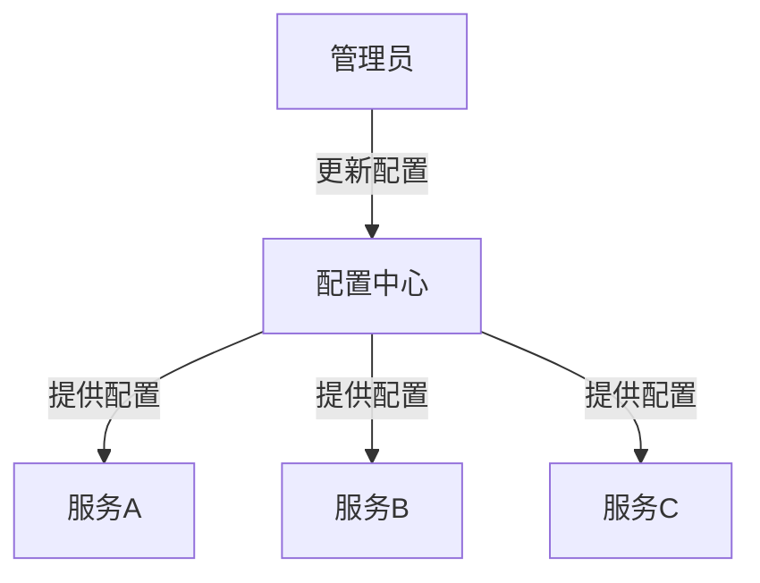

# 配置中心

## 概述
配置中心是微服务架构中的关键组件，它提供了一种集中化的方式来管理分布式系统中的配置信息。随着系统规模的扩大，手动管理每个服务实例的配置变得不可行，配置中心解决了这一问题，使配置可以动态更新，并且在多环境和多实例之间保持一致性。Go语言以其简洁的语法和高效的性能，非常适合实现配置中心客户端以及与配置中心的集成。

## 配置中心的核心功能

### 1. 集中化配置管理



### 2. 动态配置更新

配置中心允许在不重启服务的情况下更新配置，这对于调整服务行为、特性开关、资源限制等非常有用。

```go
// 配置监听客户端
type ConfigClient interface {
    // 获取配置
    Get(key string) (string, error)
    
    // 监听配置变更
    Watch(key string, callback func(string))
    
    // 关闭客户端
    Close() error
}

// 使用示例
func configExample() {
    client := NewConfigClient("localhost:2379")
    defer client.Close()
    
    // 获取初始配置
    config, err := client.Get("app/service-a/database")
    if err != nil {
        log.Fatalf("Failed to get config: %v", err)
    }
    
    // 解析配置
    var dbConfig DatabaseConfig
    if err := json.Unmarshal([]byte(config), &dbConfig); err != nil {
        log.Fatalf("Failed to parse config: %v", err)
    }
    
    // 初始化数据库连接
    db := initDatabase(dbConfig)
    
    // 监听配置变更
    client.Watch("app/service-a/database", func(newConfig string) {
        var newDBConfig DatabaseConfig
        if err := json.Unmarshal([]byte(newConfig), &newDBConfig); err != nil {
            log.Printf("Failed to parse new config: %v", err)
            return
        }
        
        // 更新数据库连接
        if dbConfig != newDBConfig {
            log.Println("Database config changed, updating connection...")
            db.Close()
            db = initDatabase(newDBConfig)
            dbConfig = newDBConfig
        }
    })
    
    // 服务主循环
    // ...
}
```

### 3. 配置版本控制与回滚

配置中心通常提供配置的版本控制，允许在配置更新导致问题时快速回滚。

```go
// 配置版本管理接口
type ConfigVersionManager interface {
    // 获取当前版本的配置
    GetCurrent(key string) (string, error)
    
    // 获取特定版本的配置
    GetVersion(key string, version int) (string, error)
    
    // 列出配置的所有版本
    ListVersions(key string) ([]ConfigVersion, error)
    
    // 回滚到特定版本
    Rollback(key string, version int) error
}

type ConfigVersion struct {
    Version   int
    Value     string
    Timestamp time.Time
    Author    string
    Comment   string
}

// 使用示例
func configVersionExample() {
    manager := NewConfigVersionManager("localhost:2379")
    
    // 列出所有版本
    versions, err := manager.ListVersions("app/service-a/database")
    if err != nil {
        log.Fatalf("Failed to list versions: %v", err)
    }
    
    for _, version := range versions {
        log.Printf("Version %d: %s (at %s by %s)", 
            version.Version, 
            version.Comment, 
            version.Timestamp.Format(time.RFC3339),
            version.Author)
    }
    
    // 如果发现问题，回滚到特定版本
    if err := manager.Rollback("app/service-a/database", 3); err != nil {
        log.Fatalf("Failed to rollback: %v", err)
    }
    
    log.Println("Successfully rolled back to version 3")
}
```

### 4. 环境隔离

配置中心支持不同环境（如开发、测试、生产）的配置隔离，确保环境特定的配置不会混淆。

```go
// 环境隔离配置客户端
type EnvAwareConfigClient struct {
    environment string
    client      ConfigClient
}

func NewEnvAwareConfigClient(endpoint, environment string) *EnvAwareConfigClient {
    return &EnvAwareConfigClient{
        environment: environment,
        client:      NewConfigClient(endpoint),
    }
}

func (c *EnvAwareConfigClient) Get(key string) (string, error) {
    // 添加环境前缀
    envKey := fmt.Sprintf("%s/%s", c.environment, key)
    return c.client.Get(envKey)
}

func (c *EnvAwareConfigClient) Watch(key string, callback func(string)) {
    // 添加环境前缀
    envKey := fmt.Sprintf("%s/%s", c.environment, key)
    c.client.Watch(envKey, callback)
}

func (c *EnvAwareConfigClient) Close() error {
    return c.client.Close()
}

// 使用示例
func envConfigExample() {
    // 根据运行环境选择配置
    env := os.Getenv("APP_ENV")
    if env == "" {
        env = "development" // 默认环境
    }
    
    client := NewEnvAwareConfigClient("localhost:2379", env)
    defer client.Close()
    
    // 获取当前环境的配置
    config, err := client.Get("service-a/database")
    if err != nil {
        log.Fatalf("Failed to get config for env %s: %v", env, err)
    }
    
    log.Printf("Loaded configuration for environment: %s", env)
    
    // 使用配置...
}
```

## 主流配置中心实现

### 1. etcd

etcd是一个分布式键值存储系统，常用于配置管理和服务发现。

```go
// etcd配置客户端
package main

import (
    "context"
    "log"
    "time"
    
    clientv3 "go.etcd.io/etcd/client/v3"
)

type EtcdConfigClient struct {
    client *clientv3.Client
}

func NewEtcdConfigClient(endpoints []string) (*EtcdConfigClient, error) {
    client, err := clientv3.New(clientv3.Config{
        Endpoints:   endpoints,
        DialTimeout: 5 * time.Second,
    })
    if err != nil {
        return nil, err
    }
    
    return &EtcdConfigClient{client: client}, nil
}

func (c *EtcdConfigClient) Get(key string) (string, error) {
    ctx, cancel := context.WithTimeout(context.Background(), 3*time.Second)
    defer cancel()
    
    resp, err := c.client.Get(ctx, key)
    if err != nil {
        return "", err
    }
    
    if len(resp.Kvs) == 0 {
        return "", nil // 键不存在
    }
    
    return string(resp.Kvs[0].Value), nil
}

func (c *EtcdConfigClient) Put(key, value string) error {
    ctx, cancel := context.WithTimeout(context.Background(), 3*time.Second)
    defer cancel()
    
    _, err := c.client.Put(ctx, key, value)
    return err
}

func (c *EtcdConfigClient) Watch(key string, callback func(string)) {
    go func() {
        watchChan := c.client.Watch(context.Background(), key)
        for resp := range watchChan {
            for _, event := range resp.Events {
                if event.Type == clientv3.EventTypePut {
                    callback(string(event.Kv.Value))
                }
            }
        }
    }()
}

func (c *EtcdConfigClient) Close() error {
    return c.client.Close()
}

// 使用示例
func main() {
    client, err := NewEtcdConfigClient([]string{"localhost:2379"})
    if err != nil {
        log.Fatalf("Failed to create etcd client: %v", err)
    }
    defer client.Close()
    
    // 设置配置
    if err := client.Put("app/config/database", `{
        "host": "localhost",
        "port": 5432,
        "user": "postgres",
        "password": "password",
        "database": "myapp"
    }`); err != nil {
        log.Fatalf("Failed to set config: %v", err)
    }
    
    // 获取配置
    config, err := client.Get("app/config/database")
    if err != nil {
        log.Fatalf("Failed to get config: %v", err)
    }
    
    log.Printf("Current database config: %s", config)
    
    // 监听配置变更
    client.Watch("app/config/database", func(newConfig string) {
        log.Printf("Database config changed: %s", newConfig)
    })
    
    // 保持程序运行
    select {}
}
```

### 2. Consul

Consul是一个服务网格解决方案，提供服务发现、健康检查和键值存储功能。

```go
// Consul配置客户端
package main

import (
    "log"
    
    "github.com/hashicorp/consul/api"
)

type ConsulConfigClient struct {
    client *api.Client
    kv     *api.KV
}

func NewConsulConfigClient(address string) (*ConsulConfigClient, error) {
    config := api.DefaultConfig()
    config.Address = address
    
    client, err := api.NewClient(config)
    if err != nil {
        return nil, err
    }
    
    return &ConsulConfigClient{
        client: client,
        kv:     client.KV(),
    }, nil
}

func (c *ConsulConfigClient) Get(key string) (string, error) {
    pair, _, err := c.kv.Get(key, nil)
    if err != nil {
        return "", err
    }
    
    if pair == nil {
        return "", nil // 键不存在
    }
    
    return string(pair.Value), nil
}

func (c *ConsulConfigClient) Put(key string, value string) error {
    pair := &api.KVPair{
        Key:   key,
        Value: []byte(value),
    }
    
    _, err := c.kv.Put(pair, nil)
    return err
}

func (c *ConsulConfigClient) Watch(key string, callback func(string)) {
    var lastIndex uint64
    
    go func() {
        for {
            // 使用阻塞查询
            pair, meta, err := c.kv.Get(key, &api.QueryOptions{
                WaitIndex: lastIndex,
                WaitTime:  5 * time.Minute,
            })
            
            if err != nil {
                log.Printf("Error watching key %s: %v", key, err)
                time.Sleep(time.Second) // 错误重试间隔
                continue
            }
            
            // 更新索引
            lastIndex = meta.LastIndex
            
            // 如果值存在且不为空，回调
            if pair != nil && pair.Value != nil {
                callback(string(pair.Value))
            }
        }
    }()
}

// 使用示例
func main() {
    client, err := NewConsulConfigClient("localhost:8500")
    if err != nil {
        log.Fatalf("Failed to create Consul client: %v", err)
    }
    
    // 设置配置
    if err := client.Put("app/config/database", `{
        "host": "localhost",
        "port": 5432,
        "user": "postgres",
        "password": "password",
        "database": "myapp"
    }`); err != nil {
        log.Fatalf("Failed to set config: %v", err)
    }
    
    // 获取配置
    config, err := client.Get("app/config/database")
    if err != nil {
        log.Fatalf("Failed to get config: %v", err)
    }
    
    log.Printf("Current database config: %s", config)
    
    // 监听配置变更
    client.Watch("app/config/database", func(newConfig string) {
        log.Printf("Database config changed: %s", newConfig)
    })
    
    // 保持程序运行
    select {}
}
```

### 3. Nacos

Nacos是阿里巴巴开源的动态服务发现、配置管理和服务管理平台。

```go
// Nacos配置客户端
package main

import (
    "log"
    
    "github.com/nacos-group/nacos-sdk-go/clients"
    "github.com/nacos-group/nacos-sdk-go/clients/config_client"
    "github.com/nacos-group/nacos-sdk-go/common/constant"
    "github.com/nacos-group/nacos-sdk-go/vo"
)

type NacosConfigClient struct {
    client config_client.IConfigClient
}

func NewNacosConfigClient(serverAddr string, serverPort uint64, namespace string) (*NacosConfigClient, error) {
    // 创建serverConfig
    serverConfig := []constant.ServerConfig{
        {
            IpAddr: serverAddr,
            Port:   serverPort,
        },
    }
    
    // 创建clientConfig
    clientConfig := constant.ClientConfig{
        NamespaceId:         namespace,
        TimeoutMs:           5000,
        NotLoadCacheAtStart: true,
        LogDir:              "/tmp/nacos/log",
        CacheDir:            "/tmp/nacos/cache",
    }
    
    // 创建配置客户端
    client, err := clients.NewConfigClient(
        vo.NacosClientParam{
            ServerConfigs: serverConfig,
            ClientConfig:  &clientConfig,
        },
    )
    
    if err != nil {
        return nil, err
    }
    
    return &NacosConfigClient{client: client}, nil
}

func (c *NacosConfigClient) Get(dataId, group string) (string, error) {
    content, err := c.client.GetConfig(vo.ConfigParam{
        DataId: dataId,
        Group:  group,
    })
    
    if err != nil {
        return "", err
    }
    
    return content, nil
}

func (c *NacosConfigClient) Publish(dataId, group, content string) error {
    _, err := c.client.PublishConfig(vo.ConfigParam{
        DataId:  dataId,
        Group:   group,
        Content: content,
    })
    
    return err
}

func (c *NacosConfigClient) Listen(dataId, group string, callback func(string)) error {
    return c.client.ListenConfig(vo.ConfigParam{
        DataId:   dataId,
        Group:    group,
        OnChange: callback,
    })
}

// 使用示例
func main() {
    client, err := NewNacosConfigClient("localhost", 8848, "public")
    if err != nil {
        log.Fatalf("Failed to create Nacos client: %v", err)
    }
    
    // 发布配置
    if err := client.Publish("database.json", "DEFAULT_GROUP", `{
        "host": "localhost",
        "port": 5432,
        "user": "postgres",
        "password": "password",
        "database": "myapp"
    }`); err != nil {
        log.Fatalf("Failed to publish config: %v", err)
    }
    
    // 获取配置
    config, err := client.Get("database.json", "DEFAULT_GROUP")
    if err != nil {
        log.Fatalf("Failed to get config: %v", err)
    }
    
    log.Printf("Current database config: %s", config)
    
    // 监听配置变更
    if err := client.Listen("database.json", "DEFAULT_GROUP", func(newContent string) {
        log.Printf("Database config changed: %s", newContent)
    }); err != nil {
        log.Fatalf("Failed to listen config: %v", err)
    }
    
    // 保持程序运行
    select {}
}
```

### 4. Spring Cloud Config

Spring Cloud Config是Spring Cloud的配置服务器，提供外部化配置支持。以下是使用Go客户端访问Spring Cloud Config服务器的示例。

```go
// Spring Cloud Config客户端
package main

import (
    "encoding/json"
    "fmt"
    "io/ioutil"
    "log"
    "net/http"
    "time"
)

type SpringCloudConfigClient struct {
    serverURL   string
    application string
    profile     string
    label       string
    httpClient  *http.Client
}

func NewSpringCloudConfigClient(serverURL, application, profile, label string) *SpringCloudConfigClient {
    return &SpringCloudConfigClient{
        serverURL:   serverURL,
        application: application,
        profile:     profile,
        label:       label,
        httpClient: &http.Client{
            Timeout: 10 * time.Second,
        },
    }
}

func (c *SpringCloudConfigClient) GetConfig() (map[string]interface{}, error) {
    url := fmt.Sprintf("%s/%s/%s/%s", c.serverURL, c.application, c.profile, c.label)
    
    resp, err := c.httpClient.Get(url)
    if err != nil {
        return nil, err
    }
    defer resp.Body.Close()
    
    if resp.StatusCode != http.StatusOK {
        return nil, fmt.Errorf("failed to get config, status code: %d", resp.StatusCode)
    }
    
    body, err := ioutil.ReadAll(resp.Body)
    if err != nil {
        return nil, err
    }
    
    var result map[string]interface{}
    if err := json.Unmarshal(body, &result); err != nil {
        return nil, err
    }
    
    return result, nil
}

func (c *SpringCloudConfigClient) GetProperty(key string) (interface{}, error) {
    config, err := c.GetConfig()
    if err != nil {
        return nil, err
    }
    
    // 从propertySources中提取属性
    if propertySources, ok := config["propertySources"].([]interface{}); ok {
        for _, source := range propertySources {
            if sourceMap, ok := source.(map[string]interface{}); ok {
                if properties, ok := sourceMap["source"].(map[string]interface{}); ok {
                    if value, exists := properties[key]; exists {
                        return value, nil
                    }
                }
            }
        }
    }
    
    return nil, fmt.Errorf("property not found: %s", key)
}

// 使用示例
func main() {
    client := NewSpringCloudConfigClient(
        "http://localhost:8888",
        "application",
        "dev",
        "master",
    )
    
    // 获取所有配置
    config, err := client.GetConfig()
    if err != nil {
        log.Fatalf("Failed to get config: %v", err)
    }
    
    log.Printf("Complete configuration: %+v", config)
    
    // 获取特定属性
    dbUrl, err := client.GetProperty("spring.datasource.url")
    if err != nil {
        log.Printf("Warning: %v", err)
    } else {
        log.Printf("Database URL: %v", dbUrl)
    }
}
```

## 使用Go实现配置中心

### 1. 简单的本地配置中心

```go
// 简单的本地配置中心
package main

import (
    "encoding/json"
    "io/ioutil"
    "log"
    "net/http"
    "sync"
    "time"
)

// 配置存储
type ConfigStore struct {
    configs  map[string]string
    versions map[string][]ConfigVersion
    mutex    sync.RWMutex
}

type ConfigVersion struct {
    Version   int       `json:"version"`
    Value     string    `json:"value"`
    Timestamp time.Time `json:"timestamp"`
}

func NewConfigStore() *ConfigStore {
    return &ConfigStore{
        configs:  make(map[string]string),
        versions: make(map[string][]ConfigVersion),
    }
}

func (s *ConfigStore) Get(key string) (string, bool) {
    s.mutex.RLock()
    defer s.mutex.RUnlock()
    
    value, exists := s.configs[key]
    return value, exists
}

func (s *ConfigStore) Put(key, value string) {
    s.mutex.Lock()
    defer s.mutex.Unlock()
    
    s.configs[key] = value
    
    // 保存版本历史
    version := 1
    if versions, exists := s.versions[key]; exists {
        version = versions[len(versions)-1].Version + 1
    }
    
    configVersion := ConfigVersion{
        Version:   version,
        Value:     value,
        Timestamp: time.Now(),
    }
    
    s.versions[key] = append(s.versions[key], configVersion)
}

func (s *ConfigStore) GetVersions(key string) []ConfigVersion {
    s.mutex.RLock()
    defer s.mutex.RUnlock()
    
    if versions, exists := s.versions[key]; exists {
        return versions
    }
    
    return []ConfigVersion{}
}

func (s *ConfigStore) GetVersion(key string, version int) (string, bool) {
    s.mutex.RLock()
    defer s.mutex.RUnlock()
    
    if versions, exists := s.versions[key]; exists {
        for _, v := range versions {
            if v.Version == version {
                return v.Value, true
            }
        }
    }
    
    return "", false
}

func (s *ConfigStore) Rollback(key string, version int) bool {
    value, exists := s.GetVersion(key, version)
    if !exists {
        return false
    }
    
    s.Put(key, value) // 这会创建一个新版本
    return true
}

// HTTP服务器
type ConfigServer struct {
    store    *ConfigStore
    watchers map[string][]chan string
    mutex    sync.RWMutex
}

func NewConfigServer(store *ConfigStore) *ConfigServer {
    return &ConfigServer{
        store:    store,
        watchers: make(map[string][]chan string),
    }
}

func (s *ConfigServer) HandleGet(w http.ResponseWriter, r *http.Request) {
    key := r.URL.Path[len("/config/"):]
    
    value, exists := s.store.Get(key)
    if !exists {
        http.Error(w, "Config not found", http.StatusNotFound)
        return
    }
    
    w.Header().Set("Content-Type", "application/json")
    w.Write([]byte(value))
}

func (s *ConfigServer) HandlePut(w http.ResponseWriter, r *http.Request) {
    key := r.URL.Path[len("/config/"):]
    
    body, err := ioutil.ReadAll(r.Body)
    if err != nil {
        http.Error(w, "Failed to read request body", http.StatusBadRequest)
        return
    }
    
    s.store.Put(key, string(body))
    
    // 通知所有订阅者
    s.notifyWatchers(key, string(body))
    
    w.WriteHeader(http.StatusOK)
}

func (s *ConfigServer) HandleWatch(w http.ResponseWriter, r *http.Request) {
    key := r.URL.Path[len("/watch/"):]
    
    // Server-Sent Events 设置
    w.Header().Set("Content-Type", "text/event-stream")
    w.Header().Set("Cache-Control", "no-cache")
    w.Header().Set("Connection", "keep-alive")
    
    // 创建一个通道来接收更新
    ch := make(chan string)
    
    // 注册观察者
    s.mutex.Lock()
    if _, exists := s.watchers[key]; !exists {
        s.watchers[key] = make([]chan string, 0)
    }
    s.watchers[key] = append(s.watchers[key], ch)
    s.mutex.Unlock()
    
    // 确保客户端断开连接时清理资源
    notify := w.(http.CloseNotifier).CloseNotify()
    go func() {
        <-notify
        s.removeWatcher(key, ch)
    }()
    
    // 发送初始配置
    if value, exists := s.store.Get(key); exists {
        fmt.Fprintf(w, "data: %s\n\n", value)
        w.(http.Flusher).Flush()
    }
    
    // 等待更新并发送
    for {
        select {
        case value := <-ch:
            fmt.Fprintf(w, "data: %s\n\n", value)
            w.(http.Flusher).Flush()
        case <-notify:
            return
        }
    }
}

func (s *ConfigServer) HandleVersions(w http.ResponseWriter, r *http.Request) {
    key := r.URL.Path[len("/versions/"):]
    
    versions := s.store.GetVersions(key)
    
    w.Header().Set("Content-Type", "application/json")
    json.NewEncoder(w).Encode(versions)
}

func (s *ConfigServer) HandleRollback(w http.ResponseWriter, r *http.Request) {
    key := r.URL.Path[len("/rollback/"):]
    
    var request struct {
        Version int `json:"version"`
    }
    
    if err := json.NewDecoder(r.Body).Decode(&request); err != nil {
        http.Error(w, "Invalid request", http.StatusBadRequest)
        return
    }
    
    if success := s.store.Rollback(key, request.Version); !success {
        http.Error(w, "Version not found", http.StatusNotFound)
        return
    }
    
    w.WriteHeader(http.StatusOK)
}

func (s *ConfigServer) notifyWatchers(key, value string) {
    s.mutex.RLock()
    defer s.mutex.RUnlock()
    
    if watchers, exists := s.watchers[key]; exists {
        for _, ch := range watchers {
            // 非阻塞发送
            select {
            case ch <- value:
            default:
            }
        }
    }
}

func (s *ConfigServer) removeWatcher(key string, ch chan string) {
    s.mutex.Lock()
    defer s.mutex.Unlock()
    
    if watchers, exists := s.watchers[key]; exists {
        for i, watcher := range watchers {
            if watcher == ch {
                // 从切片中移除
                s.watchers[key] = append(watchers[:i], watchers[i+1:]...)
                close(ch)
                break
            }
        }
    }
}

func main() {
    store := NewConfigStore()
    server := NewConfigServer(store)
    
    // 添加一些初始配置
    store.Put("app/database", `{
        "host": "localhost",
        "port": 5432,
        "user": "postgres",
        "password": "password",
        "database": "myapp"
    }`)
    
    // 设置路由
    http.HandleFunc("/config/", server.HandleGet)
    http.HandleFunc("/config/", server.HandlePut)
    http.HandleFunc("/watch/", server.HandleWatch)
    http.HandleFunc("/versions/", server.HandleVersions)
    http.HandleFunc("/rollback/", server.HandleRollback)
    
    // 启动服务器
    log.Println("Config server starting on :8080")
    log.Fatal(http.ListenAndServe(":8080", nil))
}
```

### 2. 分布式配置中心

对于生产环境，通常需要一个分布式的配置中心，以下是一个基于etcd的简单实现：

```go
// 基于etcd的分布式配置中心
package main

import (
    "context"
    "encoding/json"
    "log"
    "net/http"
    "time"
    
    "github.com/gorilla/mux"
    clientv3 "go.etcd.io/etcd/client/v3"
)

// 配置服务
type ConfigService struct {
    client *clientv3.Client
}

func NewConfigService(endpoints []string) (*ConfigService, error) {
    client, err := clientv3.New(clientv3.Config{
        Endpoints:   endpoints,
        DialTimeout: 5 * time.Second,
    })
    if err != nil {
        return nil, err
    }
    
    return &ConfigService{client: client}, nil
}

func (s *ConfigService) Get(key string) (string, error) {
    ctx, cancel := context.WithTimeout(context.Background(), 3*time.Second)
    defer cancel()
    
    resp, err := s.client.Get(ctx, key)
    if err != nil {
        return "", err
    }
    
    if len(resp.Kvs) == 0 {
        return "", nil // 键不存在
    }
    
    return string(resp.Kvs[0].Value), nil
}

func (s *ConfigService) Put(key, value string) error {
    ctx, cancel := context.WithTimeout(context.Background(), 3*time.Second)
    defer cancel()
    
    // 保存历史版本
    version := time.Now().UnixNano()
    versionKey := key + "/versions/" + string(version)
    
    // 开始事务
    txn := s.client.Txn(ctx)
    
    // 在一个事务中执行：1. 保存当前值 2. 保存历史版本
    _, err := txn.Then(
        clientv3.OpPut(key, value),
        clientv3.OpPut(versionKey, value),
    ).Commit()
    
    return err
}

func (s *ConfigService) GetVersions(key string) ([]ConfigVersion, error) {
    ctx, cancel := context.WithTimeout(context.Background(), 3*time.Second)
    defer cancel()
    
    versionPrefix := key + "/versions/"
    resp, err := s.client.Get(ctx, versionPrefix, clientv3.WithPrefix())
    if err != nil {
        return nil, err
    }
    
    versions := make([]ConfigVersion, 0, len(resp.Kvs))
    for _, kv := range resp.Kvs {
        versionTime := string(kv.Key[len(versionPrefix):])
        versions = append(versions, ConfigVersion{
            Version:   string(kv.Key),
            Value:     string(kv.Value),
            Timestamp: versionTime,
        })
    }
    
    return versions, nil
}

// HTTP服务器
type ConfigServer struct {
    service *ConfigService
}

type ConfigVersion struct {
    Version   string `json:"version"`
    Value     string `json:"value"`
    Timestamp string `json:"timestamp"`
}

func NewConfigServer(service *ConfigService) *ConfigServer {
    return &ConfigServer{service: service}
}

func (s *ConfigServer) HandleGet(w http.ResponseWriter, r *http.Request) {
    vars := mux.Vars(r)
    key := vars["key"]
    
    value, err := s.service.Get(key)
    if err != nil {
        http.Error(w, "Failed to get config: "+err.Error(), http.StatusInternalServerError)
        return
    }
    
    if value == "" {
        http.Error(w, "Config not found", http.StatusNotFound)
        return
    }
    
    w.Header().Set("Content-Type", "application/json")
    w.Write([]byte(value))
}

func (s *ConfigServer) HandlePut(w http.ResponseWriter, r *http.Request) {
    vars := mux.Vars(r)
    key := vars["key"]
    
    // 限制请求体大小
    r.Body = http.MaxBytesReader(w, r.Body, 1048576)
    
    decoder := json.NewDecoder(r.Body)
    var data map[string]interface{}
    if err := decoder.Decode(&data); err != nil {
        http.Error(w, "Invalid JSON", http.StatusBadRequest)
        return
    }
    
    // 转换回JSON字符串
    jsonData, err := json.Marshal(data)
    if err != nil {
        http.Error(w, "Failed to encode JSON", http.StatusInternalServerError)
        return
    }
    
    if err := s.service.Put(key, string(jsonData)); err != nil {
        http.Error(w, "Failed to save config: "+err.Error(), http.StatusInternalServerError)
        return
    }
    
    w.WriteHeader(http.StatusOK)
}

func (s *ConfigServer) HandleWatch(w http.ResponseWriter, r *http.Request) {
    vars := mux.Vars(r)
    key := vars["key"]
    
    // Server-Sent Events 设置
    w.Header().Set("Content-Type", "text/event-stream")
    w.Header().Set("Cache-Control", "no-cache")
    w.Header().Set("Connection", "keep-alive")
    
    // 创建watch通道
    watchChan := s.service.client.Watch(r.Context(), key)
    
    // 发送初始配置
    if value, err := s.service.Get(key); err == nil && value != "" {
        data := "data: " + value + "\n\n"
        w.Write([]byte(data))
        w.(http.Flusher).Flush()
    }
    
    // 监听变更
    for resp := range watchChan {
        for _, event := range resp.Events {
            if event.Type == clientv3.EventTypePut {
                data := "data: " + string(event.Kv.Value) + "\n\n"
                if _, err := w.Write([]byte(data)); err != nil {
                    return
                }
                w.(http.Flusher).Flush()
            }
        }
    }
}

func (s *ConfigServer) HandleVersions(w http.ResponseWriter, r *http.Request) {
    vars := mux.Vars(r)
    key := vars["key"]
    
    versions, err := s.service.GetVersions(key)
    if err != nil {
        http.Error(w, "Failed to get versions: "+err.Error(), http.StatusInternalServerError)
        return
    }
    
    w.Header().Set("Content-Type", "application/json")
    json.NewEncoder(w).Encode(versions)
}

func main() {
    // 创建配置服务
    service, err := NewConfigService([]string{"localhost:2379"})
    if err != nil {
        log.Fatalf("Failed to create config service: %v", err)
    }
    
    // 创建HTTP服务器
    server := NewConfigServer(service)
    
    // 设置路由
    r := mux.NewRouter()
    r.HandleFunc("/config/{key:.*}", server.HandleGet).Methods("GET")
    r.HandleFunc("/config/{key:.*}", server.HandlePut).Methods("POST", "PUT")
    r.HandleFunc("/watch/{key:.*}", server.HandleWatch).Methods("GET")
    r.HandleFunc("/versions/{key:.*}", server.HandleVersions).Methods("GET")
    
    // 启动服务器
    log.Println("Config server starting on :8080")
    log.Fatal(http.ListenAndServe(":8080", r))
}
```

## 最佳实践

### 1. 配置分层

将配置分为不同的层级，从底层到顶层依次是：默认配置、环境配置、应用配置、实例配置。

```go
// 分层配置加载器
type LayeredConfig struct {
    configs []ConfigSource
    cache   map[string]interface{}
}

type ConfigSource interface {
    Get(key string) (interface{}, bool)
}

func NewLayeredConfig(sources ...ConfigSource) *LayeredConfig {
    return &LayeredConfig{
        configs: sources,
        cache:   make(map[string]interface{}),
    }
}

func (c *LayeredConfig) Get(key string) (interface{}, bool) {
    // 检查缓存
    if value, found := c.cache[key]; found {
        return value, true
    }
    
    // 从最高优先级到最低优先级查找
    for i := len(c.configs) - 1; i >= 0; i-- {
        if value, found := c.configs[i].Get(key); found {
            c.cache[key] = value
            return value, true
        }
    }
    
    return nil, false
}

// 使用示例
func layeredConfigExample() {
    // 创建不同的配置源
    defaultConfig := &MemoryConfigSource{
        values: map[string]interface{}{
            "app.timeout": 30,
            "app.retries": 3,
        },
    }
    
    envConfig := &MemoryConfigSource{
        values: map[string]interface{}{
            "app.timeout": 60, // 环境配置覆盖默认配置
        },
    }
    
    // 创建分层配置
    config := NewLayeredConfig(defaultConfig, envConfig)
    
    // 获取配置 - 使用环境覆盖的值
    timeout, _ := config.Get("app.timeout")
    fmt.Println("Timeout:", timeout) // 输出: Timeout: 60
    
    // 获取配置 - 使用默认值
    retries, _ := config.Get("app.retries")
    fmt.Println("Retries:", retries) // 输出: Retries: 3
}
```

### 2. 配置验证

对配置进行验证，确保配置符合预期格式和范围。

```go
// 配置验证器
type ConfigValidator interface {
    Validate(config map[string]interface{}) error
}

// 基于JSON Schema的验证器
type JSONSchemaValidator struct {
    schema string
}

func NewJSONSchemaValidator(schema string) *JSONSchemaValidator {
    return &JSONSchemaValidator{schema: schema}
}

func (v *JSONSchemaValidator) Validate(config map[string]interface{}) error {
    // 使用JSON Schema验证配置
    schemaLoader := gojsonschema.NewStringLoader(v.schema)
    documentLoader := gojsonschema.NewGoLoader(config)
    
    result, err := gojsonschema.Validate(schemaLoader, documentLoader)
    if err != nil {
        return err
    }
    
    if !result.Valid() {
        // 收集验证错误
        errors := make([]string, 0, len(result.Errors()))
        for _, err := range result.Errors() {
            errors = append(errors, err.String())
        }
        return fmt.Errorf("config validation failed: %s", strings.Join(errors, "; "))
    }
    
    return nil
}

// 使用示例
func validationExample() {
    // 定义JSON Schema
    schema := `{
        "type": "object",
        "required": ["host", "port", "database"],
        "properties": {
            "host": {"type": "string"},
            "port": {"type": "integer", "minimum": 1, "maximum": 65535},
            "database": {"type": "string"},
            "username": {"type": "string"},
            "password": {"type": "string"},
            "pool": {
                "type": "object",
                "properties": {
                    "maxConnections": {"type": "integer", "minimum": 1},
                    "maxIdleConnections": {"type": "integer", "minimum": 0}
                }
            }
        }
    }`
    
    // 创建验证器
    validator := NewJSONSchemaValidator(schema)
    
    // 验证有效配置
    validConfig := map[string]interface{}{
        "host":     "localhost",
        "port":     5432,
        "database": "myapp",
        "username": "postgres",
        "password": "password",
        "pool": map[string]interface{}{
            "maxConnections":    10,
            "maxIdleConnections": 5,
        },
    }
    
    if err := validator.Validate(validConfig); err != nil {
        log.Fatalf("Unexpected validation error: %v", err)
    }
    
    log.Println("Valid config passed validation")
    
    // 验证无效配置
    invalidConfig := map[string]interface{}{
        "host":     "localhost",
        "port":     70000, // 超出范围
        "username": "postgres",
        // 缺少必需的database字段
    }
    
    if err := validator.Validate(invalidConfig); err != nil {
        log.Printf("Expected validation error: %v", err)
    }
}
```

### 3. 敏感信息保护

对敏感信息（如密码、API密钥）进行加密保护。

```go
// 敏感信息处理器
type SensitiveDataHandler struct {
    encryptionKey []byte
}

func NewSensitiveDataHandler(key string) *SensitiveDataHandler {
    // 使用MD5生成固定长度的密钥（仅作为示例，生产环境请使用更安全的方法）
    h := md5.New()
    h.Write([]byte(key))
    encryptionKey := h.Sum(nil)
    
    return &SensitiveDataHandler{
        encryptionKey: encryptionKey,
    }
}

func (h *SensitiveDataHandler) Encrypt(plaintext string) (string, error) {
    block, err := aes.NewCipher(h.encryptionKey)
    if err != nil {
        return "", err
    }
    
    // 生成随机IV
    iv := make([]byte, aes.BlockSize)
    if _, err := io.ReadFull(rand.Reader, iv); err != nil {
        return "", err
    }
    
    // 加密
    paddedPlaintext := pkcs7Pad([]byte(plaintext), aes.BlockSize)
    ciphertext := make([]byte, len(paddedPlaintext))
    
    mode := cipher.NewCBCEncrypter(block, iv)
    mode.CryptBlocks(ciphertext, paddedPlaintext)
    
    // 组合IV和密文
    result := make([]byte, len(iv)+len(ciphertext))
    copy(result, iv)
    copy(result[len(iv):], ciphertext)
    
    // Base64编码
    return base64.StdEncoding.EncodeToString(result), nil
}

func (h *SensitiveDataHandler) Decrypt(ciphertext string) (string, error) {
    data, err := base64.StdEncoding.DecodeString(ciphertext)
    if err != nil {
        return "", err
    }
    
    if len(data) < aes.BlockSize {
        return "", fmt.Errorf("ciphertext too short")
    }
    
    // 提取IV
    iv := data[:aes.BlockSize]
    ciphertext = data[aes.BlockSize:]
    
    // 创建解密器
    block, err := aes.NewCipher(h.encryptionKey)
    if err != nil {
        return "", err
    }
    
    // 解密
    plaintext := make([]byte, len(ciphertext))
    mode := cipher.NewCBCDecrypter(block, iv)
    mode.CryptBlocks(plaintext, ciphertext)
    
    // 去除填充
    unpaddedPlaintext, err := pkcs7Unpad(plaintext)
    if err != nil {
        return "", err
    }
    
    return string(unpaddedPlaintext), nil
}

// PKCS#7填充
func pkcs7Pad(data []byte, blockSize int) []byte {
    padding := blockSize - (len(data) % blockSize)
    padText := bytes.Repeat([]byte{byte(padding)}, padding)
    return append(data, padText...)
}

// PKCS#7解填充
func pkcs7Unpad(data []byte) ([]byte, error) {
    length := len(data)
    if length == 0 {
        return nil, fmt.Errorf("invalid padding")
    }
    
    padding := int(data[length-1])
    if padding > length {
        return nil, fmt.Errorf("invalid padding size")
    }
    
    return data[:length-padding], nil
}

// 使用示例
func sensitiveDataExample() {
    handler := NewSensitiveDataHandler("my-secret-key")
    
    // 加密敏感信息
    password := "super-secret-password"
    encryptedPassword, err := handler.Encrypt(password)
    if err != nil {
        log.Fatalf("Failed to encrypt: %v", err)
    }
    
    log.Printf("Encrypted password: %s", encryptedPassword)
    
    // 解密敏感信息
    decryptedPassword, err := handler.Decrypt(encryptedPassword)
    if err != nil {
        log.Fatalf("Failed to decrypt: %v", err)
    }
    
    log.Printf("Decrypted password: %s", decryptedPassword)
    
    // 在配置中使用
    config := map[string]interface{}{
        "database": map[string]interface{}{
            "host":     "localhost",
            "port":     5432,
            "database": "myapp",
            "username": "postgres",
            "password": encryptedPassword, // 存储加密后的密码
        },
    }
    
    // 在使用时解密
    dbConfig := config["database"].(map[string]interface{})
    encryptedDBPassword := dbConfig["password"].(string)
    
    dbPassword, err := handler.Decrypt(encryptedDBPassword)
    if err != nil {
        log.Fatalf("Failed to decrypt database password: %v", err)
    }
    
    log.Printf("Using database password: %s", dbPassword)
}
```

### 4. 配置热加载

实现配置的热加载，使应用程序能够在不重启的情况下应用新配置。

```go
// 配置热加载器
type HotReloader struct {
    config     atomic.Value
    listeners  []func(map[string]interface{})
    listenerMu sync.Mutex
}

func NewHotReloader(initialConfig map[string]interface{}) *HotReloader {
    reloader := &HotReloader{
        listeners: make([]func(map[string]interface{}), 0),
    }
    reloader.config.Store(initialConfig)
    return reloader
}

func (r *HotReloader) GetConfig() map[string]interface{} {
    return r.config.Load().(map[string]interface{})
}

func (r *HotReloader) UpdateConfig(newConfig map[string]interface{}) {
    r.config.Store(newConfig)
    
    // 通知所有监听器
    r.listenerMu.Lock()
    listeners := r.listeners
    r.listenerMu.Unlock()
    
    for _, listener := range listeners {
        listener(newConfig)
    }
}

func (r *HotReloader) AddListener(listener func(map[string]interface{})) {
    r.listenerMu.Lock()
    defer r.listenerMu.Unlock()
    
    r.listeners = append(r.listeners, listener)
    
    // 立即通知新的监听器当前配置
    go listener(r.GetConfig())
}

// 使用示例
func hotReloadExample() {
    // 初始配置
    initialConfig := map[string]interface{}{
        "server": map[string]interface{}{
            "port":    8080,
            "timeout": 30,
        },
        "database": map[string]interface{}{
            "host":     "localhost",
            "port":     5432,
            "maxConns": 10,
        },
    }
    
    reloader := NewHotReloader(initialConfig)
    
    // 添加服务器配置监听器
    reloader.AddListener(func(config map[string]interface{}) {
        serverConfig := config["server"].(map[string]interface{})
        port := int(serverConfig["port"].(float64))
        timeout := int(serverConfig["timeout"].(float64))
        
        log.Printf("Server config updated: port=%d, timeout=%d", port, timeout)
        
        // 在实际应用中，这里可能会重新配置HTTP服务器
    })
    
    // 添加数据库配置监听器
    reloader.AddListener(func(config map[string]interface{}) {
        dbConfig := config["database"].(map[string]interface{})
        maxConns := int(dbConfig["maxConns"].(float64))
        
        log.Printf("Database config updated: maxConns=%d", maxConns)
        
        // 在实际应用中，这里可能会重新配置数据库连接池
    })
    
    // 模拟配置更新
    time.Sleep(2 * time.Second)
    
    newConfig := map[string]interface{}{
        "server": map[string]interface{}{
            "port":    9090,
            "timeout": 60,
        },
        "database": map[string]interface{}{
            "host":     "localhost",
            "port":     5432,
            "maxConns": 20,
        },
    }
    
    reloader.UpdateConfig(newConfig)
    
    // 让程序运行一段时间，以查看日志输出
    time.Sleep(1 * time.Second)
}
```

## 相关知识点
- [微服务架构概述](微服务架构概述.md)
- [服务发现](服务发现.md)
- [API网关](API网关.md)
- [微服务监控](微服务监控.md)
- [标准库/json处理](../标准库/json处理.md)
- [高级特性/反射机制](../高级特性/反射机制.md)
