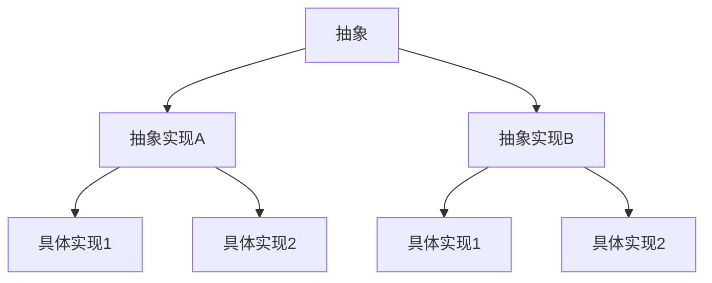

# 结构型模式

## 概述
结构型模式关注类和对象的组合，通过创建复杂结构提供更高层次的灵活性。这类模式描述了如何将对象和类组合在一起形成更大的结构，同时保持结构的灵活性和高效性。在Go语言中，由于其没有传统的类继承机制，结构型模式实现通常依赖于组合和接口。

## 主要结构型模式

### 1. 适配器模式（Adapter Pattern）

适配器模式允许将一个类的接口转换成客户端所期望的另一个接口，使原本因接口不兼容而无法工作的类能够协同工作。

```go
// 目标接口
type Target interface {
    Request() string
}

// 被适配的类
type Adaptee struct{}

func (a *Adaptee) SpecificRequest() string {
    return "特殊请求"
}

// 适配器
type Adapter struct {
    adaptee *Adaptee
}

func NewAdapter(adaptee *Adaptee) *Adapter {
    return &Adapter{adaptee: adaptee}
}

func (a *Adapter) Request() string {
    return "适配器: " + a.adaptee.SpecificRequest()
}

// 客户端代码
func main() {
    adaptee := &Adaptee{}
    adapter := NewAdapter(adaptee)
    
    // 通过适配器调用适配者方法
    fmt.Println(adapter.Request())
}
```

### 2. 桥接模式（Bridge Pattern）

桥接模式将抽象部分与其实现部分分离，使它们都可以独立地变化。这种模式特别适合Go语言的组合设计理念。



```go
// 实现者接口
type Implementor interface {
    OperationImpl() string
}

// 具体实现A
type ConcreteImplementorA struct{}

func (c *ConcreteImplementorA) OperationImpl() string {
    return "具体实现A"
}

// 具体实现B
type ConcreteImplementorB struct{}

func (c *ConcreteImplementorB) OperationImpl() string {
    return "具体实现B"
}

// 抽象接口
type Abstraction interface {
    Operation() string
}

// 精确抽象
type RefinedAbstraction struct {
    implementor Implementor
}

func NewRefinedAbstraction(implementor Implementor) *RefinedAbstraction {
    return &RefinedAbstraction{implementor: implementor}
}

func (r *RefinedAbstraction) Operation() string {
    return "精确抽象: " + r.implementor.OperationImpl()
}

// 客户端代码
func main() {
    implA := &ConcreteImplementorA{}
    implB := &ConcreteImplementorB{}
    
    abstractionA := NewRefinedAbstraction(implA)
    abstractionB := NewRefinedAbstraction(implB)
    
    fmt.Println(abstractionA.Operation())
    fmt.Println(abstractionB.Operation())
}
```

### 3. 组合模式（Composite Pattern）

组合模式将对象组合成树形结构以表示"部分-整体"的层次结构，使客户端可以统一处理单个对象和组合对象。

```go
// 组件接口
type Component interface {
    Operation() string
    Add(Component)
    Remove(Component)
    GetChild(int) Component
}

// 叶子节点
type Leaf struct {
    name string
}

func NewLeaf(name string) *Leaf {
    return &Leaf{name: name}
}

func (l *Leaf) Operation() string {
    return "叶子节点: " + l.name
}

func (l *Leaf) Add(c Component) {}
func (l *Leaf) Remove(c Component) {}
func (l *Leaf) GetChild(i int) Component { return nil }

// 复合节点
type Composite struct {
    name       string
    components []Component
}

func NewComposite(name string) *Composite {
    return &Composite{
        name:       name,
        components: make([]Component, 0),
    }
}

func (c *Composite) Operation() string {
    result := "组合节点: " + c.name + " ["
    for i, component := range c.components {
        result += component.Operation()
        if i < len(c.components)-1 {
            result += ", "
        }
    }
    return result + "]"
}

func (c *Composite) Add(component Component) {
    c.components = append(c.components, component)
}

func (c *Composite) Remove(component Component) {
    // 简化实现，实际应根据组件查找并移除
}

func (c *Composite) GetChild(i int) Component {
    if i >= 0 && i < len(c.components) {
        return c.components[i]
    }
    return nil
}

// 客户端代码
func main() {
    root := NewComposite("根节点")
    branch1 := NewComposite("分支1")
    branch2 := NewComposite("分支2")
    
    leaf1 := NewLeaf("叶子1")
    leaf2 := NewLeaf("叶子2")
    leaf3 := NewLeaf("叶子3")
    
    branch1.Add(leaf1)
    branch2.Add(leaf2)
    branch2.Add(leaf3)
    
    root.Add(branch1)
    root.Add(branch2)
    
    fmt.Println(root.Operation())
}
```

### 4. 装饰器模式（Decorator Pattern）

装饰器模式动态地给对象添加额外的职责，相比生成子类更加灵活。Go语言特别适合实现装饰器模式，因为其接口和组合机制使得包装对象变得简单自然。

```go
// 组件接口
type Component interface {
    Operation() string
}

// 具体组件
type ConcreteComponent struct{}

func (c *ConcreteComponent) Operation() string {
    return "具体组件"
}

// 装饰器
type Decorator struct {
    component Component
}

func NewDecorator(component Component) *Decorator {
    return &Decorator{component: component}
}

func (d *Decorator) Operation() string {
    return d.component.Operation()
}

// 具体装饰器A
type ConcreteDecoratorA struct {
    Decorator
}

func NewConcreteDecoratorA(component Component) *ConcreteDecoratorA {
    return &ConcreteDecoratorA{Decorator: Decorator{component: component}}
}

func (d *ConcreteDecoratorA) Operation() string {
    return "装饰器A(" + d.component.Operation() + ")"
}

// 具体装饰器B
type ConcreteDecoratorB struct {
    Decorator
}

func NewConcreteDecoratorB(component Component) *ConcreteDecoratorB {
    return &ConcreteDecoratorB{Decorator: Decorator{component: component}}
}

func (d *ConcreteDecoratorB) Operation() string {
    return "装饰器B(" + d.component.Operation() + ")"
}

// 客户端代码
func main() {
    component := &ConcreteComponent{}
    decoratorA := NewConcreteDecoratorA(component)
    decoratorB := NewConcreteDecoratorB(decoratorA)
    
    fmt.Println(decoratorB.Operation()) // 输出: 装饰器B(装饰器A(具体组件))
}
```

### 5. 外观模式（Facade Pattern）

外观模式为子系统中的一组接口提供一个统一的高层接口，使子系统更容易使用。在Go微服务架构中，外观模式经常用来简化复杂系统的调用。

```go
// 子系统A
type SubsystemA struct{}

func (s *SubsystemA) OperationA() string {
    return "子系统A操作"
}

// 子系统B
type SubsystemB struct{}

func (s *SubsystemB) OperationB() string {
    return "子系统B操作"
}

// 子系统C
type SubsystemC struct{}

func (s *SubsystemC) OperationC() string {
    return "子系统C操作"
}

// 外观
type Facade struct {
    sysA *SubsystemA
    sysB *SubsystemB
    sysC *SubsystemC
}

func NewFacade() *Facade {
    return &Facade{
        sysA: &SubsystemA{},
        sysB: &SubsystemB{},
        sysC: &SubsystemC{},
    }
}

// 提供简单接口
func (f *Facade) Operation() string {
    result := "外观调用:\n"
    result += f.sysA.OperationA() + "\n"
    result += f.sysB.OperationB() + "\n"
    result += f.sysC.OperationC()
    return result
}

// 客户端代码
func main() {
    facade := NewFacade()
    fmt.Println(facade.Operation())
}
```

### 6. 享元模式（Flyweight Pattern）

享元模式通过共享技术有效地支持大量细粒度的对象，减少内存使用和提高性能。在Go中，享元模式常用于管理大量相似对象。

```go
// 享元接口
type Flyweight interface {
    Operation(extrinsicState string) string
}

// 具体享元
type ConcreteFlyweight struct {
    intrinsicState string
}

func NewConcreteFlyweight(intrinsicState string) *ConcreteFlyweight {
    return &ConcreteFlyweight{intrinsicState: intrinsicState}
}

func (f *ConcreteFlyweight) Operation(extrinsicState string) string {
    return "具体享元[" + f.intrinsicState + "] - 外部状态[" + extrinsicState + "]"
}

// 享元工厂
type FlyweightFactory struct {
    flyweights map[string]Flyweight
}

func NewFlyweightFactory() *FlyweightFactory {
    return &FlyweightFactory{
        flyweights: make(map[string]Flyweight),
    }
}

func (f *FlyweightFactory) GetFlyweight(key string) Flyweight {
    if flyweight, ok := f.flyweights[key]; ok {
        return flyweight
    }
    
    // 创建新享元
    f.flyweights[key] = NewConcreteFlyweight(key)
    return f.flyweights[key]
}

// 客户端代码
func main() {
    factory := NewFlyweightFactory()
    
    // 获取享元（可能是共享的）
    flyweightA := factory.GetFlyweight("A")
    flyweightB := factory.GetFlyweight("B")
    flyweightA2 := factory.GetFlyweight("A") // 复用已有享元
    
    // 使用享元
    fmt.Println(flyweightA.Operation("第一次调用"))
    fmt.Println(flyweightB.Operation("第一次调用"))
    fmt.Println(flyweightA2.Operation("第二次调用")) // 使用共享的A实例
}
```

### 7. 代理模式（Proxy Pattern）

代理模式为其他对象提供一种代理以控制对这个对象的访问。在Go中，代理模式常用于实现中间件、缓存和延迟加载等功能。

```go
// 主题接口
type Subject interface {
    Request() string
}

// 真实主题
type RealSubject struct{}

func (r *RealSubject) Request() string {
    return "真实主题处理请求"
}

// 代理
type Proxy struct {
    realSubject *RealSubject
}

func NewProxy() *Proxy {
    return &Proxy{}
}

func (p *Proxy) Request() string {
    // 延迟加载
    if p.realSubject == nil {
        p.realSubject = &RealSubject{}
    }
    
    // 前置处理
    preResult := "代理前置处理 -> "
    
    // 调用真实主题
    result := p.realSubject.Request()
    
    // 后置处理
    postResult := " -> 代理后置处理"
    
    return preResult + result + postResult
}

// 客户端代码
func main() {
    proxy := NewProxy()
    fmt.Println(proxy.Request())
}
```

## 结构型模式在Go中的应用场景

1. **适配器模式**: 适用于需要兼容不同接口的场景，例如将第三方库包装成符合项目接口规范的形式
2. **桥接模式**: 适用于需要将抽象与实现分离的场景，例如数据库访问层的设计
3. **组合模式**: 适用于树形结构表示的场景，例如文件系统、组织架构或UI组件树
4. **装饰器模式**: 适用于需要动态增强对象功能的场景，例如中间件链、日志装饰器
5. **外观模式**: 适用于简化复杂子系统调用的场景，例如API网关、服务聚合层
6. **享元模式**: 适用于需要共享大量相似对象的场景，例如连接池、对象缓存
7. **代理模式**: 适用于控制对象访问的场景，例如权限控制、缓存代理、远程服务代理

## Go语言结构型模式的最佳实践

1. **利用接口**: 充分利用Go的接口机制实现结构型模式，使代码更加灵活
2. **组合优于继承**: 遵循Go的设计理念，通过组合而非继承来实现结构型模式
3. **保持简单**: 避免过度设计，只在确实需要的地方应用模式
4. **考虑性能**: 特别是在享元模式和代理模式中，注意内存使用和性能开销
5. **并发安全**: 在并发环境中使用结构型模式时，确保线程安全

## 相关知识点
- [创建型模式](创建型模式.md)
- [工程实践/项目结构与组织](../工程实践/项目结构与组织.md)
- [高级特性/反射机制](../高级特性/反射机制.md)
