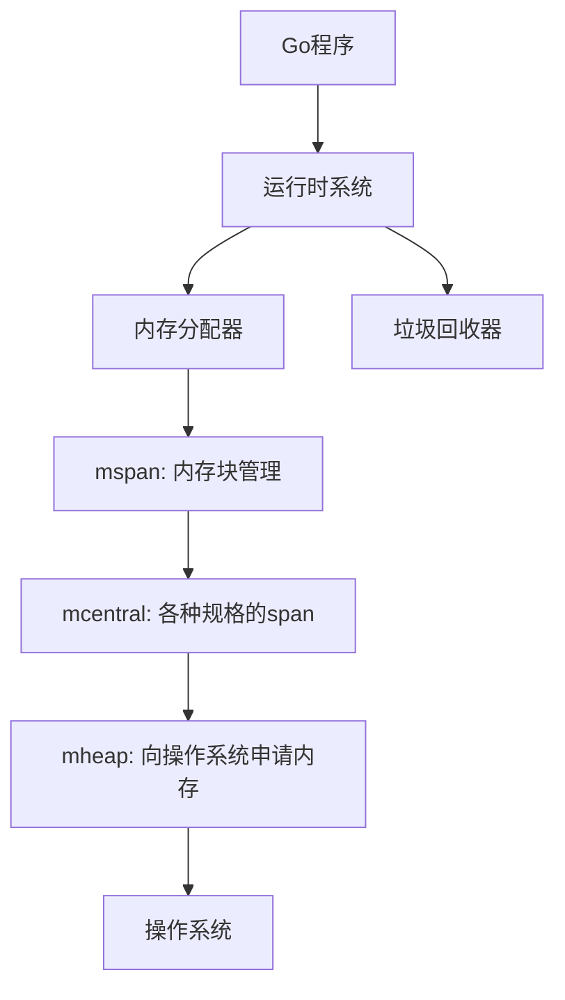
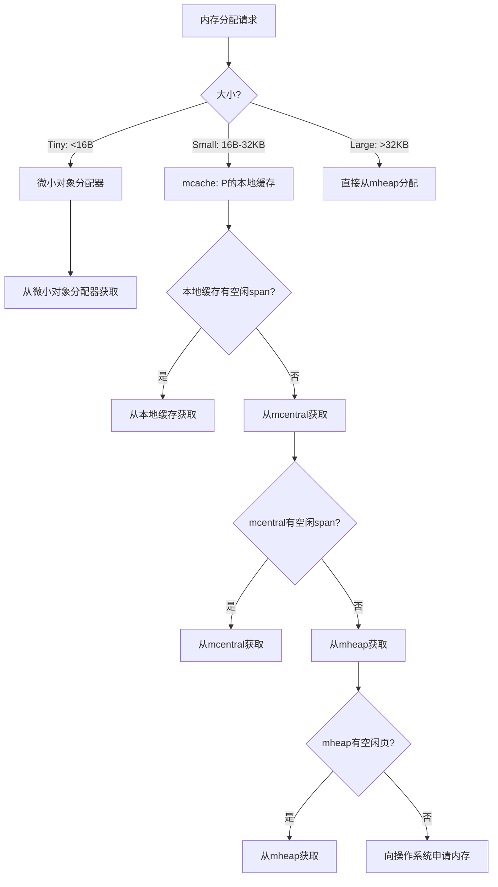
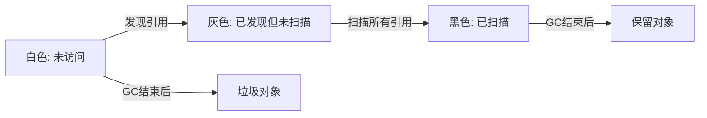
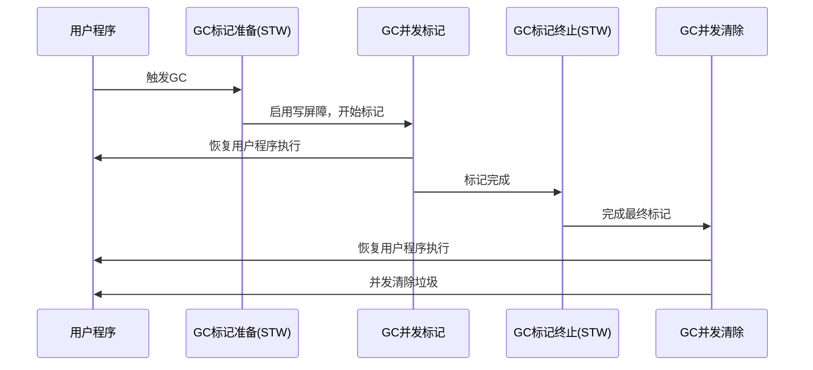

# 内存管理和垃圾回收

## 概述
Go语言的内存管理和垃圾回收机制是其运行时系统的核心组件，它为开发者提供了高效、自动的内存管理，使开发者可以专注于业务逻辑而不必手动分配和释放内存。Go的内存管理结合了编译时的逃逸分析和运行时的垃圾回收，提供了良好的性能和低延迟。本文深入探讨Go内存管理的工作原理、垃圾回收算法和优化策略，帮助开发者更好地理解和优化Go程序的内存使用。

## 内存分配基础

### 1. Go内存管理架构

Go的内存管理系统主要由以下组件组成：

1. **堆(Heap)**: 用于动态分配内存，由垃圾回收器管理
2. **栈(Stack)**: 每个goroutine都有自己的栈，用于存储局部变量
3. **全局内存管理器**: 负责从操作系统申请内存，并提供给堆和栈使用
4. **垃圾回收器**: 自动回收不再使用的堆内存



### 2. 栈与堆

Go中的变量根据其生命周期和大小，可能分配在栈上或堆上：

**栈内存分配**:
- 编译器通过逃逸分析决定变量分配位置
- 函数内的局部变量优先分配在栈上
- 栈内存随函数返回自动释放，不需要垃圾回收
- 栈大小默认为2KB，可以动态增长到最大限制(可通过GOMAXSTACK环境变量调整)

**堆内存分配**:
- 当变量可能在函数返回后仍被引用时，分配到堆上
- 通过`new()`、`make()`或复合字面量创建的变量可能在堆上
- 堆内存由垃圾回收器负责回收
- 内存分配器使用多级缓存提高分配效率

### 3. 逃逸分析

逃逸分析是Go编译器进行的一种静态分析，用于确定变量应该分配在栈上还是堆上：

```go
package main

import "fmt"

// 不发生逃逸：返回值在栈上分配
func createInt() int {
    x := 42
    return x
}

// 发生逃逸：返回指针，指向的变量必须在堆上分配
func createIntPointer() *int {
    x := 42
    return &x
}

func main() {
    a := createInt()      // a存储在栈上
    b := createIntPointer() // b指向的内存存储在堆上
    
    fmt.Println(a, *b)
}
```

可以使用`go build -gcflags="-m"`查看变量的逃逸情况：

```bash
go build -gcflags="-m" main.go
```

常见的导致变量逃逸到堆的情况：
1. 返回局部变量的指针
2. 将局部变量分配给全局变量或传入闭包
3. 局部变量过大，超过栈的大小限制
4. 局部变量大小在编译期未知
5. 在interface上的方法调用

### 4. TCMalloc分配算法

Go的内存分配器基于Google的TCMalloc(Thread-Caching Malloc)算法，专为多线程应用程序设计：

**主要特点**:
- **多级缓存**: mcache(线程缓存)、mcentral(中央缓存)、mheap(全局堆)
- **细粒度的大小类**: 将内存对象按大小分为约67个类别，减少内存碎片
- **按页分配**: 以页(8KB)为基本单位向操作系统申请内存



## 内存分配器详解

### 1. 分配大小类别

Go内存分配器根据对象大小将内存分为不同的类别：

1. **微小对象(Tiny)**: <16B，多个对象可能合并到一个内存块
2. **小对象(Small)**: 16B-32KB，使用固定大小类别的缓存
3. **大对象(Large)**: >32KB，直接从堆分配

每个大小类别对应的内存规格(以字节为单位)：
```
8, 16, 24, 32, 48, 64, 80, 96, 112, 128, 144, 160, 176, 192, 208, 224, 240, 256,
288, 320, 352, 384, 416, 448, 480, 512, 576, 640, 704, 768, 832, 896, 960, 1024,
1152, 1280, 1408, 1536, 1664, 1792, 1920, 2048, 2304, 2560, 2816, 3072, 3328,
3584, 3840, 4096, 4608, 5120, 5632, 6144, 6656, 7168, 7680, 8192, 9216, 10240,
11264, 12288, 13312, 14336, 15360, 16384, 18432, 20480, 22528, 24576, 26624,
28672, 30720, 32768
```

这种细粒度的分类减少了内存碎片，提高了内存利用率。

### 2. 内存结构

Go的内存管理使用以下数据结构：

1. **mspan**: 管理一组大小相同的内存块，是内存管理的基本单元
2. **mcache**: 每个P都有一个mcache，存储各种大小类别的mspan
3. **mcentral**: 全局的mspan缓存，按大小类别组织
4. **mheap**: 管理从操作系统申请的内存，按页(8KB)管理

```go
// mspan: 管理连续的内存页
type mspan struct {
    next *mspan     // 链表中的下一个span
    prev *mspan     // 链表中的上一个span
    startAddr uintptr // span起始地址
    npages    uintptr // span中的页数
    freeindex uintptr // 分配位图中下一个可用的位置
    nelems    uintptr // span中对象的总数
    allocBits *gcBits // 标记哪些对象已分配
    allocCount uint16  // 已分配的对象数量
    spanclass spanClass // span的大小类别
    // 其他字段...
}

// mcache: P的本地缓存
type mcache struct {
    alloc [numSpanClasses]*mspan // 各种大小类别的span缓存
    tiny             uintptr     // 微小对象分配器
    tinyoffset       uintptr     // 微小对象分配器中的偏移量
    // 其他字段...
}

// mcentral: 全局的span缓存
type mcentral struct {
    lock      mutex   // 互斥锁
    spanclass spanClass // span大小类别
    nonempty  mSpanList // 非空闲的span链表
    empty     mSpanList // 空闲的span链表
    // 其他字段...
}

// mheap: 全局堆
type mheap struct {
    lock      mutex
    pages     pageAlloc // 页分配器
    allspans  []*mspan  // 所有span的切片
    central   [numSpanClasses]struct { // 中央span缓存
        mcentral mcentral
        pad      [sys.CacheLineSize - unsafe.Sizeof(mcentral)]byte
    }
    // 其他字段...
}
```

### 3. 内存分配流程

对象分配的一般流程：

1. **对象大小判断**:
   - 微小对象(<16B): 使用微小对象分配器
   - 小对象(16B-32KB): 使用mcache
   - 大对象(>32KB): 直接从mheap分配

2. **小对象分配**:
   - 首先查找P的mcache中对应大小类别的mspan
   - 如果mcache没有可用的span，则从mcentral获取
   - 如果mcentral也没有，则从mheap获取或向操作系统申请新内存

3. **大对象分配**:
   - 直接从mheap申请足够的页
   - 如果mheap不足，向操作系统申请更多内存

### 4. 内存释放

Go程序中的内存释放有两种方式：

1. **栈内存自动释放**: 函数返回时，栈帧自动收缩，栈内存被回收
2. **堆内存垃圾回收**: 由垃圾回收器自动识别和回收不再使用的对象

## 垃圾回收机制

### 1. Go的GC演进历史

Go的垃圾回收器经历了多次重大升级：

1. **Go 1.0-1.4**: 使用停止-复制(Stop-the-world)的标记-清除算法
2. **Go 1.5**: 引入三色标记法，并发垃圾回收
3. **Go 1.6**: 优化垃圾回收器的调度和平衡
4. **Go 1.8**: 引入混合写屏障，降低GC延迟
5. **Go 1.9-1.11**: 持续优化GC性能和减少延迟
6. **Go 1.12+**: 进一步改进内存管理和垃圾回收

这些改进使Go的GC从早期版本的几百毫秒延迟降低到现代版本的亚毫秒级延迟。

### 2. 三色标记算法

Go使用三色标记-清除算法进行垃圾回收，将对象分为三种颜色：

- **白色**: 潜在的垃圾，GC开始时所有对象都是白色
- **灰色**: 已被标记但其引用尚未被扫描的对象
- **黑色**: 已被标记且其所有引用都已被扫描的对象



**三色标记算法步骤**:
1. GC开始时，所有对象标记为白色
2. 从根对象(全局变量、栈变量)开始，标记为灰色
3. 从灰色集合取出一个对象，扫描其引用的所有对象
4. 将该对象标记为黑色，将其引用的白色对象标记为灰色
5. 重复步骤3和4，直到灰色集合为空
6. 回收所有仍为白色的对象

这种算法允许垃圾回收与程序执行并发进行，减少了停顿时间。

### 3. 写屏障技术

为了解决并发垃圾回收中的对象可达性变化问题，Go使用写屏障技术：

**写屏障**是在内存写操作中插入的一段代码，用于记录或更新对象之间的引用关系。

Go 1.8引入了**混合写屏障(Hybrid Write Barrier)**，结合了Dijkstra插入屏障和Yuasa删除屏障的优点：

1. GC开始时，栈上的所有对象都标记为黑色(不扫描)
2. GC期间新分配的对象直接标记为黑色
3. 当黑色对象引用白色对象时，将白色对象标记为灰色(保证不会遗漏)

这种方法避免了重新扫描栈，大大提高了垃圾回收的效率。

### 4. 垃圾回收触发条件

Go的垃圾回收可能由以下条件触发：

1. **内存阈值**: 当堆内存增长到上次GC结束时的一定比例(默认是2倍)
2. **超时触发**: 当距离上次GC已经过去了一定时间(2分钟)
3. **手动触发**: 通过调用`runtime.GC()`手动触发

```go
// 手动触发垃圾回收
runtime.GC()

// 设置垃圾回收的目标百分比
// 100表示内存翻倍时触发GC
// 更小的值会更频繁地触发GC
debug.SetGCPercent(100)
```

### 5. 垃圾回收流程

一次完整的垃圾回收周期包括以下阶段：

1. **标记准备(Mark Setup)**: 启用写屏障，设置GC状态
2. **并发标记(Concurrent Mark)**: 标记所有可达对象
3. **标记终止(Mark Termination)**: STW(Stop-The-World)，完成最终标记
4. **清除(Sweep)**: 并发回收不可达对象
5. **完成(Done)**: 更新统计信息，准备下一次GC



### 6. 内存回收后的处理

垃圾回收后，内存的处理方式：

1. **小对象的内存页**:
   - 回收到mcache和mcentral，供下次分配使用
   - 如果空闲时间过长，可能归还给mheap

2. **大对象的内存页**:
   - 直接归还给mheap，供下次大对象分配

3. **连续空闲的内存页**:
   - 可能归还给操作系统(依赖于MADV_FREE和MADV_DONTNEED机制)
   - Go 1.12后增强了内存归还给操作系统的能力

## 内存优化最佳实践

### 1. 减少内存分配

减少内存分配是优化Go程序性能的关键：

1. **重用对象**:
   - 使用对象池(`sync.Pool`)重用对象，减少分配
   ```go
   var bufferPool = sync.Pool{
       New: func() interface{} {
           return new(bytes.Buffer)
       },
   }
   
   func getBuffer() *bytes.Buffer {
       return bufferPool.Get().(*bytes.Buffer)
   }
   
   func putBuffer(buf *bytes.Buffer) {
       buf.Reset()
       bufferPool.Put(buf)
   }
   ```

2. **预分配内存**:
   - 使用`make()`预分配切片和映射的容量
   ```go
   // 差: 可能导致多次重新分配
   data := []int{}
   for i := 0; i < 10000; i++ {
       data = append(data, i)
   }
   
   // 好: 一次性分配足够的容量
   data := make([]int, 0, 10000)
   for i := 0; i < 10000; i++ {
       data = append(data, i)
   }
   ```

3. **减少指针使用**:
   - 值类型优于指针类型，减少GC扫描负担
   ```go
   // 指针类型: GC需要跟踪
   type PointerStruct struct {
       values []*int
   }
   
   // 值类型: 减少GC扫描
   type ValueStruct struct {
       values []int
   }
   ```

4. **字符串处理优化**:
   - 使用`strings.Builder`而非`+`连接字符串
   ```go
   // 差: 每次连接都会分配新的字符串
   s := ""
   for i := 0; i < 1000; i++ {
       s += strconv.Itoa(i)
   }
   
   // 好: 只分配必要的内存
   var sb strings.Builder
   for i := 0; i < 1000; i++ {
       sb.WriteString(strconv.Itoa(i))
   }
   s := sb.String()
   ```

### 2. 使用适当的数据结构

选择合适的数据结构可以显著减少内存使用：

1. **使用紧凑的数据结构**:
   - 小结构体节省内存，减少GC压力
   ```go
   // 内存占用大
   type User struct {
       ID   string     // 16字节(指针+长度)
       Name string     // 16字节(指针+长度)
       Age  int        // 8字节
       Tags []string   // 24字节(指针+长度+容量)
   }
   
   // 更紧凑的替代方案
   type User struct {
       ID   [8]byte    // 8字节(固定大小)
       Name string     // 16字节
       Age  uint8      // 1字节
       Tags string     // 16字节(JSON编码)
   }
   ```

2. **考虑字段顺序**:
   - 按大小排列结构体字段，减少对齐填充
   ```go
   // 不良排序: 有填充空间
   type BadLayout struct {
       a bool     // 1字节 + 7字节填充
       b int64    // 8字节
       c bool     // 1字节 + 7字节填充
   } // 总共24字节
   
   // 良好排序: 最小化填充
   type GoodLayout struct {
       b int64    // 8字节
       a bool     // 1字节
       c bool     // 1字节
       // 6字节填充(为了8字节对齐)
   } // 总共16字节
   ```

3. **使用适当的容器**:
   - 当键是整数时，切片通常比映射更高效
   - 小容量的固定大小数组比切片更高效

### 3. 控制并发度

过高的并发度会增加内存压力：

1. **使用工作池模式**:
   - 限制goroutine数量，避免过度创建
   ```go
   func worker(jobs <-chan Job, results chan<- Result) {
       for job := range jobs {
           results <- process(job)
       }
   }
   
   func main() {
       jobs := make(chan Job, 100)
       results := make(chan Result, 100)
       
       // 创建固定数量的工作goroutine
       workerCount := runtime.NumCPU()
       for i := 0; i < workerCount; i++ {
           go worker(jobs, results)
       }
       
       // 发送任务...
   }
   ```

2. **使用缓冲通道**:
   - 适当的缓冲区大小可以减少阻塞，提高效率
   ```go
   // 无缓冲: 发送者必须等待接收者
   ch := make(chan int)
   
   // 有缓冲: 可以缓存多个值，减少等待
   ch := make(chan int, 100)
   ```

3. **避免goroutine泄漏**:
   - 确保goroutine最终会退出，不会无限阻塞
   ```go
   // 使用context控制goroutine生命周期
   func worker(ctx context.Context) {
       for {
           select {
           case <-ctx.Done():
               return // 正确退出
           default:
               // 工作...
           }
       }
   }
   
   func main() {
       ctx, cancel := context.WithTimeout(context.Background(), 10*time.Second)
       defer cancel()
       
       go worker(ctx)
       // ...
   }
   ```

### 4. GC调优

垃圾回收设置的调整：

1. **设置GOGC环境变量**:
   - 控制GC触发的内存增长比例
   ```bash
   # 默认值为100，表示当内存使用增长到上次GC后的2倍时触发GC
   export GOGC=100
   
   # 更高的值意味着更低的GC频率，但更高的内存使用
   export GOGC=200
   
   # 更低的值意味着更高的GC频率，但更低的内存使用
   export GOGC=50
   
   # 禁用GC(不推荐)
   export GOGC=off
   ```

2. **使用debug包调整GC参数**:
   ```go
   import "runtime/debug"
   
   // 设置GC目标百分比
   debug.SetGCPercent(100)
   
   // 立即触发GC
   runtime.GC()
   
   // 释放未使用的内存给操作系统
   debug.FreeOSMemory()
   ```

3. **调整GC并发度**:
   - 通过`GOGC`和`GOMAXPROCS`间接控制
   - 较高的`GOMAXPROCS`可能增加GC的并行度，但也增加了调度开销

### 5. 内存监控与分析

监控和分析内存使用情况是优化的前提：

1. **使用runtime包获取内存统计**:
   ```go
   import (
       "fmt"
       "runtime"
   )
   
   func printMemStats() {
       var m runtime.MemStats
       runtime.ReadMemStats(&m)
       
       fmt.Printf("Alloc = %v MiB", m.Alloc / 1024 / 1024)
       fmt.Printf("\tTotalAlloc = %v MiB", m.TotalAlloc / 1024 / 1024)
       fmt.Printf("\tSys = %v MiB", m.Sys / 1024 / 1024)
       fmt.Printf("\tNumGC = %v\n", m.NumGC)
   }
   ```

2. **使用pprof进行内存分析**:
   ```go
   import (
       "net/http"
       _ "net/http/pprof"
       "runtime/pprof"
       "os"
   )
   
   func main() {
       // 启动pprof HTTP服务器
       go func() {
           http.ListenAndServe("localhost:6060", nil)
       }()
       
       // 或者生成内存profile文件
       f, _ := os.Create("mem.pprof")
       defer f.Close()
       pprof.WriteHeapProfile(f)
       
       // 应用代码...
   }
   ```

   然后使用pprof工具分析:
   ```bash
   go tool pprof http://localhost:6060/debug/pprof/heap
   # 或
   go tool pprof mem.pprof
   ```

3. **使用第三方工具**:
   - Prometheus + Grafana: 实时监控指标
   - go-metrics: 应用内部指标收集
   - DataDog, New Relic等: 提供全面的应用性能监控

## 常见内存问题解决

### 1. 内存泄漏

Go中的内存泄漏通常由以下原因导致：

1. **goroutine泄漏**:
   - goroutine无法退出，持续占用内存
   ```go
   // 问题: 发送方阻塞，无法退出
   func leak() {
       ch := make(chan int) // 无缓冲通道
       go func() {
           val := 42
           ch <- val // 永远阻塞，因为没有接收者
       }()
       // goroutine泄漏
   }
   
   // 解决方案: 使用缓冲通道或确保有接收者
   func fixed() {
       ch := make(chan int, 1) // 缓冲通道
       go func() {
           val := 42
           ch <- val // 不会阻塞
       }()
       // 或者确保有接收者
       <-ch
   }
   ```

2. **定时器泄漏**:
   - 未使用的timer没有被停止
   ```go
   // 问题: timer未被停止
   func leakyTimers() {
       for i := 0; i < 1000; i++ {
           time.AfterFunc(time.Hour, func() {
               // 一小时后执行
           })
       }
       // 1000个timer会存活至少一小时
   }
   
   // 解决方案: 停止不需要的timer
   func fixedTimers() {
       for i := 0; i < 1000; i++ {
           timer := time.AfterFunc(time.Hour, func() {
               // 一小时后执行
           })
           
           // 如果不再需要，停止timer
           timer.Stop()
       }
   }
   ```

3. **无限增长的缓存**:
   - 持续增长且不释放的内存结构
   ```go
   // 问题: 永不清理的缓存
   var cache = make(map[string][]byte)
   
   func getItem(key string) []byte {
       if data, ok := cache[key]; ok {
           return data
       }
       
       data := loadData(key)
       cache[key] = data // 缓存永不清理
       return data
   }
   
   // 解决方案: 使用有大小限制的缓存
   import "github.com/hashicorp/golang-lru"
   
   var cache, _ = lru.New(1000) // 最多存储1000项
   
   func getItem(key string) []byte {
       if data, ok := cache.Get(key); ok {
           return data.([]byte)
       }
       
       data := loadData(key)
       cache.Add(key, data)
       return data
   }
   ```

### 2. 内存占用过高

处理内存占用过高的问题：

1. **减少每个对象的大小**:
   - 使用更紧凑的数据类型
   ```go
   // 原始结构: 每个条目约34字节
   type Entry struct {
       ID    int64
       Value string
       Valid bool
   }
   
   // 优化结构: 可能只需16字节
   type Entry struct {
       ID    int32   // 减小为4字节
       Valid bool    // 1字节
       Value string  // 仍然是16字节(指针+长度)
   }
   ```

2. **使用指针池**:
   - 重用指针结构而非频繁分配
   ```go
   var bufferPool = &sync.Pool{
       New: func() interface{} {
           return new(bytes.Buffer)
       },
   }
   
   func processData(data []byte) {
       buffer := bufferPool.Get().(*bytes.Buffer)
       buffer.Reset()
       defer bufferPool.Put(buffer)
       
       // 使用buffer处理数据...
   }
   ```

3. **批处理**:
   - 合并小操作为大操作，减少分配次数
   ```go
   // 问题: 每个项目单独处理
   for _, item := range items {
       processItem(item)
   }
   
   // 解决方案: 批量处理
   const batchSize = 100
   for i := 0; i < len(items); i += batchSize {
       end := i + batchSize
       if end > len(items) {
           end = len(items)
       }
       processBatch(items[i:end])
   }
   ```

### 3. GC问题

解决垃圾回收导致的性能问题：

1. **减少对象分配频率**:
   - 减少分配即减少垃圾回收负担
   ```go
   // 问题: 频繁创建对象
   func process() {
       for i := 0; i < 1000; i++ {
           obj := createLargeObject()
           use(obj)
       }
   }
   
   // 解决方案: 重用对象
   func process() {
       obj := createLargeObject()
       for i := 0; i < 1000; i++ {
           resetObject(obj)
           use(obj)
       }
   }
   ```

2. **控制GC触发时机**:
   - 选择合适的时机手动触发GC
   ```go
   // 在低负载期间触发GC
   func lowLoadPeriod() {
       // 在处理关键任务前手动GC
       runtime.GC()
       
       // 执行关键任务...
   }
   ```

3. **使用finalizer的注意事项**:
   - finalizer会增加GC负担，谨慎使用
   ```go
   // 问题: 过度使用finalizer
   func NewObject() *Object {
       obj := &Object{}
       runtime.SetFinalizer(obj, func(o *Object) {
           // 复杂的清理逻辑
       })
       return obj
   }
   
   // 解决方案: 使用明确的Close方法
   func (o *Object) Close() {
       // 清理逻辑
       runtime.SetFinalizer(o, nil) // 移除finalizer
   }
   ```

## 实际案例分析

### 1. Web服务优化

一个API服务的内存优化案例：

```go
package main

import (
    "encoding/json"
    "log"
    "net/http"
    "runtime"
    "sync"
    "time"
)

// 原始代码: 内存使用较高
func originalHandler(w http.ResponseWriter, r *http.Request) {
    // 解析请求体
    var request struct {
        IDs []int `json:"ids"`
    }
    decoder := json.NewDecoder(r.Body)
    if err := decoder.Decode(&request); err != nil {
        http.Error(w, err.Error(), http.StatusBadRequest)
        return
    }
    
    // 获取数据
    var results []map[string]interface{}
    for _, id := range request.IDs {
        // 为每个ID创建新的map
        data := fetchData(id)
        results = append(results, data)
    }
    
    // 序列化响应
    response, err := json.Marshal(results)
    if err != nil {
        http.Error(w, err.Error(), http.StatusInternalServerError)
        return
    }
    
    w.Header().Set("Content-Type", "application/json")
    w.Write(response)
}

// 优化后的代码: 内存使用更低
var bufferPool = sync.Pool{
    New: func() interface{} {
        return make([]byte, 0, 10240) // 10KB初始容量
    },
}

var resultPool = sync.Pool{
    New: func() interface{} {
        return make([]map[string]interface{}, 0, 100)
    },
}

func optimizedHandler(w http.ResponseWriter, r *http.Request) {
    // 使用对象池获取缓冲区
    buf := bufferPool.Get().([]byte)[:0]
    defer bufferPool.Put(buf)
    
    // 直接解析请求体到缓冲区
    buffer := bufferPool.Get().([]byte)[:0]
    buffer, err := readBody(r, buffer)
    if err != nil {
        http.Error(w, err.Error(), http.StatusBadRequest)
        return
    }
    
    // 解析请求
    var request struct {
        IDs []int `json:"ids"`
    }
    if err := json.Unmarshal(buffer, &request); err != nil {
        http.Error(w, err.Error(), http.StatusBadRequest)
        return
    }
    
    // 重用结果切片
    results := resultPool.Get().([]map[string]interface{})[:0]
    defer resultPool.Put(results)
    
    // 获取数据
    for _, id := range request.IDs {
        data := fetchDataReuse(id)
        results = append(results, data)
    }
    
    // 使用buffer进行序列化
    buffer = buffer[:0]
    buffer, err = json.Marshal(results)
    if err != nil {
        http.Error(w, err.Error(), http.StatusInternalServerError)
        return
    }
    
    w.Header().Set("Content-Type", "application/json")
    w.Write(buffer)
}

// 辅助函数: 重用map
var dataPool = sync.Pool{
    New: func() interface{} {
        return make(map[string]interface{})
    },
}

func fetchDataReuse(id int) map[string]interface{} {
    data := dataPool.Get().(map[string]interface{})
    for k := range data {
        delete(data, k) // 清空map
    }
    
    // 填充数据
    data["id"] = id
    data["name"] = "Item " + string(id)
    data["value"] = id * 100
    
    return data
}

// 读取请求体到缓冲区
func readBody(r *http.Request, buffer []byte) ([]byte, error) {
    buffer = buffer[:0] // 重置缓冲区
    
    // 读取请求体
    for {
        if len(buffer) == cap(buffer) {
            // 扩展缓冲区
            newBuf := make([]byte, len(buffer), cap(buffer)*2)
            copy(newBuf, buffer)
            buffer = newBuf
        }
        
        n, err := r.Body.Read(buffer[len(buffer):cap(buffer)])
        buffer = buffer[:len(buffer)+n]
        
        if err != nil {
            if err.Error() == "EOF" {
                break
            }
            return nil, err
        }
    }
    
    return buffer, nil
}

// 主函数
func main() {
    // 设置GC参数
    debug.SetGCPercent(100)
    
    // 定期打印内存统计
    go func() {
        for {
            printMemStats()
            time.Sleep(10 * time.Second)
        }
    }()
    
    // 设置路由
    http.HandleFunc("/api/original", originalHandler)
    http.HandleFunc("/api/optimized", optimizedHandler)
    
    log.Println("Server starting on :8080")
    log.Fatal(http.ListenAndServe(":8080", nil))
}

// 打印内存统计
func printMemStats() {
    var m runtime.MemStats
    runtime.ReadMemStats(&m)
    
    log.Printf("Alloc = %v MiB, TotalAlloc = %v MiB, Sys = %v MiB, NumGC = %v",
        m.Alloc / 1024 / 1024,
        m.TotalAlloc / 1024 / 1024,
        m.Sys / 1024 / 1024,
        m.NumGC)
}
```

优化后的处理器显著减少了内存分配，降低了垃圾回收压力，提高了服务性能。

### 2. 大数据处理优化

处理大量数据的程序优化：

```go
package main

import (
    "bufio"
    "encoding/json"
    "io"
    "log"
    "os"
    "runtime"
    "runtime/debug"
    "sync"
)

// 原始实现: 内存使用较高
func processLargeFileOriginal(filename string) error {
    // 打开文件
    file, err := os.Open(filename)
    if err != nil {
        return err
    }
    defer file.Close()
    
    // 读取全部内容
    data, err := io.ReadAll(file)
    if err != nil {
        return err
    }
    
    // 解析JSON
    var items []map[string]interface{}
    if err := json.Unmarshal(data, &items); err != nil {
        return err
    }
    
    // 处理每一项
    results := make([]map[string]interface{}, 0, len(items))
    for _, item := range items {
        processed := processItem(item)
        results = append(results, processed)
    }
    
    // 保存结果
    outputData, err := json.Marshal(results)
    if err != nil {
        return err
    }
    
    return os.WriteFile("output.json", outputData, 0644)
}

// 优化实现: 流式处理，内存使用更低
func processLargeFileOptimized(filename string) error {
    // 打开输入文件
    inFile, err := os.Open(filename)
    if err != nil {
        return err
    }
    defer inFile.Close()
    
    // 创建输出文件
    outFile, err := os.Create("output.json")
    if err != nil {
        return err
    }
    defer outFile.Close()
    
    // 创建JSON解码器
    decoder := json.NewDecoder(inFile)
    
    // 创建JSON编码器
    encoder := json.NewEncoder(outFile)
    
    // 读取开始的数组标记
    _, err = decoder.Token()
    if err != nil {
        return err
    }
    
    // 写入开始的数组标记
    outFile.Write([]byte("["))
    
    // 使用工作池处理项目
    itemChan := make(chan map[string]interface{}, 100)
    resultChan := make(chan map[string]interface{}, 100)
    
    var wg sync.WaitGroup
    workerCount := runtime.NumCPU()
    
    // 启动工作goroutine
    for i := 0; i < workerCount; i++ {
        wg.Add(1)
        go func() {
            defer wg.Done()
            
            for item := range itemChan {
                result := processItem(item)
                resultChan <- result
                
                // 将处理过的项目放回对象池
                mapPool.Put(item)
            }
        }()
    }
    
    // 启动写入goroutine
    doneChan := make(chan struct{})
    go func() {
        defer close(doneChan)
        
        isFirst := true
        for result := range resultChan {
            if !isFirst {
                outFile.Write([]byte(","))
            } else {
                isFirst = false
            }
            
            encoder.Encode(result)
            
            // 将结果放回对象池
            mapPool.Put(result)
        }
    }()
    
    // 解析和分发项目
    for decoder.More() {
        // 从对象池获取map
        item := mapPool.Get().(map[string]interface{})
        for k := range item {
            delete(item, k) // 清空map
        }
        
        // 解码到重用的map
        if err := decoder.Decode(&item); err != nil {
            close(itemChan)
            return err
        }
        
        itemChan <- item
        
        // 定期触发GC
        if decoder.InputOffset() % (100*1024*1024) < 1024 { // 每100MB左右
            runtime.GC()
        }
    }
    
    // 关闭通道并等待处理完成
    close(itemChan)
    wg.Wait()
    close(resultChan)
    <-doneChan
    
    // 写入结束的数组标记
    outFile.Write([]byte("]"))
    
    return nil
}

// 对象池: 重用map
var mapPool = sync.Pool{
    New: func() interface{} {
        return make(map[string]interface{})
    },
}

// 处理单个项目
func processItem(item map[string]interface{}) map[string]interface{} {
    // 从对象池获取结果map
    result := mapPool.Get().(map[string]interface{})
    for k := range result {
        delete(result, k) // 清空map
    }
    
    // 复制和处理数据
    for k, v := range item {
        if str, ok := v.(string); ok {
            // 处理字符串值
            result[k] = processString(str)
        } else {
            // 直接复制其他值
            result[k] = v
        }
    }
    
    // 添加一些元数据
    result["processed"] = true
    
    return result
}

// 处理字符串
func processString(s string) string {
    // 简单的示例处理
    if len(s) > 0 {
        return s + " (processed)"
    }
    return s
}

func main() {
    // 设置内存限制
    debug.SetMemoryLimit(1 * 1024 * 1024 * 1024) // 1GB
    
    // 定期打印内存统计
    go func() {
        for {
            var m runtime.MemStats
            runtime.ReadMemStats(&m)
            
            log.Printf("Alloc = %v MiB, Sys = %v MiB, NumGC = %v",
                m.Alloc / 1024 / 1024,
                m.Sys / 1024 / 1024,
                m.NumGC)
            
            time.Sleep(5 * time.Second)
        }
    }()
    
    // 使用优化版本处理大文件
    err := processLargeFileOptimized("large_data.json")
    if err != nil {
        log.Fatalf("Error processing file: %v", err)
    }
    
    log.Println("Processing complete")
}
```

这个优化版本使用流式处理而非一次性加载全部数据，使用对象池重用内存，并使用多goroutine并行处理，显著降低了内存占用。

## 总结

Go的内存管理和垃圾回收系统是其运行时的核心组成部分，它们使Go能够提供高效、低延迟的内存管理，同时保持编程模型的简洁性。本文介绍了以下关键知识点：

1. **内存分配机制**：
   - Go使用分级内存分配器，基于TCMalloc设计
   - 逃逸分析决定变量分配在栈上还是堆上
   - 微小对象、小对象和大对象有不同的分配策略

2. **垃圾回收**：
   - Go使用并发三色标记-清除算法
   - 混合写屏障保证并发标记的正确性
   - GC会自动触发，也可以手动控制

3. **性能优化**：
   - 减少内存分配是提高性能的关键
   - 重用对象、预分配内存和使用对象池可减少GC压力
   - 合理使用数据结构可以降低内存占用

4. **常见问题解决**：
   - goroutine泄漏、无限增长的缓存和资源未释放是常见的内存泄漏原因
   - 批处理、对象重用和流式处理可以降低内存占用
   - 监控和分析工具帮助识别和解决内存问题

通过深入理解Go的内存管理机制，开发者可以编写更高效、更可靠的Go程序，充分利用Go语言的性能潜力。

## 相关知识点
- [高级特性/性能分析和调优](./性能分析和调优.md)
- [高级特性/运行时系统](./运行时系统.md)
- [高级特性/编译器优化](./编译器优化.md)
- [并发编程/Goroutine基础](../并发编程/Goroutine基础.md)
- [测试与调试/基准测试与性能分析](../测试与调试/基准测试与性能分析.md)
